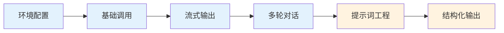
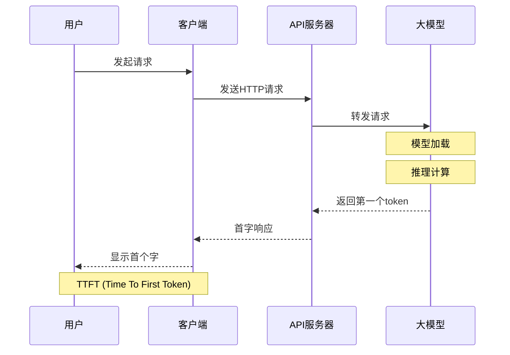
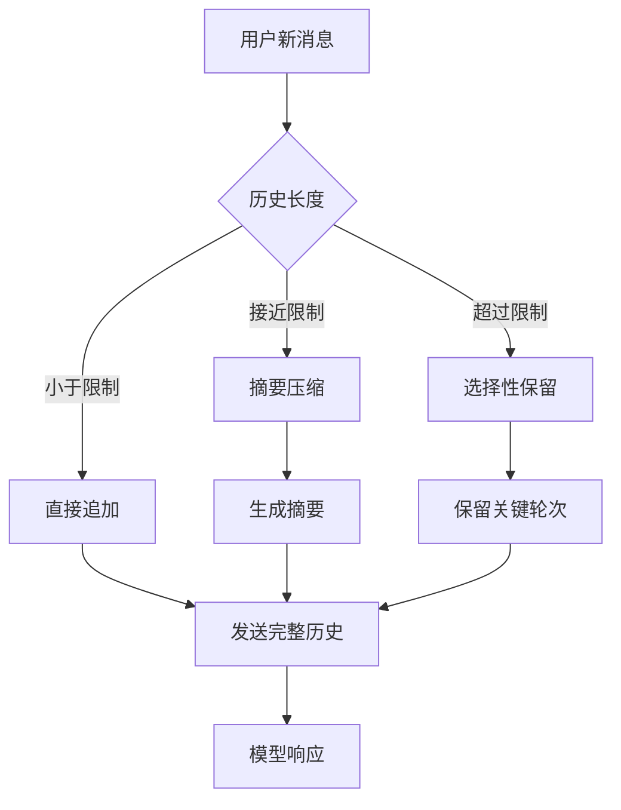
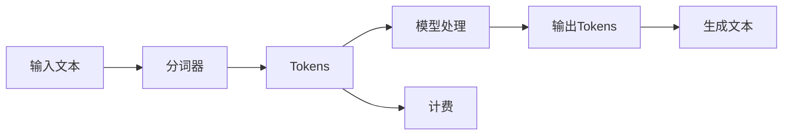

# OpenAI库基础使用指南

**作者：Red_Moon**  
**开发时间：2026年2月**

---

## 学习目标

通过本指南的学习，你将能够：

- 理解OpenAI SDK的基本架构和工作原理
- 掌握API密钥的安全配置方法
- 熟练发送单轮和多轮对话请求
- 实现流式输出以提升用户体验
- 管理对话历史实现上下文理解
- 应用性能优化策略提升系统效率

---

## 目录

1. [项目概述](#项目概述)
2. [环境配置说明](#环境配置说明)
3. [核心功能模块介绍](#核心功能模块介绍)
4. [使用示例](#使用示例)
5. [常见问题解决](#常见问题解决)
6. [代码结构说明](#代码结构说明)
7. [深入技术原理](#深入技术原理)
8. [性能优化与最佳实践](#性能优化与最佳实践)

---

## 项目概述

### 章节摘要
本章节介绍了OpenAI库基础使用指南的核心内容和技术栈，帮助读者快速了解本指南的学习目标和适用范围。

本项目系列文件演示如何使用OpenAI Python SDK与阿里云百炼（DashScope）提供的大语言模型进行交互。通过本指南，你将学会：

- 初始化OpenAI客户端并配置API密钥
- 发送单轮和多轮对话请求
- 使用流式输出提升用户体验
- 理解对话历史在多轮对话中的作用

### 技术栈

- **编程语言**: Python
- **SDK**: OpenAI Python SDK
- **模型服务**: 阿里云百炼（DashScope）
- **模型**: qwen3.5-plus

### 学习路径



---

## 环境配置说明

### 章节摘要
本章节详细介绍了OpenAI库的环境配置步骤，包括依赖安装、API密钥配置和获取方法，为后续的开发和测试做好准备。

### 1. 安装依赖

```bash
pip install openai
```

**版本说明**：
- 建议使用最新版本的OpenAI SDK，以获得最佳性能和最新功能
- 本项目基于OpenAI SDK v1.0+设计

### 2. 配置API密钥

#### 方式一：使用环境变量（推荐）

Windows PowerShell:
```powershell
$env:DASHSCOPE_API_KEY="你的API密钥"
```

Windows CMD:
```cmd
set DASHSCOPE_API_KEY=你的API密钥
```

Linux/Mac:
```bash
export DASHSCOPE_API_KEY="你的API密钥"
```

**为什么使用环境变量**：
- 避免密钥硬编码在代码中
- 便于在不同环境切换配置
- 防止密钥意外提交到版本控制系统

#### 方式二：直接在代码中配置（不推荐用于生产环境）

```python
client = OpenAI(
    api_key="你的API密钥",
    base_url="https://dashscope.aliyuncs.com/compatible-mode/v1"
)
```

**安全警告**：切勿将包含真实API密钥的代码提交到公开仓库！

### 3. 获取API密钥

1. 访问阿里云百炼控制台：https://bailian.console.aliyun.com/
2. 注册/登录账号
3. 创建API Key

---

## 核心功能模块介绍

### 章节摘要
本章节详细介绍了OpenAI库的核心功能模块，包括客户端初始化、对话消息结构、流式输出和多轮对话等关键概念和实现方法。

### 1. 客户端初始化模块

**核心代码**（来自01测试APIEKEY.py）：

```python
import os
from openai import OpenAI

# 初始化OpenAI客户端
# api_key: 使用环境变量获取API密钥，提高安全性
# base_url: 指定阿里云百炼API服务地址
client = OpenAI(
    api_key=os.getenv("DASHSCOPE_API_KEY"),  # 从环境变量读取API密钥
    base_url="https://dashscope.aliyuncs.com/compatible-mode/v1",  # 阿里云百炼兼容OpenAI接口地址
)
```

**知识点详解**：
- OpenAI SDK支持兼容OpenAI接口规范的第三方服务
- `base_url` 参数用于指定API服务地址
- `api_key` 参数用于身份认证
- 使用环境变量管理密钥是安全最佳实践

**关键参数详解**：

| 参数 | 类型 | 说明 |
|------|------|------|
| `api_key` | str | API密钥，用于身份验证 |
| `base_url` | str | API服务地址 |
| `timeout` | float | 请求超时时间（秒） |
| `max_retries` | int | 最大重试次数 |
| `default_headers` | dict | 默认请求头 |

### 2. 对话消息结构

messages列表是对话的核心，包含以下角色：

| 角色 | 说明 | 用途 |
|------|------|------|
| `system` | 系统消息 | 定义助手的角色、行为准则和背景知识 |
| `user` | 用户消息 | 用户的提问或输入内容 |
| `assistant` | 助手消息 | 模型的回复内容，用于构建对话历史 |

**消息结构深层解析**：

```python
{
    "role": "system" | "user" | "assistant",
    "content": "消息内容",
    # 下方为可选字段
    "name": "发言者名称",      # 可选，用于区分不同用户
    "tool_call_id": "工具调用ID",  # 仅用于工具调用场景
}
```

### 3. 非流式输出

**特点**：
- 等待模型生成完整响应后一次性返回
- 适用于需要完整结果后再处理的场景
- 实现简单，代码更简洁

**适用场景**：
- 批量处理任务
- 需要对完整响应进行分析的场景
- 对响应完整性要求较高的应用

### 4. 流式输出

**特点**：
- 模型每生成一部分内容就立即返回
- 大幅降低首字延迟（TTFT）
- 提升对话交互体验

**首字延迟（TTFT）详解**：

首字延迟是指从发起请求到收到第一个token的时间。这个指标对用户体验至关重要：



**适用场景**：
- 实时对话应用
- 长文本生成
- 用户体验敏感的应用

### 5. 多轮对话（上下文理解）

**核心原理**：
每次请求都需要将完整的对话历史发送给模型，模型才能理解上下文。

**为什么需要发送完整历史**：
- 大模型是无状态的，不记忆之前的对话
- 通过messages列表传递上下文信息
- 模型根据完整历史生成回复

**对话历史管理策略**：



---

## 使用示例

### 章节摘要
本章节提供了多个OpenAI库的使用示例，包括API密钥测试、基础对话、流式输出和多轮对话等场景，帮助读者快速上手实际应用。

### 示例1：测试API密钥（01测试APIEKEY.py）

**功能**：验证API密钥配置是否正确

**本地代码**（来自01测试APIEKEY.py）：

```python
import os
from openai import OpenAI

# 初始化客户端
client = OpenAI(
    api_key=os.getenv("DASHSCOPE_API_KEY"),  # 从环境变量读取API密钥
    base_url="https://dashscope.aliyuncs.com/compatible-mode/v1",  # 阿里云百炼API地址
)

# 创建对话完成请求
completion = client.chat.completions.create(
    model="qwen3.5-plus",  # 使用的模型名称
    messages=[
        {"role": "system", "content": "You are a helpful assistant."},  # 系统消息，定义助手角色
        {"role": "user", "content": "你是谁？"},  # 用户消息，测试问题
    ],
    stream=True  # 启用流式输出
)

# 处理流式响应
for chunk in completion:
    # 输出每个chunk的内容，使用end=""确保不换行
    # flush=True确保内容立即显示
    print(chunk.choices[0].delta.content, end="", flush=True)
```

### 示例2：基础非流式对话（02OpenAI库的基础使用.py）

**功能**：发送对话请求，等待完整响应后输出

**本地代码**（来自02OpenAI库的基础使用.py）：

```python
from openai import OpenAI

client = OpenAI(
    base_url="https://dashscope.aliyuncs.com/compatible-mode/v1"
)

response = client.chat.completions.create(
    model="qwen3.5-plus",
    messages=[
        {"role": "system", "content": "你是一个Python编程专家"},
        {"role": "assistant", "content": "好的我是编程专家，你想要问什么"},
        {"role": "user", "content": "输出a+b的代码"}
    ]
)

print(response.choices[0].message.content)
```

### 示例3：流式输出（03OpenAI库的流式输出.py）

**功能**：开启流式输出，逐字显示响应内容

**本地代码**（来自03OpenAI库的流式输出.py）：

```python
from openai import OpenAI

client = OpenAI(
    base_url="https://dashscope.aliyuncs.com/compatible-mode/v1"
)

response = client.chat.completions.create(
    model="qwen3.5-plus",
    messages=[
        {"role": "system", "content": "你是一个Python编程专家"},
        {"role": "assistant", "content": "好的我是编程专家，你想要问什么"},
        {"role": "user", "content": "输出a+b的代码"}
    ],
    stream=True
)

for chunk in response:
    print(
        chunk.choices[0].delta.content,
        end=" ",
        flush=True
    )
```

### 示例4：多轮对话（04OpenAI附带历史消息调用模型.py）

**功能**：通过对话历史实现上下文理解

**本地代码**（来自04OpenAI附带历史消息调用模型.py）：

```python
from openai import OpenAI

client = OpenAI(
    base_url="https://dashscope.aliyuncs.com/compatible-mode/v1"
)

response = client.chat.completions.create(
    model="qwen3.5-plus",
    messages=[
        {"role": "system", "content": "你是AI助理，回答很简洁"},
        {"role": "user", "content": "小明有2条宠物狗"},
        {"role": "assistant", "content": "好的"},
        {"role": "user", "content": "小红有3只宠物猫"},
        {"role": "assistant", "content": "好的"},
        {"role": "user", "content": "总共有几个宠物吖"},
    ],
    stream=True
)

for chunk in response:
    print(
        chunk.choices[0].delta.content,
        end=" ",
        flush=True
    )
```

---

## 常见问题解决

### 章节摘要
本章节汇总了使用OpenAI库时常见的问题及其解决方案，帮助读者快速排查和解决开发过程中遇到的技术难题。

### 1. API密钥错误

**错误信息**：`AuthenticationError`

**解决方案**：
- 检查API密钥是否正确
- 确认环境变量名称是否为 `DASHSCOPE_API_KEY`
- 尝试直接在代码中配置api_key参数

### 2. 模型名称错误

**错误信息**：`NotFoundError`

**解决方案**：
- 确认模型名称正确：`qwen3.5-plus`
- 检查阿里云百炼控制台中该模型是否可用

### 3. 流式输出中第一个chunk为None

**问题**：`AttributeError: 'NoneType' object has no attribute 'content'`

**原因分析**：
在流式输出的第一个chunk中，`delta.content`可能为`None`，因为模型刚开始生成时还没有任何内容产出。

**解决方案**：

```python
for chunk in response:
    content = chunk.choices[0].delta.content
    if content:  # 添加None检查
        print(content, end="", flush=True)
```

### 4. 网络连接超时

**解决方案**：
- 检查网络连接
- 配置超时参数：

```python
client = OpenAI(
    base_url="https://dashscope.aliyuncs.com/compatible-mode/v1",
    timeout=30.0  # 设置超时时间（秒）
)
```

### 5. 多轮对话中模型忘记上下文

**原因**：未在messages中包含完整对话历史

**解决方案**：每次请求都要将之前的user和assistant消息都包含在messages列表中

### 6. 请求频率过高被限流

**错误信息**：`RateLimitError`

**解决方案**：
- 添加请求间隔
- 实现指数退避重试
- 使用缓存减少重复请求

---

## 代码结构说明

### 章节摘要
本章节详细介绍了项目的代码结构和文件组织，帮助读者理解各个文件的功能和核心知识点，便于快速定位和使用相关代码。

### 文件列表

| 文件名 | 功能说明 | 核心知识点 |
|--------|----------|------------|
| 01测试APIEKEY.py | 验证API密钥配置 | 环境变量、流式输出基础 |
| 02OpenAI库的基础使用.py | 非流式对话请求 | 基础API调用、messages结构 |
| 03OpenAI库的流式输出.py | 流式输出实现 | stream=True、chunk处理 |
| 04OpenAI附带历史消息调用模型.py | 多轮对话上下文理解 | 对话历史管理 |

### 核心API参数说明

#### `client.chat.completions.create()` 参数

| 参数 | 类型 | 必填 | 说明 |
|------|------|------|------|
| `model` | str | 是 | 模型名称，如 "qwen3.5-plus" |
| `messages` | list | 是 | 对话消息列表 |
| `stream` | bool | 否 | 是否开启流式输出，默认False |
| `temperature` | float | 否 | 温度参数，控制随机性，0-2 |
| `max_tokens` | int | 否 | 最大生成token数 |
| `top_p` | float | 否 | 核采样参数，0-1 |
| `frequency_penalty` | float | 否 | 频率惩罚，-2到2 |
| `presence_penalty` | float | 否 | 存在惩罚，-2到2 |
| `stop` | list | 否 | 停止序列 |

#### messages 列表元素结构

```python
{
    "role": "system" | "user" | "assistant",
    "content": "消息内容"
}
```

#### 响应对象结构

**非流式响应**：

```python
response.choices[0].message.content  # 完整回复内容
response.choices[0].message.role     # 角色信息
response.choices[0].finish_reason    # 结束原因
response.usage.total_tokens          # 消耗的token总数
```

**流式响应**：

```python
for chunk in response:
    chunk.choices[0].delta.content   # 当前块的增量内容
    chunk.choices[0].delta.role      # 角色信息
    chunk.choices[0].finish_reason   # 结束原因
```

---

## 深入技术原理

### 章节摘要
本章节深入探讨了OpenAI库的技术原理，包括Token计算、成本控制、模型参数调优和对话历史管理等核心概念，帮助读者理解底层机制并优化应用。

### Token与成本控制

#### 什么是Token

Token是语言模型处理文本的基本单位。在中文语境下，通常1个Token约等于1-2个汉字；在英文语境下，约等于0.75个单词。



#### 成本计算

大模型通常按Token数量计费，成本控制至关重要：

```python
# 估算请求成本
def estimate_cost(prompt_tokens, completion_tokens, price_per_1k_tokens):
    prompt_cost = (prompt_tokens / 1000) * price_per_1k_tokens
    completion_cost = (completion_tokens / 1000) * price_per_1k_tokens
    return prompt_cost + completion_cost

# 使用响应中的usage信息
response = client.chat.completions.create(...)
print(f"消耗Token: {response.usage.total_tokens}")
print(f"Prompt Token: {response.usage.prompt_tokens}")
print(f"Completion Token: {response.usage.completion_tokens}")
```

#### 成本优化策略

1. **精简System消息**：避免冗长的系统提示
2. **合理管理对话历史**：不要保留过长的历史记录
3. **使用max_tokens限制输出**：防止过长回复
4. **适当使用temperature**：过高会增加无效Token

### 模型参数详解

#### temperature（温度参数）

控制输出的随机性：

| 值 | 效果 | 适用场景 |
|-----|------|----------|
| 0.0-0.3 | 确定性高，保守输出 | 代码生成、精确问答 |
| 0.4-0.7 | 平衡，创造性适中 | 通用对话 |
| 0.8-1.0 | 随机性高，多样性丰富 | 创意写作、头脑风暴 |

**数学原理**：
temperature实际上是对softmax概率分布的缩放：
$$P_i = \frac{exp(z_i / T)}{\sum exp(z_j / T)}$$

其中T为temperature，T越大，概率分布越平缓。

#### top_p（核采样）

与temperature类似，控制词汇选择范围：

- top_p = 1.0：考虑所有词汇
- top_p = 0.9：只考虑累计概率达90%的词汇
- 通常只需调整temperature或top_p其一

#### max_tokens（最大Token数）

限制模型输出的最大长度：

```python
response = client.chat.completions.create(
    model="qwen3.5-plus",
    messages=[...],
    max_tokens=1000  # 限制最多生成1000个Token
)
```

### 对话历史管理策略

#### 策略一：固定窗口（Fixed Window）

保留最近N轮对话：

```python
def manage_history(messages, max_turns=10):
    # 只保留最近max_turns轮
    system = messages[0] if messages[0]["role"] == "system" else None
    history = messages[1:]  # 去掉system
    if len(history) > max_turns * 2:  # 每轮包含user和assistant
        history = history[-max_turns * 2:]
    return [system] + history if system else history
```

#### 策略二：摘要压缩（Summary Compression）

当历史过长时，生成摘要：

```python
# 伪代码示例
def compress_history(messages):
    # 提取关键信息生成摘要
    summary_prompt = "请简洁概括以下对话的核心内容："
    # 调用模型生成摘要
    # 替换原始历史为摘要
    return compressed_messages
```

#### 策略三：选择性保留（Selective Retention）

根据重要性保留关键轮次：

```python
def selective_history(messages, important_keywords):
    # 保留包含关键词的轮次
    # 保留最新N轮
    # 其他轮次根据关键词匹配
    return filtered_messages
```

---

## 性能优化与最佳实践

### 章节摘要
本章节介绍了OpenAI库的性能优化策略和最佳实践，包括错误处理、连接池配置、异步调用、缓存策略和安全性等方面，帮助读者构建高效可靠的应用。

### 1. 错误处理与重试机制

```python
import time
from openai import OpenAI
from openai import APIError, RateLimitError

def create_with_retry(client, messages, max_retries=3):
    """
    带重试机制的对话创建函数
    
    Args:
        client: OpenAI客户端实例
        messages: 对话消息列表
        max_retries: 最大重试次数
        
    Returns:
        对话响应对象
    """
    for attempt in range(max_retries):
        try:
            response = client.chat.completions.create(
                model="qwen3.5-plus",
                messages=messages
            )
            return response
        except RateLimitError:
            wait_time = 2 ** attempt  # 指数退避策略
            print(f"触发限流，等待{wait_time}秒...")
            time.sleep(wait_time)
        except APIError as e:
            print(f"API错误: {e}")
            if attempt == max_retries - 1:
                raise
    return None
```

### 2. 连接池与超时配置

```python
client = OpenAI(
    base_url="https://dashscope.aliyuncs.com/compatible-mode/v1",
    timeout=30.0,           # 请求超时30秒
    max_retries=3,          # 最多重试3次
)
```

### 3. 异步调用（高级）

对于高并发场景，可以使用异步API：

```python
import asyncio
from openai import AsyncOpenAI

async_client = AsyncOpenAI(
    base_url="https://dashscope.aliyuncs.com/compatible-mode/v1"
)

async def async_chat(messages):
    response = await async_client.chat.completions.create(
        model="qwen3.5-plus",
        messages=messages
    )
    return response.choices[0].message.content

# 并发调用
results = asyncio.gather(
    async_chat(messages1),
    async_chat(messages2),
    async_chat(messages3)
)
```

### 4. 缓存策略

对于相同或相似的请求，可以使用缓存：

```python
from functools import lru_cache
import hashlib

def get_cache_key(messages):
    """生成缓存键"""
    content = str(messages)
    return hashlib.md5(content.encode()).hexdigest()

# 使用示例
cache = {}
def chat_with_cache(client, messages):
    key = get_cache_key(messages)
    if key in cache:
        return cache[key]
    response = client.chat.completions.create(
        model="qwen3.5-plus",
        messages=messages
    )
    cache[key] = response
    return response
```

### 5. 安全性最佳实践

| 实践 | 说明 |
|------|------|
| 环境变量管理 | 使用.env文件或环境变量存储密钥 |
| 密钥轮换 | 定期更换API密钥 |
| 访问日志 | 记录API调用日志便于审计 |
| 输入验证 | 校验用户输入，防止Prompt Injection |
| 输出过滤 | 对敏感输出进行过滤 |

---

## 进阶学习建议

### 章节摘要
本章节提供了OpenAI库的进阶学习路径和建议，帮助读者在掌握基础使用后进一步提升技术能力，为后续的LangChain学习做好准备。

1. **提示词工程**：学习如何编写高质量的system提示词
2. **Token管理**：了解Token计数和成本控制
3. **异常处理**：添加完善的错误处理和重试机制
4. **对话历史优化**：学习如何裁剪过长的对话历史
5. **LangChain框架**：本项目下一步将学习LangChain的使用

---

**文档版本**：v1.1  
**最后更新**：2026年2月
