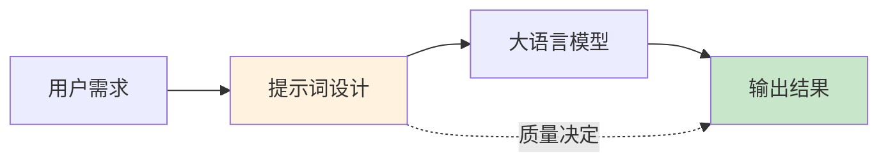
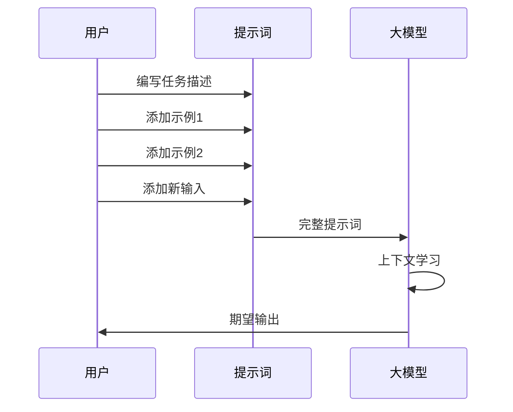
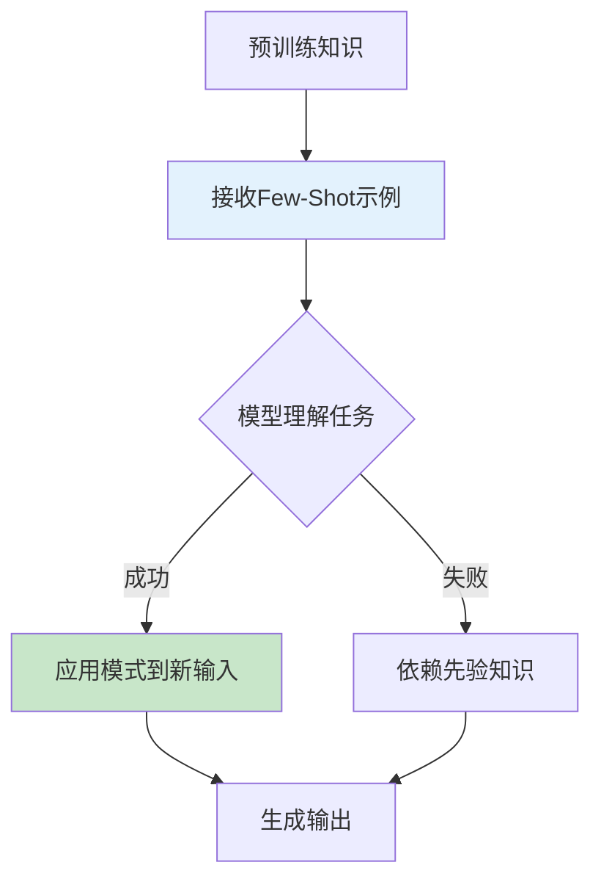
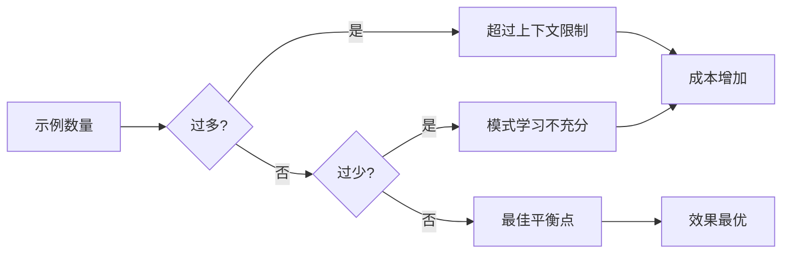
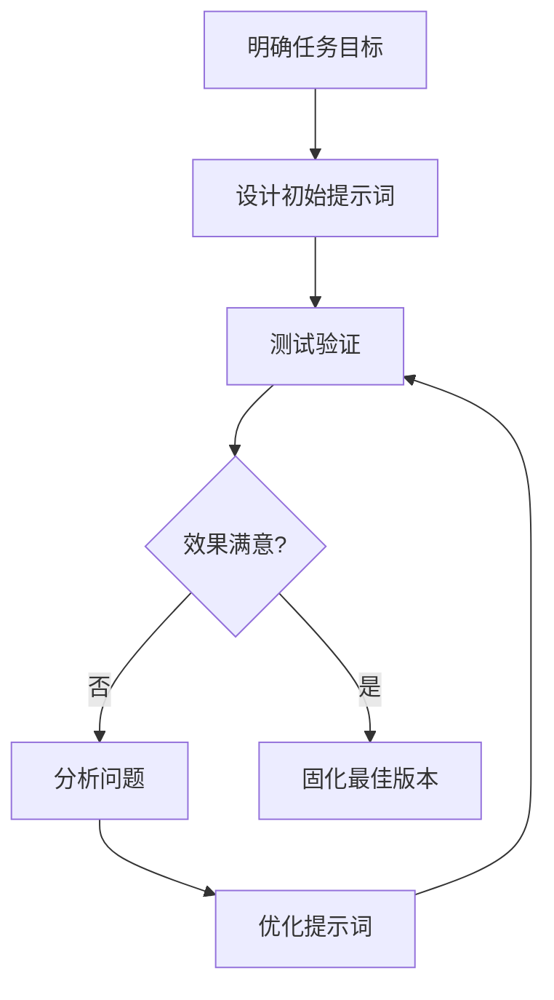
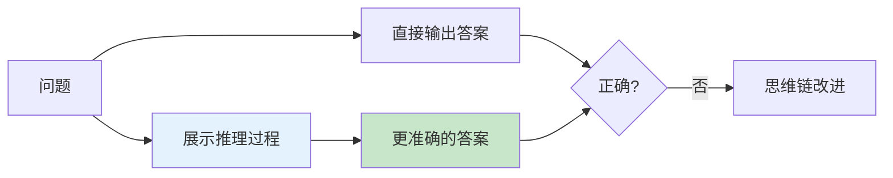
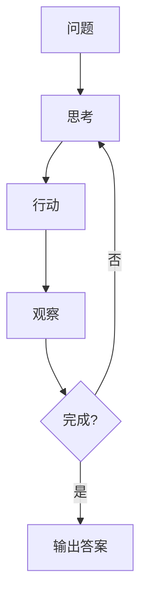

# 提示词工程核心技术指南

**作者：Red_Moon**  
**开发时间：2026年2月**

---

## 学习目标

通过本指南的学习，你将能够：

- 理解提示词工程的核心概念和重要性
- 掌握提示词的核心组件和设计原则
- 运用Few-Shot Learning技术提升模型表现
- 设计有效的提示词模式应对不同任务
- 控制模型输出格式，实现JSON结构化输出
- 应用提示词工程的最佳实践和高级技术

---

## 目录

1. [提示词工程概述](#提示词工程概述)
2. [提示词核心组件](#提示词核心组件)
3. [Few-Shot Learning技术](#few-shot-learning技术)
4. [提示词设计模式](#提示词设计模式)
5. [输出格式控制](#输出格式控制)
6. [典型任务提示词设计](#典型任务提示词设计)
7. [最佳实践与优化策略](#最佳实践与优化策略)
8. [高级技术与进阶应用](#高级技术与进阶应用)

---

## 提示词工程概述

### 章节摘要
本章节介绍了提示词工程的核心概念、重要性和基本结构，帮助读者理解提示词工程在大语言模型应用中的关键作用和价值。

### 什么是提示词工程

提示词工程（Prompt Engineering）是一门设计和优化提示词（Prompt）的艺术与科学，旨在引导大语言模型生成准确、高质量的输出。它是与大模型交互的核心技能，直接影响模型的表现效果。

### 提示词工程的重要性



**核心价值**：
- 无需微调模型即可适应新任务
- 成本极低，迭代速度快
- 灵活性高，可快速调整优化

### 提示词的基本结构

一个完整的提示词通常包含以下组件：

| 组件 | 说明 | 示例 |
|------|------|------|
| System消息 | 定义模型角色和任务背景 | "你是金融专家" |
| 任务描述 | 明确任务目标和要求 | "将文本分类为..." |
| 示例数据 | 展示输入输出的对应关系 | Few-Shot示例 |
| 输入数据 | 待处理的实际数据 | 需要分类的文本 |
| 格式约束 | 指定输出格式要求 | "按JSON格式输出" |

### 提示词工程与编程的关系

传统编程 vs 提示词工程：

| 维度 | 传统编程 | 提示词工程 |
|------|----------|------------|
| 输入 | 确定性的代码 | 自然语言描述 |
| 输出 | 确定性的执行结果 | 概率性的文本生成 |
| 调试 | 断点调试、单元测试 | 调整提示词、添加示例 |
| 确定性 | 高 | 中等（概率性） |

---

## 提示词核心组件

### 章节摘要
本章节详细介绍了提示词的核心组件，包括System消息设计和任务描述编写等关键要素，帮助读者掌握提示词的基本构成和设计原则。

### System消息设计

System消息是提示词的"角色设定"，决定了模型的基本行为模式。

**设计原则**：

1. **角色定义**：明确模型扮演的专业角色
2. **能力边界**：说明模型应该做什么、不应该做什么
3. **输出规范**：定义输出的格式和风格

**示例对比**：

```python
# 弱提示词 - 信息量不足
system_message = "你是一个助手"

# 强提示词 - 明确角色、能力和风格
system_message = "你是金融领域的资深分析师，擅长从财经新闻中提取关键信息。你的回答应该简洁、专业、准确。"
```

**System消息的深层作用**：

System消息的作用远不止设定角色，它还能：
- 设置回答的格式和风格
- 限定知识范围和时间
- 指定特定的思考方式
- 定义输出的结构

### 任务描述编写

任务描述需要清晰、具体、无歧义。

**核心要素**：
- 任务类型（分类、抽取、匹配等）
- 输入说明
- 输出要求
- 特殊情况处理

**示例**（来自07文件）：

```python
task_description = f"""
你帮我完成信息抽取，我给你句子，你抽取{schema}信息，按JSON字符串输出，
如果某些信息不存在，用'原文未提及'表示，请参考如下示例：
"""
```

**任务描述的设计技巧**：

1. **使用动作词**：明确模型需要执行的动作
   - "分类" → "提取" → "判断" → "生成"
   
2. **明确输入边界**：说明输入是什么、不是什么
   
3. **示例化输出**：不仅说格式，还要展示格式

---

## Few-Shot Learning技术

### 章节摘要
本章节深入探讨了Few-Shot Learning技术的原理和应用策略，包括技术机制、示例构建方法和数量建议，帮助读者有效提升模型的任务表现。

### 技术原理

Few-Shot Learning（少样本学习）是提示词工程的核心技术，通过在提示词中提供少量示例，让模型快速学习任务模式。

**为什么Few-Shot有效**：

大语言模型在预训练阶段学习了海量文本，具备强大的：
- **模式识别能力**：从示例中学习输入-输出映射
- **零样本推理能力**：根据描述推断任务意图
- **上下文理解能力**：理解示例之间的逻辑关系



**Few-Shot Learning的工作机制**：



### 示例构建策略

#### 策略一：覆盖所有类别

确保示例覆盖所有可能的输出类别，避免模型产生偏见。

```python
# 来源：05提示词优化案例_金融文本分类.py
examples_data = {
    '新闻报道': '示例文本...',
    '财务报告': '示例文本...',
    '公司公告': '示例文本...',
    '分析师报告': '示例文本...'
}
```

**为什么需要覆盖所有类别**：
- 避免模型对未展示的类别产生偏见
- 帮助模型理解每个类别的边界
- 提高分类的准确性

#### 策略二：正负例平衡

对于判断类任务，正例和负例应保持平衡。

```python
# 来源：08提示词优化案例_金融文本匹配判断.py
examples_data = {
    "是": [正例列表],    # 匹配的例子
    "不是": [负例列表]   # 不匹配的例子
}
```

**正负例设计的关键点**：
- 正负例数量应大致相等
- 负例应展示"不匹配"的各种情况
- 避免负例过于明显

#### 策略三：边界案例覆盖

包含边界情况，帮助模型处理特殊输入。

```python
# 来源：05提示词优化案例_金融文本分类.py
questions = [
    "正常的金融新闻...",
    "小明喜欢小新哟"  # 边界测试：与金融无关的文本
]
```

**边界案例的重要性**：
- 测试模型的鲁棒性
- 明确特殊情况的处理方式
- 防止模型对边缘情况产生错误判断

### 示例数量建议

| 任务复杂度 | 建议示例数 | 说明 |
|------------|------------|------|
| 简单分类 | 1-2个/类别 | 类别明确，规则简单 |
| 中等复杂 | 2-3个/类别 | 需要理解上下文 |
| 复杂抽取 | 3-5个 | 多字段、多格式 |
| 高度复杂 | 5-10个 | 需要推理或转换 |

**示例数量的权衡**：



---

## 提示词设计模式

### 章节摘要
本章节介绍了几种常见的提示词设计模式，包括分类任务、信息抽取和文本匹配等场景的模板和应用方法，帮助读者快速构建有效的提示词。

### 模式一：分类任务提示词

**任务特点**：将输入划分到预定义类别

**提示词模板**：

```python
messages = [
    {
        "role": "system",
        "content": f"你是{领域}专家，将文本分类为{类别列表}，不清楚的分类为'{默认类别}'"
    }
]

# 添加示例
for 文本, 类别 in 示例数据:
    messages.append({"role": "user", "content": 文本})
    messages.append({"role": "assistant", "content": 类别})
```

**关键点**：
- 明确所有可能的类别
- 定义默认/未知类别处理方式
- 示例覆盖所有类别

### 模式二：信息抽取提示词

**任务特点**：从文本中提取结构化信息

**提示词模板**：

```python
# 来源：07提示词优化案例_金融信息抽取.py
messages = [
    {
        "role": "system",
        "content": f"你帮我完成信息抽取，我给你句子，你抽取{schema}信息，按JSON字符串输出，如果某些信息不存在，用'{默认值}'表示"
    }
]

# 添加示例（使用JSON格式）
for example in examples_data:
    messages.append({"role": "user", "content": example["content"]})
    messages.append({"role": "assistant", "content": json.dumps(example["answers"], ensure_ascii=False)})
```

**关键点**：
- 明确定义Schema（抽取字段列表）
- 指定输出格式（JSON）
- 说明缺失字段的处理方式
- 示例输出使用JSON格式

### 模式三：文本匹配提示词

**任务特点**：判断两个文本的语义关系

**提示词模板**：

```python
# 来源：08提示词优化案例_金融文本匹配判断.py
messages = [
    {
        "role": "system",
        "content": "你帮我完成文本匹配，我给你2个句子，被[]包围，你判断它们是否匹配，回答是或不是"
    }
]

# 添加正负例
for 判断结果, 句子对列表 in examples_data.items():
    for 句子1, 句子2 in 句子对列表:
        messages.append({"role": "user", "content": f"句子1：[{句子1}]，句子2：[{句子2}]"})
        messages.append({"role": "assistant", "content": 判断结果})
```

**关键点**：
- 使用分隔符区分多个输入
- 正负例平衡展示
- 输出简洁明确

---

## 输出格式控制

### 章节摘要
本章节详细介绍了输出格式控制的重要性和方法，特别是JSON格式输出的实现技巧，帮助读者实现结构化、可解析的模型输出。

### 为什么需要控制输出格式

结构化输出便于程序解析和处理，是提示词工程的重要技能。

### JSON格式输出

JSON是大模型结构化输出的首选格式。

**提示词设计要点**：

1. **明确要求JSON格式**
```python
"按JSON字符串输出"
```

2. **定义JSON结构**
```python
schema = ['日期', '股票名称', '开盘价', '收盘价', '成交量']
f"你抽取{schema}信息"
```

3. **示例使用真实JSON**
```python
# 使用json.dumps确保格式正确
assistant_content = json.dumps(example["answers"], ensure_ascii=False)
```

**ensure_ascii参数的作用**：

```python
import json

data = {"name": "张三"}

# 默认：中文被转义
json.dumps(data)  # {"name": "\u5f20\u4e09"}

# 推荐：中文原样输出，提高可读性
json.dumps(data, ensure_ascii=False)  # {"name": "张三"}
```

### 格式约束技巧

| 技巧 | 说明 | 示例 |
|------|------|------|
| 明确格式名称 | 直接指定格式 | "按JSON格式输出" |
| 展示示例 | 用示例说明格式 | 提供JSON示例 |
| 限制输出 | 约束输出范围 | "只回答是或不是" |
| 模板引导 | 提供输出模板 | "输出格式：{字段1}: xxx" |

---

## 典型任务提示词设计

### 章节摘要
本章节通过具体的金融领域示例，详细介绍了不同类型任务的提示词设计方法，包括文本分类、信息抽取和文本匹配等场景，帮助读者掌握实际应用中的提示词设计技巧。

### 金融文本分类（05文件）

**任务目标**：将金融文本分类到预定义类别

**本地代码**（来自05提示词优化案例_金融文本分类.py）：

```python
# System消息
messages = [
    {"role": "system",
     "content": "你是金融专家，将文本分类为['新闻报道', '财务报道', '公司公告', '分析师报告']，不清楚的分类为'不清楚类别' 下面有示例："},
]

# 添加示例
examples_data = {
    '新闻报道': '今日，股市经历了一轮震荡，受到宏观经济数据和全球贸易紧张局势的影响。投资者密切关注美联储可能的政策调整...',
    '财务报告': '本公司年度财务报告显示，去年公司实现了稳步增长的盈利，同时资产负债表呈现强劲的状况...',
    '公司公告': '本公司高兴地宣布成功完成最新一轮并购交易，收购了一家在人工智能领域领先的公司...',
    '分析师报告': '最新的行业分析报告指出，科技公司的创新将成为未来增长的主要推动力...'
}

for key, value in examples_data.items():
    messages.append({"role": "user", "content": value})
    messages.append({"role": "assistant", "content": key})
```

**设计亮点**：
- 角色定位清晰（金融专家）
- 类别定义完整
- 包含默认类别处理

### 金融信息抽取（07文件）

**任务目标**：从金融文本中提取股票交易信息

**本地代码**（来自07提示词优化案例_金融信息抽取.py）：

```python
# Schema定义
schema = ['日期', '股票名称', '开盘价', '收盘价', '成交量']

# 示例数据
examples_data = [
    {
        "content": "2023-01-10，股市震荡。股票强大科技A股今日开盘价100人民币，一度飙升至105人民币，随后回落至98人民币，最终以102人民币收盘，成交量达到520000。",
        "answers": {
            "日期": "2023-01-10",
            "股票名称": "强大科技A股",
            "开盘价": "100人民币",
            "收盘价": "102人民币",
            "成交量": "520000"
        }
    },
]

# System消息
messages = [
    {"role": "system",
     "content": f"你帮我完成信息抽取，我给你句子，你抽取{schema}信息，按JSON字符串输出，如果某些信息不存在，用'原文未提及'表示，请参考如下示例："}
]

# 添加示例
for example in examples_data:
    messages.append({"role": "user", "content": example["content"]})
    messages.append(
        {"role": "assistant", "content": json.dumps(example["answers"], ensure_ascii=False)}
    )
```

**设计亮点**：
- Schema明确抽取字段
- JSON格式便于程序处理
- 缺失字段有默认处理

### 金融文本匹配（08文件）

**任务目标**：判断两个金融句子是否语义匹配

**本地代码**（来自08提示词优化案例_金融文本匹配判断.py）：

```python
# 示例数据（正负例平衡）
examples_data = {
    "是": [
        ("公司ABC发布了季度财报，显示盈利增长。", "财报披露，公司ABC利润上升。"),
        ("公司ITCAST发布了年度财报，显示盈利大幅度增长。", "财报披露，公司ITCAST更赚钱了。")
    ],
    "不是": [
        ("黄金价格下跌，投资者抛售。", "外汇市场交易额创下新高。"),
        ("央行降息，刺激经济增长。", "新能源技术的创新。")
    ]
}

# System消息
messages = [
    {"role": "system",
     "content": "你帮我完成文本匹配，我给你2个句子，被[]包围，你判断它们是否匹配，回答是或不是，请参考如下示例："},
]

# 添加示例
for key, value in examples_data.items():
    for t in value:
        messages.append(
            {"role": "user", "content": f"句子1：[{t[0]}]，句子2：[{t[1]}]"}
        )
        messages.append(
            {"role": "assistant", "content": key}
        )
```

**设计亮点**：
- 使用[]分隔符提高辨识度
- 正负例平衡展示
- 输出简洁（是/不是）

---

## 最佳实践与优化策略

### 章节摘要
本章节介绍了提示词工程的最佳实践和优化策略，包括提示词优化流程、常见问题解决方案和迭代优化技巧，帮助读者持续提升提示词的效果。

### 提示词优化流程



### 常见问题与解决方案

| 问题 | 原因 | 解决方案 |
|------|------|----------|
| 输出格式不一致 | 格式约束不够明确 | 增加格式示例 |
| 分类错误 | 类别定义模糊 | 明确类别边界 |
| 信息遗漏 | Schema不清晰 | 明确列出所有字段 |
| 输出过长 | 未限制输出 | 添加长度约束 |

### 提示词迭代优化技巧

1. **逐步添加示例**：从少到多，观察效果变化
2. **A/B测试**：对比不同提示词版本的效果
3. **错误分析**：收集失败案例，针对性优化
4. **边界测试**：专门测试特殊情况

### 提示词模板化

将成功的提示词抽象为模板，便于复用：

```python
def build_classification_prompt(domain, categories, default_category, examples):
    """构建分类任务提示词模板"""
    messages = [
        {"role": "system", 
         "content": f"你是{domain}专家，将文本分类为{categories}，不清楚的分类为'{default_category}'"}
    ]
    for text, category in examples:
        messages.append({"role": "user", "content": text})
        messages.append({"role": "assistant", "content": category})
    return messages
```

---

## 高级技术与进阶应用

### 章节摘要
本章节介绍了提示词工程的高级技术和进阶应用，包括Chain-of-Thought（思维链）、Self-Consistency（自一致性）和ReAct框架等技术，帮助读者进一步提升模型的推理能力和任务表现。

### Chain-of-Thought（思维链）

思维链是一种让模型"展示推理过程"的技术。

**基本原理**：

```python
# 不使用思维链
prompt = "小明有5个苹果，小红给了他3个，小明吃了2个，现在有多少个苹果？"

# 使用思维链
prompt = """小明有5个苹果，小红给了他3个，小明吃了2个，现在有多少个苹果？
请一步步推理：
1. 小明最初有5个苹果
2. 小红给了3个，现在有5+3=8个
3. 小明吃了2个，现在有8-2=6个
答案是6个"""
```

**思维链的效果**：



### Self-Consistency（自一致性）

通过多次采样，选择最一致的答案。

**实现方式**：

```python
def self_consistency(client, question, num_samples=5):
    """自一致性采样"""
    answers = []
    for _ in range(num_samples):
        response = client.chat.completions.create(
            model="qwen3.5-plus",
            messages=[
                {"role": "system", "content": "你是一个数学助手，请一步步推理。"},
                {"role": "user", "content": question}
            ]
        )
        answers.append(extract_answer(response))
    
    # 选择最常见的答案
    return most_common(answers)
```

### ReAct框架

结合推理和行动的框架。



---

## 文件对照表

| 文件名 | 提示词技术 | 任务类型 | 输出控制 |
|--------|------------|----------|----------|
| 05提示词优化案例_金融文本分类.py | Few-Shot + 类别覆盖 | 文本分类 | 类别标签 |
| 06Json的基础使用.py | JSON格式构建 | 数据处理 | JSON字符串 |
| 07提示词优化案例_金融信息抽取.py | Few-Shot + Schema定义 + JSON约束 | 信息抽取 | JSON对象 |
| 08提示词优化案例_金融文本匹配判断.py | Few-Shot + 正负例平衡 | 文本匹配 | 是/否 |

---

## 进阶学习路径

1. **提示词高级技术**
   - Chain-of-Thought（思维链）
   - Self-Consistency（自一致性）
   - ReAct框架

2. **LangChain提示词管理**
   - PromptTemplate
   - FewShotPromptTemplate
   - OutputParser

3. **提示词安全与防护**
   - Prompt Injection防御
   - 输出内容过滤
   - 敏感信息保护

---

**文档版本**：v1.1  
**最后更新**：2026年2月
