# LangChain RAG开发技术指南

## 学习目标

通过本指南的学习，你将能够：

- 理解RAG（检索增强生成）的核心概念和工作原理
- 掌握LangChain框架的基本组件和使用方法
- 实现文档加载、分割和向量存储
- 构建完整的RAG系统，实现智能问答
- 优化RAG系统的性能和效果
- 应用LangChain的高级特性，如会话记忆和多模型串联

## 概述

本指南系统性地整理了LangChain RAG（检索增强生成）开发的核心技术知识点，涵盖向量检索、提示词模板、Chain构建、对话记忆等关键模块。通过本指南，你将建立起从理论到实践的完整知识体系。

---

## 第一部分：基础数学概念

### 章节摘要
本章节介绍了RAG开发所需的基础数学概念，特别是余弦相似度的计算原理和几何意义，为理解向量检索奠定数学基础。

### 1.1 余弦相似度

余弦相似度是向量检索的基础，用于衡量两个向量方向的相似程度。在RAG系统中，它决定了我们能否从向量库中准确检索到与用户问题相关的文档片段。

#### 1.1.1 为什么使用余弦相似度

在文本向量化场景中，文档长度差异巨大（短句vs长文）。欧几里得距离会受向量长度影响——长文档的向量模长通常更大，导致误判。余弦相似度**只关注向量方向**，忽略长度差异，更适合语义相似度比较。

**几何意义：**

| 值 | 含义 | 应用场景 |
|---|------|---------|
| 1 | 方向完全相同 | 完全相似，如"猫"和"猫咪"的向量 |
| 0 | 方向正交 | 无相关性，如"苹果"（水果）和"苹果"（公司）在特定语境下 |
| -1 | 方向完全相反 | 对立关系，如"好"和"坏" |

#### 1.1.2 核心公式解析

$$
\text{cosine\_similarity}(\vec{a}, \vec{b}) = \frac{\vec{a} \cdot \vec{b}}{|\vec{a}| \times |\vec{b}|} = \frac{\sum_{i=1}^{n} a_i \times b_i}{\sqrt{\sum_{i=1}^{n} a_i^2} \times \sqrt{\sum_{i=1}^{n} b_i^2}}
$$

**公式拆解：**

- **分子（点积）**：$\vec{a} \cdot \vec{b} = \sum_{i=1}^{n} a_i \times b_i$
  - 同维度向量对应元素相乘后求和
  - 结果为正表示两向量大致同向，为负表示反向，为0表示正交
  - 几何意义：$|\vec{a}| \times |\vec{b}| \times \cos\theta$，即两向量长度乘积再乘以夹角余弦

- **分母（模长乘积）**：$|\vec{a}| \times |\vec{b}|$
  - $|\vec{a}| = \sqrt{\sum_{i=1}^{n} a_i^2}$（L2范数）
  - 作用：归一化，消除向量长度的影响

#### 1.1.3 计算示例

```python
def cosine_similarity(vec_a, vec_b):
    """
    计算两个向量的余弦相似度
    
    原理：cos(θ) = (a·b) / (||a|| * ||b||)
    
    参数:
        vec_a: 第一个向量，List[float]
        vec_b: 第二个向量，List[float]
    
    返回:
        float: 余弦相似度，范围[-1, 1]
    
    异常:
        若输入向量维度不匹配或包含零向量，可能产生除零错误
    """
    # 计算点积：对应元素相乘后累加
    # 例如：[1,2,3]·[4,5,6] = 1*4 + 2*5 + 3*6 = 32
    dot_product = sum(a * b for a, b in zip(vec_a, vec_b))
    
    # 计算向量a的模长（L2范数）
    # 例如：||[1,2,3]|| = sqrt(1² + 2² + 3²) = sqrt(14) ≈ 3.74
    norm_a = sum(a * a for a in vec_a) ** 0.5
    
    # 计算向量b的模长
    norm_b = sum(b * b for b in vec_b) ** 0.5
    
    # 防御性编程：避免除以零
    if norm_a == 0 or norm_b == 0:
        return 0.0
    
    # 返回归一化后的相似度
    return dot_product / (norm_a * norm_b)


# 使用示例
if __name__ == "__main__":
    # 模拟两个文本的向量表示（实际中由嵌入模型生成）
    vec_cat = [0.2, 0.8, 0.1, 0.3]      # "猫"的向量
    vec_kitten = [0.25, 0.75, 0.15, 0.28]  # "小猫"的向量（语义相近）
    vec_car = [0.9, 0.1, 0.8, 0.2]      # "汽车"的向量（语义无关）
    
    sim_cat_kitten = cosine_similarity(vec_cat, vec_kitten)
    sim_cat_car = cosine_similarity(vec_cat, vec_car)
    
    print(f"猫 vs 小猫 相似度: {sim_cat_kitten:.4f}")  # 输出接近1
    print(f"猫 vs 汽车 相似度: {sim_cat_car:.4f}")      # 输出较低
```

#### 1.1.4 在RAG中的应用

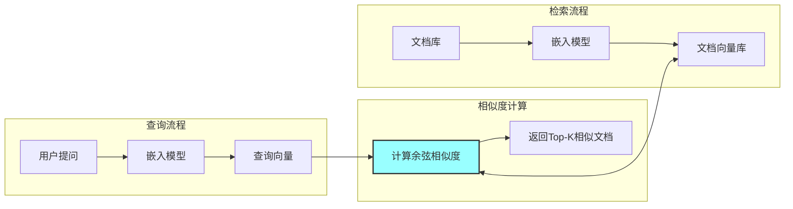

**性能优化提示**：
- 大规模向量检索使用近似最近邻（ANN）算法（如FAISS、HNSW）
- 余弦相似度等价于归一化后的欧几里得距离：$1 - \text{cosine\_similarity} = \frac{||\vec{a} - \vec{b}||^2}{2}$（当向量已归一化时）

---

## 第二部分：大模型接入

### 章节摘要
本章节介绍了LangChain中不同类型模型的接入方法，包括云端模型和本地模型的配置与使用，帮助读者灵活选择适合的模型服务。

### 2.1 模型类型对比

LangChain通过抽象层统一了不同模型供应商的接口，使开发者能够以一致的方式调用云端API或本地模型。

#### 2.1.1 LLM vs ChatModel 架构差异

| 类型 | 类 | 输入 | 返回值 | 适用场景 | 底层协议 |
|------|-----|------|--------|---------|---------|
| LLM | `Tongyi`/`OllamaLLM` | `str` | `str` | 简单文本生成、补全任务 | 传统Completion API |
| ChatModel | `ChatTongyi`/`ChatOllama` | `List[BaseMessage]` | `AIMessage` | 多轮对话、上下文管理 | Chat Completion API |

**选型建议**：
- 新项目优先使用ChatModel，支持系统提示词和消息角色管理
- LLM适用于遗留系统迁移或简单文本补全场景

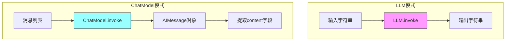

### 2.2 云端模型接入

云端模型通过API调用，无需本地部署，适合生产环境使用。

#### 2.2.1 阿里云通义千问接入

```python
import os
from langchain_community.llms.tongyi import Tongyi
from langchain_community.chat_models.tongyi import ChatTongyi
from langchain_core.messages import SystemMessage, HumanMessage

# 安全规范：从环境变量读取API密钥，禁止硬编码
# 设置方式：export DASHSCOPE_API_KEY="your-api-key"
os.environ["DASHSCOPE_API_KEY"] = os.getenv("DASHSCOPE_API_KEY", "")

# ==================== LLM模式（传统接口）====================
# 适用场景：简单文本生成、无需对话历史的任务
llm_model = Tongyi(
    model="qwen-max",           # 模型名称，可选：qwen-turbo, qwen-plus等
    temperature=0.7,            # 温度参数：0-2，越高输出越随机
    max_tokens=1500             # 最大生成token数，控制输出长度
)

# invoke方法：同步调用，返回字符串
response = llm_model.invoke("请介绍一下Python编程语言")
print(f"LLM响应: {response}")

# ==================== Chat模式（推荐）====================
# 适用场景：多轮对话、需要系统提示词的场景
chat_model = ChatTongyi(
    model="qwen-max",           # 模型版本
    temperature=0.7,
    max_tokens=1500
)

# 构建消息列表：支持SystemMessage设定角色行为
messages = [
    # SystemMessage：设定AI助手的角色和行为约束
    SystemMessage(content="你是一位专业的Python讲师，回答要简洁明了，适合初学者理解。"),
    # HumanMessage：用户输入
    HumanMessage(content="什么是列表推导式？")
]

# invoke返回AIMessage对象，包含content和additional_kwargs
ai_message = chat_model.invoke(messages)
print(f"AI回复: {ai_message.content}")
print(f"元数据: {ai_message.additional_kwargs}")  # 包含token用量等信息
```

#### 2.2.2 模型参数详解

| 参数 | 类型 | 默认值 | 说明 |
|------|------|--------|------|
| `model` | str | - | 模型标识符，如"qwen-max" |
| `temperature` | float | 0.7 | 采样温度，0表示确定性输出，越高越随机 |
| `max_tokens` | int | - | 最大生成token数 |
| `top_p` | float | 0.8 | 核采样参数，与temperature二选一 |
| `streaming` | bool | False | 是否启用流式输出 |

### 2.3 本地模型接入

Ollama提供本地大模型运行环境，适合离线场景和数据隐私要求高的应用。

#### 2.3.1 Ollama环境准备

```bash
# 1. 安装Ollama（Windows/Mac/Linux）
# 访问 https://ollama.com 下载安装包

# 2. 拉取模型（以qwen3为例）
ollama pull qwen3:4b

# 3. 验证安装
ollama list
```

#### 2.3.2 代码接入

```python
from langchain_ollama import OllamaLLM, ChatOllama, OllamaEmbeddings

# ==================== 语言模型 ====================
# OllamaLLM：传统LLM接口
local_llm = OllamaLLM(
    model="qwen3:4b",           # 本地模型名称
    base_url="http://localhost:11434",  # Ollama服务地址
    temperature=0.7,
    num_predict=512             # 最大生成token数（Ollama特有参数）
)

# 简单调用
response = local_llm.invoke("解释什么是递归函数")
print(response)

# ChatOllama：对话接口（推荐）
chat_ollama = ChatOllama(
    model="qwen3:4b",
    temperature=0.7
)

from langchain_core.messages import SystemMessage, HumanMessage
messages = [
    SystemMessage(content="你是编程助手"),
    HumanMessage(content="写一个快速排序")
]
result = chat_ollama.invoke(messages)
print(result.content)

# ==================== 嵌入模型 ====================
# 用于文本向量化，是RAG系统的核心组件
embeddings = OllamaEmbeddings(
    model="qwen3-embedding:4b",  # 专用嵌入模型
    base_url="http://localhost:11434"
)

# 生成文本向量
text = "这是一段需要向量化的文本"
vector = embeddings.embed_query(text)  # 返回List[float]
print(f"向量维度: {len(vector)}")  # 通常为1024或1536维

# 批量向量化
texts = ["文本1", "文本2", "文本3"]
vectors = embeddings.embed_documents(texts)  # 返回List[List[float]]
print(f"批量向量数量: {len(vectors)}")
```

#### 2.3.3 云端vs本地模型对比

| 维度 | 云端模型（通义千问） | 本地模型（Ollama） |
|------|-------------------|-------------------|
| 部署成本 | 按token计费 | 一次性硬件投入 |
| 数据隐私 | 数据上传至云端 | 数据本地处理 |
| 网络依赖 | 需要稳定网络 | 完全离线可用 |
| 模型选择 | 供应商提供 | 开源社区丰富 |
| 性能表现 | 通常更强 | 受限于本地硬件 |
| 延迟 | 网络延迟 | 本地推理延迟 |

### 2.4 流式输出

流式输出（Streaming）让模型生成token后立即返回，无需等待完整响应，显著提升用户体验。

#### 2.4.1 工作原理

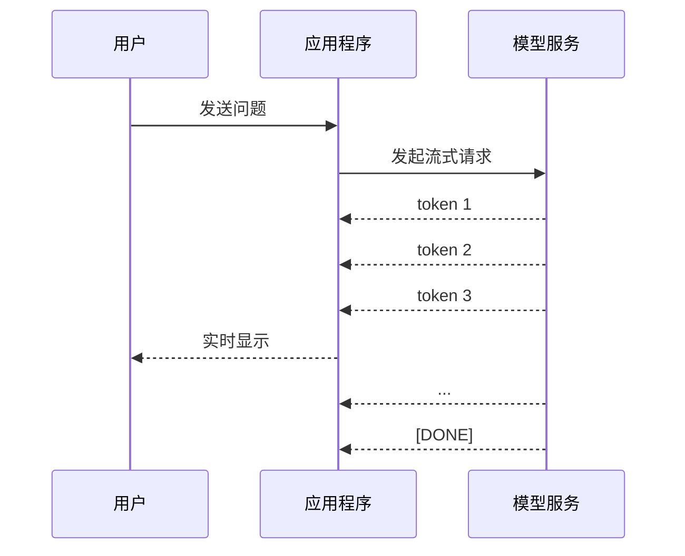

#### 2.4.2 代码实现

```python
from langchain_community.chat_models.tongyi import ChatTongyi
from langchain_core.messages import HumanMessage

# 初始化模型（云端或本地均可）
model = ChatTongyi(model="qwen-max")

# ==================== 基础流式输出 ====================
print("流式输出示例：")
print("-" * 40)

# stream方法返回生成器，每次yield一个AIMessageChunk
full_response = ""
for chunk in model.stream([HumanMessage(content="写一首关于春天的短诗")]):
    # chunk.content 包含当前生成的token
    content = chunk.content
    full_response += content
    print(content, end="", flush=True)  # end=""避免换行，flush=True立即输出

print("\n" + "-" * 40)
print(f"完整响应长度: {len(full_response)} 字符")

# ==================== 带回调的流式输出（生产环境）====================
class StreamingCallback:
    """自定义流式回调处理器"""
    
    def __init__(self):
        self.tokens = []
        self.token_count = 0
    
    def on_llm_new_token(self, token: str, **kwargs) -> None:
        """每个新token生成时调用"""
        self.tokens.append(token)
        self.token_count += 1
        # 可在此添加UI更新逻辑，如更新进度条
        if self.token_count % 10 == 0:
            print(f"\r已生成 {self.token_count} tokens", end="", flush=True)

# 使用方式（需配合LangChain回调系统）
# 详见后续章节关于Callbacks的说明
```

#### 2.4.3 流式输出应用场景

| 场景 | 实现方式 | 效果 |
|------|---------|------|
| 打字机效果 | `print(chunk, end="", flush=True)` | 逐字显示 |
| 进度反馈 | 统计token数量 | 显示生成进度 |
| 实时渲染 | WebSocket推送 | 前端实时更新 |
|  early stopping | 监控内容触发条件 | 满足条件时中断 |

---

## 第三部分：消息系统

### 章节摘要
本章节介绍了LangChain的消息系统，包括不同类型消息的作用和使用方法，帮助读者理解如何构建和管理对话上下文。

### 3.1 消息类型

LangChain的消息系统是对OpenAI Chat API消息格式的抽象，统一了不同模型供应商的消息协议。

#### 3.1.1 消息类型详解

| 类型 | 类 | 角色(role) | 作用 | 使用场景 |
|------|-----|-----------|------|---------|
| SystemMessage | 系统消息 | `system` | 设定模型角色、行为约束和全局上下文 | 定义AI助手身份、设置回答格式要求 |
| HumanMessage | 用户消息 | `user` | 用户输入的问题或指令 | 所有用户交互 |
| AIMessage | AI消息 | `assistant` | 模型的回复内容 | 存储对话历史、 few-shot示例 |
| ToolMessage | 工具消息 | `tool` | 工具调用的返回结果 | Function Calling场景 |

#### 3.1.2 消息类型继承关系

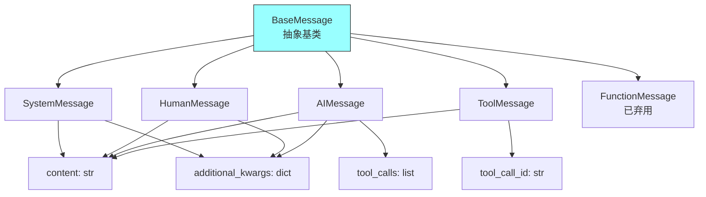

**BaseMessage核心属性**：
- `content`: 消息文本内容
- `additional_kwargs`: 额外参数，如token用量、模型名称等
- `response_metadata`: 响应元数据（仅AIMessage）

#### 3.1.3 各消息类型使用示例

```python
from langchain_core.messages import (
    SystemMessage, 
    HumanMessage, 
    AIMessage,
    ToolMessage
)

# ==================== SystemMessage ====================
# 作用：设定AI的角色和行为边界
# 注意：部分模型（如Ollama的某些版本）可能不支持system消息
system_msg = SystemMessage(content="""
你是一位专业的Python编程助手。
回答规则：
1. 代码必须包含注释
2. 先解释思路，再给出代码
3. 指出可能的边界情况
""")

# ==================== HumanMessage ====================
# 作用：封装用户输入
human_msg = HumanMessage(content="如何实现二分查找？")

# ==================== AIMessage ====================
# 作用：封装模型回复，通常用于构建对话历史
ai_msg = AIMessage(content="""
二分查找是一种在有序数组中查找目标值的高效算法。

思路：
1. 确定数组中间元素
2. 如果中间元素等于目标值，返回索引
3. 如果目标值小于中间元素，在左半部分继续查找
4. 否则在右半部分继续查找

时间复杂度：O(log n)
""")

# AIMessage还包含元数据信息
print(f"模型: {ai_msg.response_metadata.get('model_name', 'unknown')}")
print(f"Token用量: {ai_msg.response_metadata.get('token_usage', {})}")

# ==================== ToolMessage ====================
# 作用：Function Calling场景中，封装工具执行结果
tool_msg = ToolMessage(
    content="{'temperature': 25, 'city': '北京'}",  # 工具返回的JSON字符串
    tool_call_id="call_abc123"  # 对应工具调用的ID
)
```

### 3.2 简写形式

LangChain支持元组简写，自动转换为对应Message类型，简化代码编写。

#### 3.2.1 简写规则

```python
from langchain_core.messages import SystemMessage, HumanMessage, AIMessage

# ==================== 完整形式（显式创建对象）====================
# 适用场景：需要访问消息对象属性或添加额外参数
messages_explicit = [
    SystemMessage(content="你是助手"),
    HumanMessage(content="你好"),
    AIMessage(content="您好！有什么可以帮助您的？")
]

# ==================== 简写形式（推荐日常使用）====================
# 适用场景：快速构建消息列表，无需额外参数
# 规则：(role, content) 元组自动转换为对应Message类型
messages_shorthand = [
    ("system", "你是助手"),                    # 转换为 SystemMessage
    ("human", "你好"),                         # 转换为 HumanMessage
    ("ai", "您好！有什么可以帮助您的？"),       # 转换为 AIMessage
    ("tool", "工具返回结果", {"tool_call_id": "call_123"})  # 转换为 ToolMessage
]

# 验证转换结果
from langchain_core.messages import convert_to_messages
converted = convert_to_messages(messages_shorthand)
for msg in converted:
    print(f"类型: {type(msg).__name__}, 内容: {msg.content[:20]}...")
```

#### 3.2.2 简写形式的优势

| 维度 | 完整形式 | 简写形式 |
|------|---------|---------|
| 代码量 | 较多 | 简洁 |
| 可读性 | 类型明确 | 直观易懂 |
| 灵活性 | 支持额外参数 | 仅基础内容 |
| 适用场景 | 复杂逻辑 | 快速原型 |

#### 3.2.3 实际应用场景

```python
from langchain_community.chat_models.tongyi import ChatTongyi

# 场景1：构建对话历史（简写形式最常用）
conversation_history = [
    ("system", "你是Python专家"),
    ("human", "什么是装饰器？"),
    ("ai", "装饰器是Python的一种语法糖，用于在不修改原函数代码的情况下扩展功能..."),
    ("human", "能给个例子吗？")  # 继续对话
]

model = ChatTongyi(model="qwen-max")
response = model.invoke(conversation_history)
print(response.content)

# 场景2：Few-Shot提示（混合使用）
few_shot_messages = [
    ("system", "你是一个情感分析专家，只输出'正面'、'负面'或'中性'"),
    ("human", "这部电影太精彩了！"),
    ("ai", "正面"),
    ("human", "服务态度很差"),
    ("ai", "负面"),
    ("human", "今天天气晴朗"),  # 待分析的输入
]

response = model.invoke(few_shot_messages)
print(f"情感分析结果: {response.content}")
```

---

## 第四部分：提示词模板

### 章节摘要
本章节介绍了LangChain的提示词模板系统，包括PromptTemplate、FewShotPromptTemplate和ChatPromptTemplate等不同类型的模板，帮助读者构建灵活有效的提示词。

### 4.1 PromptTemplate

PromptTemplate是LangChain最基础的提示词模板，支持通过变量占位符实现动态内容注入。

#### 4.1.1 模板变量机制

```python
from langchain_core.prompts import PromptTemplate

# ==================== 基础用法 ====================
# 使用{f-string风格}定义变量占位符
template = PromptTemplate.from_template(
    "我的邻居姓{lastname}，刚生了{gender}，请起3个{name_type}的名字。"
)

# format方法：直接返回格式化后的字符串（传统方式）
prompt_text = template.format(
    lastname="张", 
    gender="女儿",
    name_type="文雅"
)
print(prompt_text)
# 输出：我的邻居姓张，刚生了女儿，请起3个文雅的名字。

# invoke方法：返回PromptValue对象（LCEL链式调用推荐）
# PromptValue对象可传递给模型，保持类型一致性
prompt_value = template.invoke({
    "lastname": "李",
    "gender": "儿子",
    "name_type": "大气"
})
print(f"PromptValue类型: {type(prompt_value)}")
print(f"文本内容: {prompt_value.to_string()[:50]}...")
```

#### 4.1.2 模板验证与部分填充

```python
# ==================== 模板验证 ====================
# 创建时指定input_variables，LangChain会验证模板与变量匹配
template_validated = PromptTemplate(
    input_variables=["product", "price"],  # 明确声明必需变量
    template="产品介绍：{product}，价格：{price}元"
)

# 如果模板中使用了未声明的变量，会抛出ValidationError
# 这有助于在开发阶段发现错误

# ==================== 部分填充（Partial）====================
# 场景：某些变量在运行时才能确定，某些变量可提前固定
base_template = PromptTemplate.from_template(
    "你是一个{role}，请用{style}风格回答：{question}"
)

# 提前固定部分变量
partial_template = base_template.partial(role="Python专家")

# 运行时只需提供剩余变量
final_prompt = partial_template.format(
    style="通俗易懂",
    question="什么是递归？"
)
print(final_prompt)

# 链式部分填充
expert_template = base_template.partial(role="专家").partial(style="严谨")
result = expert_template.format(question="解释装饰器")
```

#### 4.1.3 模板继承体系

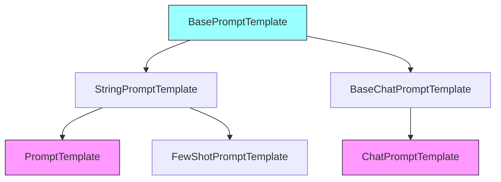

### 4.2 FewShotPromptTemplate

FewShotPromptTemplate通过提供示例（examples）引导模型学习特定输出格式，是提升模型表现的有效手段。

#### 4.2.1 工作原理

```
┌─────────────────────────────────────────────────────────┐
│  FewShotPromptTemplate 结构                              │
├─────────────────────────────────────────────────────────┤
│  [prefix: 任务说明和规则]                                │
│  ─────────────────────────────────────────────────────  │
│  [Example 1: 输入 → 输出]                                │
│  [Example 2: 输入 → 输出]                                │
│  [Example N: 输入 → 输出]                                │
│  ─────────────────────────────────────────────────────  │
│  [suffix: 用户实际输入]                                  │
└─────────────────────────────────────────────────────────┘
```

#### 4.2.2 基础用法

```python
from langchain_core.prompts import FewShotPromptTemplate, PromptTemplate

# 步骤1：定义单个示例的格式模板
# 使用{变量名}标记示例中的动态部分
example_template = PromptTemplate.from_template(
    "单词：{word}\n反义词：{antonym}\n"  # 注意换行符，使格式清晰
)

# 步骤2：准备示例数据
# 示例数量：通常3-5个即可，过多会占用上下文窗口
examples = [
    {"word": "大", "antonym": "小"},
    {"word": "上", "antonym": "下"},
    {"word": "快", "antonym": "慢"},
]

# 步骤3：组装FewShotPromptTemplate
few_shot_prompt = FewShotPromptTemplate(
    example_prompt=example_template,      # 单个示例的格式
    examples=examples,                    # 示例数据列表
    prefix="你是一个反义词专家。根据以下示例，给出单词的反义词。\n",  # 前缀指令
    suffix="单词：{input_word}\n反义词：",  # 后缀（用户输入部分）
    input_variables=["input_word"],       # 最终需要用户提供的变量
    example_separator="\n---\n"           # 示例之间的分隔符（可选）
)

# 使用示例
user_input = "高"
final_prompt = few_shot_prompt.format(input_word=user_input)
print(final_prompt)
# 输出：
# 你是一个反义词专家。根据以下示例，给出单词的反义词。
# 单词：大
# 反义词：小
# ---
# 单词：上
# 反义词：下
# ...
# 单词：高
# 反义词：
```

#### 4.2.3 动态示例选择（高级）

```python
from langchain_core.prompts import FewShotPromptTemplate, PromptTemplate
from langchain_core.example_selectors import SemanticSimilarityExampleSelector
from langchain_chroma import Chroma
from langchain_ollama import OllamaEmbeddings

# 场景：示例库很大时，只选择最相关的示例
all_examples = [
    {"query": "你好", "response": "您好！有什么可以帮助您的？"},
    {"query": "天气怎么样", "response": "今天天气晴朗，适合外出。"},
    {"query": "Python是什么", "response": "Python是一种高级编程语言..."},
    {"query": "怎么学编程", "response": "建议从基础语法开始..."},
    # ... 更多示例
]

# 使用语义相似度选择器
example_selector = SemanticSimilarityExampleSelector.from_examples(
    examples=all_examples,
    embeddings=OllamaEmbeddings(model="qwen3-embedding:4b"),
    vectorstore_cls=Chroma,
    k=2  # 只选择最相似的2个示例
)

# 构建动态FewShot模板
dynamic_few_shot = FewShotPromptTemplate(
    example_selector=example_selector,  # 使用选择器替代固定examples
    example_prompt=PromptTemplate.from_template(
        "用户：{query}\n助手：{response}"
    ),
    prefix="你是一个智能客服助手。参考以下对话示例回答问题：",
    suffix="用户：{input}\n助手：",
    input_variables=["input"]
)

# 当用户输入"想学Python"时，会自动选择"Python是什么"和"怎么学编程"作为示例
```

### 4.3 ChatPromptTemplate

ChatPromptTemplate专为对话场景设计，支持定义多轮消息的角色和内容，是构建对话系统的核心工具。

#### 4.3.1 基础结构

```python
from langchain_core.prompts import ChatPromptTemplate, MessagesPlaceholder

# ==================== 基础用法 ====================
# from_messages接收消息元组列表，每个元组为(role, content)
chat_prompt = ChatPromptTemplate.from_messages([
    # SystemMessage：设定AI角色和全局规则
    ("system", "你是一个专业的{domain}专家，回答要简洁准确。"),
    
    # MessagesPlaceholder：动态插入历史消息
    # 这是实现多轮对话记忆的关键
    MessagesPlaceholder("history"),
    
    # HumanMessage：当前用户输入
    ("human", "{input}")
])

# 使用示例
messages = chat_prompt.invoke({
    "domain": "医学",
    "history": [
        ("human", "我最近头痛"),
        ("ai", "头痛可能由多种原因引起，请问持续多久了？")
    ],
    "input": "已经持续3天了"
})

print(messages.to_messages())
# 输出消息列表，可直接传递给ChatModel
```

#### 4.3.2 MessagesPlaceholder详解

```python
from langchain_core.prompts import ChatPromptTemplate, MessagesPlaceholder

# MessagesPlaceholder的作用：在模板中预留位置，运行时动态插入消息列表
# 这是实现对话记忆的核心机制

# 方式1：使用MessagesPlaceholder（推荐）
prompt_with_placeholder = ChatPromptTemplate.from_messages([
    ("system", "你是助手"),
    MessagesPlaceholder("history"),  # 变量名可自定义
    ("human", "{input}")
])

# 方式2：使用元组简写（等效）
prompt_shorthand = ChatPromptTemplate.from_messages([
    ("system", "你是助手"),
    ("placeholder", "{history}"),  # "placeholder"是MessagesPlaceholder的简写
    ("human", "{input}")
])

# 运行时传入历史消息
result = prompt_with_placeholder.invoke({
    "history": [
        ("human", "你好"),
        ("ai", "您好！"),
        ("human", "今天天气如何？"),
        ("ai", "今天天气晴朗。")
    ],
    "input": "适合穿什么衣服？"
})

# 输出：包含完整对话历史的消息列表
```

#### 4.3.3 完整对话系统示例

```python
from langchain_core.prompts import ChatPromptTemplate, MessagesPlaceholder
from langchain_community.chat_models.tongyi import ChatTongyi
from langchain_core.output_parsers import StrOutputParser

# 构建带记忆的对话提示模板
conversation_prompt = ChatPromptTemplate.from_messages([
    ("system", """你是一个专业的技术支持助手。
规则：
1. 先确认用户问题，再给出解决方案
2. 如果信息不足，请追问
3. 保持礼貌和专业"""),
    MessagesPlaceholder("chat_history"),
    ("human", "{user_input}")
])

# 组装Chain
model = ChatTongyi(model="qwen-max")
chain = conversation_prompt | model | StrOutputParser()

# 模拟多轮对话
chat_history = []

# 第一轮
response1 = chain.invoke({
    "chat_history": chat_history,
    "user_input": "我的电脑无法开机"
})
print(f"AI: {response1}")
chat_history.extend([
    ("human", "我的电脑无法开机"),
    ("ai", response1)
])

# 第二轮（包含历史上下文）
response2 = chain.invoke({
    "chat_history": chat_history,
    "user_input": "电源灯是亮的，但屏幕黑屏"
})
print(f"AI: {response2}")
```

#### 4.3.4 模板类型选择指南

| 场景 | 推荐模板 | 原因 |
|------|---------|------|
| 简单文本生成 | PromptTemplate | 轻量，易于理解 |
| 需要示例引导 | FewShotPromptTemplate | 提升输出质量 |
| 对话系统 | ChatPromptTemplate | 支持消息角色管理 |
| RAG问答 | ChatPromptTemplate + MessagesPlaceholder | 整合检索结果和历史 |

---

## 第五部分：LCEL与Chain构建

### 章节摘要
本章节介绍了LangChain的LCEL（LangChain Expression Language）和Chain构建机制，包括组件串联、输出解析和自定义转换等功能，帮助读者构建复杂的处理流程。

### 5.1 LCEL核心概念

LCEL（LangChain Expression Language）是LangChain的声明式链式调用语法，通过管道运算符`|`串联组件，构建复杂的数据处理流程。

#### 5.1.1 设计哲学

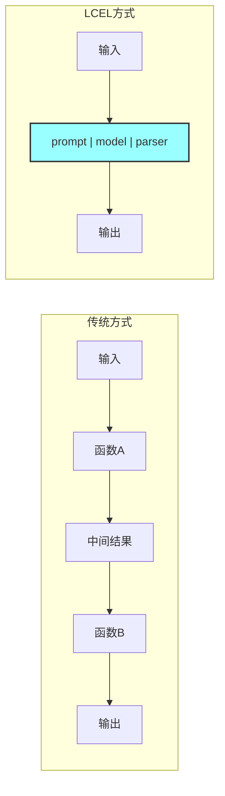

LCEL的核心优势：
- **声明式**：描述"做什么"而非"怎么做"
- **可组合**：组件像乐高积木一样拼接
- **类型安全**：数据流类型在编译期可追踪
- **统一接口**：所有组件实现`Runnable`接口

#### 5.1.2 管道运算符原理

```python
# LCEL语法
chain = prompt | model | parser

# 等价于传统写法
# chain = parser(model(prompt(input)))
```

**底层实现**：Python的运算符重载

```python
# 伪代码展示__or__方法的工作原理
class Runnable:
    def __or__(self, other: Runnable) -> "RunnableSequence":
        """
        管道运算符重载：self | other
        
        返回一个新的RunnableSequence对象，包含当前组件和下一个组件
        执行时，数据先经过self处理，再传递给other
        """
        return RunnableSequence(first=self, last=other)

class RunnableSequence(Runnable):
    def __init__(self, first: Runnable, last: Runnable):
        self.first = first
        self.last = last
    
    def invoke(self, input_data):
        # 先执行第一个组件
        intermediate = self.first.invoke(input_data)
        # 将中间结果传递给下一个组件
        return self.last.invoke(intermediate)
```

#### 5.1.3 链式调用执行流程

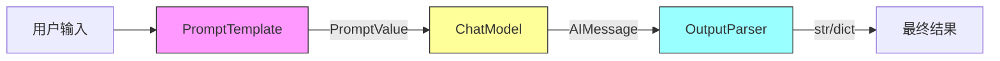

### 5.2 Runnable接口

所有LangChain组件都实现`Runnable`接口，这是LCEL能够统一调用的基础。

#### 5.2.1 核心方法

| 方法 | 签名 | 作用 | 适用场景 |
|------|------|------|---------|
| `invoke()` | `invoke(input, config)` | 同步单条处理 | 单用户请求 |
| `stream()` | `stream(input, config)` | 流式输出 | 实时响应 |
| `batch()` | `batch(inputs, config)` | 批量处理 | 高吞吐量 |
| `ainvoke()` | `ainvoke(input, config)` | 异步单条 | 异步应用 |

#### 5.2.2 方法详解与示例

```python
from langchain_core.prompts import ChatPromptTemplate
from langchain_community.chat_models.tongyi import ChatTongyi
from langchain_core.output_parsers import StrOutputParser

# 构建基础Chain
prompt = ChatPromptTemplate.from_messages([
    ("system", "你是{role}"),
    ("human", "{question}")
])
model = ChatTongyi(model="qwen-max")
parser = StrOutputParser()

chain = prompt | model | parser

# ==================== invoke：同步单条调用 ====================
# 适用：简单的请求-响应场景
result = chain.invoke({
    "role": "Python专家",
    "question": "什么是装饰器？"
})
print(result)  # 字符串输出

# ==================== stream：流式输出 ====================
# 适用：需要实时显示生成内容的场景
print("流式输出：", end=" ")
for chunk in chain.stream({"role": "诗人", "question": "写一句诗"}):
    print(chunk, end="", flush=True)
print()

# ==================== batch：批量处理 ====================
# 适用：一次性处理多个独立请求
inputs = [
    {"role": "历史学家", "question": "唐朝建立时间"},
    {"role": "地理学家", "question": "长江长度"},
    {"role": "数学家", "question": "圆周率前5位"}
]
results = chain.batch(inputs)
for i, result in enumerate(results):
    print(f"问题{i+1}回答: {result[:30]}...")

# batch还支持配置参数
results = chain.batch(inputs, config={"max_concurrency": 2})  # 限制并发数
```

#### 5.2.3 Runnable配置系统

```python
# 通过config参数传递运行时配置
config = {
    "configurable": {
        "session_id": "user_123",  # 会话ID，用于记忆管理
        "user_id": "alice"         # 用户标识
    },
    "callbacks": [],               # 回调函数列表
    "tags": ["production"],        # 标签，用于追踪
    "metadata": {"version": "1.0"} # 元数据
}

result = chain.invoke(input_data, config=config)
```

### 5.3 OutputParser解析器

OutputParser负责将模型的原始输出（通常是AIMessage）转换为结构化数据，是连接模型与应用程序的关键桥梁。

#### 5.3.1 解析器类型对比

| 解析器 | 作用 | 输入 | 输出类型 | 适用场景 |
|--------|------|------|---------|---------|
| `StrOutputParser` | 提取文本内容 | AIMessage | `str` | 通用文本生成 |
| `JsonOutputParser` | 解析JSON结构 | AIMessage | `dict` | 结构化数据提取 |
| `PydanticOutputParser` | 解析为Pydantic模型 | AIMessage | Pydantic对象 | 数据验证场景 |
| `CommaSeparatedListOutputParser` | 解析逗号分隔列表 | AIMessage | `List[str]` | 列表生成 |

#### 5.3.2 StrOutputParser详解

```python
from langchain_core.output_parsers import StrOutputParser
from langchain_core.messages import AIMessage

# StrOutputParser是最常用的解析器
# 它从AIMessage中提取content字段
parser = StrOutputParser()

# 模拟模型输出
ai_message = AIMessage(content="这是模型的回答内容")

# 解析
result = parser.invoke(ai_message)
print(result)  # 输出：这是模型的回答内容
print(type(result))  # 输出：<class 'str'>

# 在Chain中使用
chain = prompt | model | StrOutputParser()
# 最终输出为字符串，无需再处理AIMessage对象
```

#### 5.3.3 JsonOutputParser详解

```python
from langchain_core.output_parsers import JsonOutputParser
from langchain_core.pydantic_v1 import BaseModel, Field

# 方式1：直接解析JSON字符串
json_parser = JsonOutputParser()

# 模型需要被提示输出JSON格式
json_prompt = """
请分析以下产品评价，以JSON格式输出结果。
要求包含以下字段：
- sentiment: 情感倾向（positive/negative/neutral）
- keywords: 关键词列表
- score: 评分（1-10）

评价：{review}
"""

# 假设模型输出：
# {"sentiment": "positive", "keywords": ["质量好", "物流快"], "score": 9}

# 解析为Python字典
result = json_parser.invoke('{"sentiment": "positive", "score": 9}')
print(result["sentiment"])  # 输出：positive

# 方式2：结合Pydantic模型（推荐）
class ReviewAnalysis(BaseModel):
    """产品评价分析结果"""
    sentiment: str = Field(description="情感倾向：positive/negative/neutral")
    keywords: list = Field(description="关键词列表")
    score: int = Field(description="评分1-10", ge=1, le=10)

# 创建带格式说明的解析器
structured_parser = JsonOutputParser(pydantic_object=ReviewAnalysis)

# 获取格式说明（可插入到prompt中）
format_instructions = structured_parser.get_format_instructions()
print(format_instructions)
# 输出包含JSON Schema的格式说明

# 完整使用示例
from langchain_core.prompts import PromptTemplate

prompt = PromptTemplate.from_template("""
分析以下产品评价。
{format_instructions}

评价：{review}
""")

# 将format_instructions注入模板
prompt_with_format = prompt.partial(format_instructions=format_instructions)

chain = prompt_with_format | model | structured_parser
result = chain.invoke({"review": "产品质量很好，物流也很快！"})
print(result.sentiment)  # 输出：positive
print(result.score)      # 输出：9
```

### 5.4 RunnableLambda自定义转换

RunnableLambda允许将普通Python函数转换为Runnable组件，无缝接入LCEL链。

#### 5.4.1 基础用法

```python
from langchain_core.runnables import RunnableLambda

# ==================== 方式1：lambda表达式（简单场景）====================
# 适用于简单的数据转换
chain = prompt | model | (lambda msg: {"response": msg.content, "length": len(msg.content)})

# ==================== 方式2：普通函数（推荐）====================
# 适用于复杂逻辑，可添加类型提示和文档

def extract_and_enhance(msg) -> dict:
    """
    提取消息内容并添加元数据
    
    Args:
        msg: AIMessage对象
    
    Returns:
        dict: 包含回答内容和元数据的字典
    """
    content = msg.content
    return {
        "answer": content,
        "word_count": len(content.split()),
        "char_count": len(content),
        "has_code": "```" in content  # 检测是否包含代码块
    }

# 装饰器方式转换为Runnable
@RunnableLambda
def format_response(msg):
    """格式化响应输出"""
    return {
        "data": msg.content,
        "status": "success",
        "timestamp": "2024-01-01"
    }

# 直接使用函数（LangChain会自动包装）
chain = prompt | model | extract_and_enhance
```

#### 5.4.2 RunnableLambda高级特性

```python
from langchain_core.runnables import RunnableLambda

# 带配置访问的自定义函数
def custom_process(input_data: dict, config: dict) -> dict:
    """
    访问运行时配置的自定义处理函数
    
    config包含：
    - configurable: 用户自定义配置
    - callbacks: 回调列表
    - tags: 标签
    """
    # 获取会话ID
    session_id = config.get("configurable", {}).get("session_id", "default")
    
    # 根据配置调整行为
    user_tier = config.get("configurable", {}).get("user_tier", "free")
    max_length = 500 if user_tier == "free" else 2000
    
    content = input_data.content if hasattr(input_data, 'content') else str(input_data)
    
    return {
        "content": content[:max_length],
        "session_id": session_id,
        "truncated": len(content) > max_length
    }

# 包装为Runnable
runnable_fn = RunnableLambda(custom_process)

# 使用
config = {"configurable": {"session_id": "sess_123", "user_tier": "premium"}}
result = runnable_fn.invoke(some_input, config=config)
```

#### 5.4.3 复杂数据流处理

```python
from langchain_core.runnables import RunnablePassthrough, RunnableLambda

# RunnablePassthrough：原样传递输入，常用于并行分支
# 场景：同时需要原始输入和处理后的结果

chain = (
    {
        # 分支1：原始输入
        "original": RunnablePassthrough(),
        # 分支2：处理后的结果
        "processed": prompt | model | StrOutputParser()
    }
    | RunnableLambda(lambda x: {
        "query": x["original"]["question"],
        "answer": x["processed"],
        "timestamp": "2024-01-01"
    })
)

# 执行结果包含原始查询和处理后的回答
result = chain.invoke({"question": "什么是AI？"})
# 输出：{"query": "什么是AI？", "answer": "AI是人工智能...", "timestamp": "..."}
```

---

## 第六部分：会话记忆

### 章节摘要
本章节介绍了LangChain的会话记忆系统，包括临时会话记忆和长期会话记忆的实现方法，帮助读者构建具有上下文理解能力的对话系统。

### 6.1 临时会话记忆

临时会话记忆将对话历史存储在内存中，适用于单会话场景，进程结束后数据丢失。

#### 6.1.1 工作原理

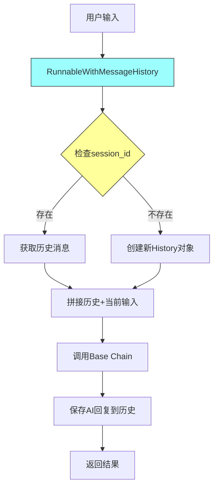

#### 6.1.2 基础实现

```python
from langchain_core.runnables.history import RunnableWithMessageHistory
from langchain_core.chat_history import InMemoryChatMessageHistory
from langchain_core.prompts import ChatPromptTemplate, MessagesPlaceholder
from langchain_community.chat_models.tongyi import ChatTongyi
from langchain_core.output_parsers import StrOutputParser

# ==================== 步骤1：创建全局存储 ====================
# 使用字典存储所有会话的历史
# 键：session_id，值：InMemoryChatMessageHistory对象
session_store = {}

def get_session_history(session_id: str) -> InMemoryChatMessageHistory:
    """
    获取指定会话的历史记录
    
    策略：
    - 如果session_id不存在，创建新的History对象
    - 如果已存在，返回现有的History对象
    
    注意：此函数会被RunnableWithMessageHistory在每次调用时执行
    """
    if session_id not in session_store:
        # 创建新的内存历史存储
        session_store[session_id] = InMemoryChatMessageHistory()
    return session_store[session_id]

# ==================== 步骤2：构建基础Chain ====================
# 提示模板必须包含MessagesPlaceholder用于插入历史消息
prompt = ChatPromptTemplate.from_messages([
    ("system", "你是一个 helpful 的AI助手。"),
    MessagesPlaceholder("chat_history"),  # 历史消息占位符
    ("human", "{input}")                  # 当前用户输入
])

model = ChatTongyi(model="qwen-max")
base_chain = prompt | model | StrOutputParser()

# ==================== 步骤3：包装为带记忆的Chain ====================
conversation_chain = RunnableWithMessageHistory(
    base_chain,                           # 基础Chain
    get_session_history,                  # 获取历史的函数
    input_messages_key="input",           # 输入字典中用户消息的键名
    history_messages_key="chat_history"   # 历史消息在模板中的变量名
)

# ==================== 步骤4：使用 ====================
# 第一轮对话
response1 = conversation_chain.invoke(
    {"input": "你好，我叫张三"},
    config={"configurable": {"session_id": "user_001"}}
)
print(f"AI: {response1}")

# 第二轮对话（自动包含历史）
response2 = conversation_chain.invoke(
    {"input": "我叫什么名字？"},  # AI能记住"张三"
    config={"configurable": {"session_id": "user_001"}}
)
print(f"AI: {response2}")

# 不同session_id，历史隔离
response3 = conversation_chain.invoke(
    {"input": "我叫什么名字？"},  # AI不知道，因为是新会话
    config={"configurable": {"session_id": "user_002"}}
)
```

#### 6.1.3 内存存储的局限性

| 特性 | 说明 | 影响 |
|------|------|------|
| 生命周期 | 与进程绑定 | 重启后历史丢失 |
| 容量 | 受限于内存 | 大量会话可能OOM |
| 共享 | 单进程内有效 | 多实例部署无法共享 |
| 持久化 | 无 | 数据安全风险 |

### 6.2 长期会话记忆

长期会话记忆将对话历史持久化到文件或数据库，进程重启后数据仍可恢复。

#### 6.2.1 自定义文件存储实现

```python
import os
import json
from typing import List
from langchain_core.chat_history import BaseChatMessageHistory
from langchain_core.messages import (
    BaseMessage, 
    message_to_dict, 
    messages_from_dict,
    HumanMessage,
    AIMessage
)

class FileChatMessageHistory(BaseChatMessageHistory):
    """
    基于文件的对话历史存储
    
    实现原理：
    - 每个session_id对应一个JSON文件
    - 消息以字典列表形式存储
    - 支持增量写入，避免频繁IO
    """
    
    def __init__(self, session_id: str, storage_path: str = "./chat_history"):
        """
        初始化文件历史存储
        
        Args:
            session_id: 会话唯一标识
            storage_path: 存储目录路径
        """
        self.session_id = session_id
        self.storage_path = storage_path
        
        # 确保存储目录存在
        os.makedirs(storage_path, exist_ok=True)
        
        # 文件路径：{storage_path}/{session_id}.json
        self.file_path = os.path.join(storage_path, f"{session_id}.json")
        
        # 内存缓存，减少文件读取
        self._cache: List[BaseMessage] = None
    
    @property
    def messages(self) -> List[BaseMessage]:
        """
        获取所有历史消息
        
        实现：
        1. 检查内存缓存
        2. 如果缓存为空，从文件加载
        3. 将JSON字典列表转换为BaseMessage对象列表
        """
        # 优先使用缓存
        if self._cache is not None:
            return self._cache
        
        # 文件不存在，返回空列表
        if not os.path.exists(self.file_path):
            self._cache = []
            return self._cache
        
        # 从JSON文件加载
        try:
            with open(self.file_path, 'r', encoding='utf-8') as f:
                data = json.load(f)
                # messages_from_dict：将字典列表转换为消息对象列表
                self._cache = messages_from_dict(data)
        except (json.JSONDecodeError, IOError) as e:
            # 防御性编程：文件损坏时返回空列表
            print(f"Warning: 读取历史记录失败: {e}")
            self._cache = []
        
        return self._cache
    
    def add_messages(self, messages: List[BaseMessage]) -> None:
        """
        添加新消息到历史
        
        实现：
        1. 读取现有历史
        2. 追加新消息
        3. 写回文件
        4. 更新缓存
        """
        # 获取现有历史（使用property，自动处理缓存）
        existing_messages = list(self.messages)
        
        # 追加新消息
        all_messages = existing_messages + list(messages)
        
        # 将消息对象转换为可序列化的字典
        # message_to_dict：将BaseMessage转换为字典格式
        data = [message_to_dict(msg) for msg in all_messages]
        
        # 写入文件（原子操作，避免数据损坏）
        temp_path = f"{self.file_path}.tmp"
        try:
            with open(temp_path, 'w', encoding='utf-8') as f:
                json.dump(data, f, ensure_ascii=False, indent=2)
            # 原子重命名，确保写入完整性
            os.replace(temp_path, self.file_path)
            
            # 更新缓存
            self._cache = all_messages
        except IOError as e:
            print(f"Error: 保存历史记录失败: {e}")
            raise
    
    def clear(self) -> None:
        """清空历史记录"""
        self._cache = []
        if os.path.exists(self.file_path):
            os.remove(self.file_path)


# ==================== 使用自定义存储 ====================

def get_file_history(session_id: str) -> FileChatMessageHistory:
    """获取文件存储的历史记录"""
    return FileChatMessageHistory(session_id, storage_path="./history")

# 构建带持久化的对话Chain
persistent_chain = RunnableWithMessageHistory(
    base_chain,
    get_file_history,
    input_messages_key="input",
    history_messages_key="chat_history"
)

# 使用方式与内存版相同，但数据会持久化到文件
response = persistent_chain.invoke(
    {"input": "记住我的邮箱是xxx@example.com"},
    config={"configurable": {"session_id": "user_001"}}
)
# 重启程序后，再次使用相同session_id，仍能获取历史
```

#### 6.2.2 存储方案对比

| 方案 | 优点 | 缺点 | 适用场景 |
|------|------|------|---------|
| InMemoryChatMessageHistory | 速度快，实现简单 | 进程结束数据丢失 | 开发测试、临时会话 |
| FileChatMessageHistory | 持久化，成本低 | 文件IO可能成为瓶颈 | 个人项目、小流量 |
| RedisChatMessageHistory | 高性能，可共享 | 需要Redis服务 | 生产环境、分布式部署 |
| SQLChatMessageHistory | 结构化，可查询 | 需要数据库 | 需要分析历史数据 |

#### 6.2.3 消息序列化格式

```python
# message_to_dict的输出格式示例
{
    "type": "human",  # 消息类型：human/ai/system/tool
    "data": {
        "content": "用户输入内容",
        "additional_kwargs": {},
        "response_metadata": {},
        "type": "human",
        "name": None,
        "id": None,
        "example": False
    }
}

# AIMessage示例
{
    "type": "ai",
    "data": {
        "content": "AI回复内容",
        "additional_kwargs": {},
        "response_metadata": {
            "model_name": "qwen-max",
            "token_usage": {"input_tokens": 10, "output_tokens": 20}
        },
        "type": "ai",
        "name": None,
        "id": "run-xxx",
        "tool_calls": [],
        "invalid_tool_calls": []
    }
}
```

---

## 第七部分：文档加载与分割

### 章节摘要
本章节介绍了LangChain的文档处理系统，包括不同类型的文档加载器和文档分割器，帮助读者实现文档的有效处理和管理。

### 7.1 文档加载器

文档加载器负责从各种格式的文件中提取文本内容，转换为LangChain的`Document`对象。

#### 7.1.1 依赖库安装

```bash
# 基础加载器（已包含在langchain-community中）
pip install langchain-community

# PDF支持（必需）
pip install pypdf

# JSON高级解析（可选，用于复杂JSON结构）
pip install jq

# 其他格式支持
pip install unstructured          # 通用文档解析（Word、PPT等）
pip install markdown              # Markdown解析
pip install beautifulsoup4        # HTML解析
```

#### 7.1.2 加载器类型对比

| 加载器 | 适用格式 | 依赖库 | 特点 | 典型场景 |
|--------|---------|--------|------|---------|
| `TextLoader` | `.txt` | 无 | 简单文本读取 | 日志文件、纯文本 |
| `CSVLoader` | `.csv` | 无 | 每行一个Document | 表格数据、问答对 |
| `JSONLoader` | `.json` | `jq`（可选） | 支持jq_schema | 结构化数据 |
| `PyPDFLoader` | `.pdf` | `pypdf` | 支持密码、多页 | 论文、报告 |
| `UnstructuredMarkdownLoader` | `.md` | `unstructured` | 保留结构 | 技术文档 |
| `BSHTMLLoader` | `.html` | `beautifulsoup4` | 提取正文 | 网页内容 |

#### 7.1.3 TextLoader详解

```python
from langchain_community.document_loaders import TextLoader

# 基础用法
loader = TextLoader(
    file_path="./document.txt",    # 文件路径
    encoding="utf-8"                # 文件编码，默认utf-8
)

# load()方法返回Document对象列表
docs = loader.load()

# Document对象结构
for doc in docs:
    print(f"内容: {doc.page_content[:100]}...")  # 文本内容
    print(f"元数据: {doc.metadata}")              # 文件路径等信息

# 懒加载（大文件推荐）
# lazy_load()返回生成器，逐行读取，节省内存
for doc in loader.lazy_load():
    process(doc)  # 逐文档处理
```

#### 7.1.4 CSVLoader详解

```python
from langchain_community.document_loaders import CSVLoader

# 基础用法
loader = CSVLoader(
    file_path="./data.csv",
    encoding="utf-8"
)
docs = loader.load()

# 高级配置
loader_advanced = CSVLoader(
    file_path="./data.csv",
    source_column="title",         # 指定哪列作为source元数据
    metadata_columns=["author", "date"],  # 额外保留的元数据列
    csv_args={                     # 传递给csv.DictReader的参数
        "delimiter": ",",          # 分隔符
        "quotechar": '"',          # 引号字符
        "fieldnames": ["col1", "col2"]  # 自定义列名（无表头时）
    }
)

# CSV文件示例
# title,content,author,date
# "文章1","内容1","张三","2024-01-01"
# "文章2","内容2","李四","2024-01-02"

# 加载后的Document
# doc.page_content = "title: 文章1\ncontent: 内容1\nauthor: 张三\ndate: 2024-01-01"
# doc.metadata = {"source": "文章1", "author": "张三", "date": "2024-01-01", "row": 0}
```

#### 7.1.5 JSONLoader详解

```python
from langchain_community.document_loaders import JSONLoader
import json

# 依赖检查：使用jq_schema需要安装jq库
# pip install jq

# 示例JSON文件
json_data = {
    "articles": [
        {"title": "文章1", "content": "内容1", "tags": ["AI", "ML"]},
        {"title": "文章2", "content": "内容2", "tags": ["Python"]}
    ]
}

# 方式1：使用jq_schema（推荐，功能强大）
loader_jq = JSONLoader(
    file_path="./data.json",
    jq_schema=".articles[]",        # jq语法：提取articles数组的每个元素
    content_key="content",          # 指定哪个字段作为page_content
    metadata_func=lambda record, metadata: {  # 自定义元数据提取
        **metadata,
        "title": record.get("title"),
        "tags": record.get("tags", [])
    }
)

# jq_schema常用语法：
# "."                    # 根对象
# ".articles"            # 取articles字段
# ".articles[]"          # 遍历articles数组
# ".articles[0]"         # 取第一个元素
# ".articles[].title"    # 取所有title

# 方式2：不使用jq（简单场景）
loader_simple = JSONLoader(
    file_path="./data.json",
    jq_schema=".",                  # 整个JSON对象
    content_key=None,               # 将整个JSON作为内容
    is_content_key_jq_parsable=False
)

# JSON Lines格式（每行一个JSON对象）
loader_jsonl = JSONLoader(
    file_path="./data.jsonl",
    jq_schema=".",
    json_lines=True                 # 启用JSON Lines模式
)
```

#### 7.1.6 PyPDFLoader详解

```python
from langchain_community.document_loaders import PyPDFLoader

# 依赖：pip install pypdf

# 基础用法
loader = PyPDFLoader(
    file_path="./document.pdf",
    # password="1234"              # 如果PDF有密码保护
)

# 加载所有页面
docs = loader.load()
print(f"总页数: {len(docs)}")

# 每页一个Document对象
for i, doc in enumerate(docs):
    print(f"第{i+1}页内容: {doc.page_content[:200]}...")
    print(f"元数据: {doc.metadata}")  # 包含page、source等信息

# 懒加载（大PDF推荐）
for doc in loader.lazy_load():
    # 逐页处理，内存友好
    process_page(doc)

# 多页模式（默认）vs 单页模式
# PyPDFLoader默认将每页作为一个Document
# 如需整PDF作为一个Document，需手动合并或使用其他加载器
```

#### 7.1.7 加载器选择决策树

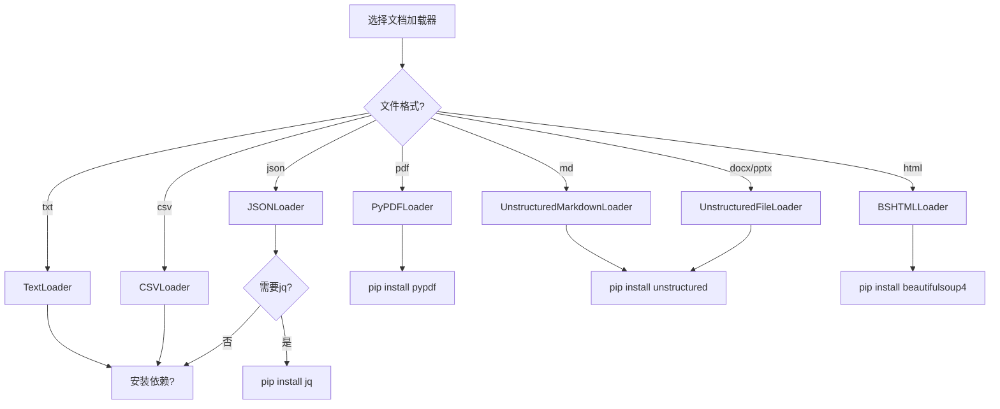

### 7.2 文档分割器

文档分割器将长文档切分为适合向量化的片段，是RAG系统的关键步骤。

#### 7.2.1 为什么需要文档分割

| 问题 | 说明 | 解决方案 |
|------|------|---------|
| 上下文窗口限制 | 模型有最大token限制 | 分割为小块 |
| 检索精度 | 长文档语义模糊 | 细粒度片段 |
| 向量维度 | 过长文本向量化质量下降 | 控制chunk大小 |
| 相关性 | 整文档包含无关信息 | 精准片段匹配 |

#### 7.2.2 RecursiveCharacterTextSplitter详解

```python
from langchain_text_splitters import RecursiveCharacterTextSplitter

# 核心原理：递归尝试分隔符，优先保持语义完整
# 1. 先尝试第一个分隔符（如\n\n，段落）
# 2. 如果仍超长，尝试第二个分隔符（如\n，行）
# 3. 继续递归，直到满足chunk_size

splitter = RecursiveCharacterTextSplitter(
    chunk_size=500,           # 每个片段的最大字符数
    chunk_overlap=50,         # 相邻片段的重叠字符数
    length_function=len,      # 长度计算函数（默认字符数）
    separators=[              # 分隔符优先级列表（从高到低）
        "\n\n",               # 段落分隔（最优先）
        "\n",                 # 行分隔
        "。",                 # 句号（中文）
        "！",                 # 感叹号（中文）
        "？",                 # 问号（中文）
        " ",                  # 空格
        ""                    # 字符级分割（最后手段）
    ],
    is_separator_regex=False  # 分隔符是否为正则表达式
)

# 使用示例
text = """
第一章 概述

这是第一章的内容。介绍了项目背景和目标。

第二章 技术方案

这是第二章的内容。详细描述了技术架构。
包含多个小节。
"""

chunks = splitter.split_text(text)
for i, chunk in enumerate(chunks):
    print(f"片段{i+1} ({len(chunk)}字符): {chunk[:50]}...")
```

#### 7.2.3 分割参数调优指南

| 参数 | 建议值 | 说明 |
|------|--------|------|
| `chunk_size` | 500-1000 | 根据模型上下文窗口调整 |
| `chunk_overlap` | 50-200 | 通常为chunk_size的10%-20% |
| `chunk_size`（中文） | 300-500 | 中文字符信息密度高，可适当减小 |

**重叠的作用**：
- 保持语义连贯性，避免关键信息被切分在边界
- 提高检索召回率，确保相关内容不被遗漏

```python
# 示例：重叠如何工作
text = "这是第一句。这是第二句。这是第三句。"
# chunk_size=20, chunk_overlap=10
# 结果：
# 片段1: "这是第一句。这是第二句。" (20字符)
# 片段2: "这是第二句。这是第三句。" (20字符，重叠10字符)
```

#### 7.2.4 其他分割器

```python
from langchain_text_splitters import (
    CharacterTextSplitter,      # 按字符简单分割
    TokenTextSplitter,          # 按token分割（需tiktoken）
    MarkdownHeaderTextSplitter, # 按Markdown标题分割
    HTMLHeaderTextSplitter      # 按HTML标签分割
)

# TokenTextSplitter（更精准，按模型token计算）
# 依赖：pip install tiktoken

token_splitter = TokenTextSplitter(
    chunk_size=512,      # token数而非字符数
    chunk_overlap=50,
    model_name="gpt-3.5-turbo"  # 指定模型以使用对应tokenizer
)

# MarkdownHeaderTextSplitter（保留文档结构）
md_splitter = MarkdownHeaderTextSplitter(
    headers_to_split_on=[
        ("#", "Header 1"),
        ("##", "Header 2"),
        ("###", "Header 3")
    ]
)
# 分割后的Document会保留header元数据
```

#### 7.2.5 完整处理流程

```python
from langchain_community.document_loaders import PyPDFLoader
from langchain_text_splitters import RecursiveCharacterTextSplitter

# 步骤1：加载文档
loader = PyPDFLoader("./paper.pdf")
docs = loader.load()
print(f"原始文档数: {len(docs)} 页")

# 步骤2：配置分割器
splitter = RecursiveCharacterTextSplitter(
    chunk_size=500,
    chunk_overlap=50,
    separators=["\n\n", "\n", "。", "！", "？", " ", ""]
)

# 步骤3：执行分割
# split_documents方法自动处理Document列表
split_docs = splitter.split_documents(docs)
print(f"分割后片段数: {len(split_docs)}")

# 步骤4：查看结果
for i, doc in enumerate(split_docs[:3]):  # 只看前3个
    print(f"\n片段{i+1}:")
    print(f"  内容: {doc.page_content[:100]}...")
    print(f"  元数据: {doc.metadata}")  # 保留原始source和page信息
    print(f"  长度: {len(doc.page_content)} 字符")

# 步骤5：向量化（后续步骤）
# from langchain_chroma import Chroma
# vector_store = Chroma.from_documents(split_docs, embeddings)
```

---

## 第八部分：向量存储与RAG

### 章节摘要
本章节介绍了LangChain的向量存储系统和RAG（检索增强生成）技术，包括嵌入模型的使用、向量存储的实现和RAG系统的构建方法，帮助读者实现智能文档检索和问答。

### 8.1 嵌入模型

嵌入模型（Embedding Model）将文本转换为高维向量，是RAG系统的核心技术。文本的语义相似度转化为向量空间中的距离度量。

#### 8.1.1 嵌入模型原理

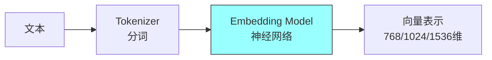

**关键概念**：
- **维度（Dimension）**：向量长度，常见768、1024、1536维
- **上下文窗口**：模型能处理的最大token数
- **语义空间**：向量所在的高维空间，语义相近的文本距离近

#### 8.1.2 阿里云DashScope嵌入

```python
import os
from langchain_community.embeddings import DashScopeEmbeddings

# 安全规范：从环境变量读取API密钥
os.environ["DASHSCOPE_API_KEY"] = os.getenv("DASHSCOPE_API_KEY", "")

# 初始化嵌入模型
embeddings = DashScopeEmbeddings(
    model="text-embedding-v2",    # 模型名称
    # 可选模型：
    # - text-embedding-v1: 1536维
    # - text-embedding-v2: 1536维，性能更好
    # - text-embedding-v3: 支持更多语言
)

# ==================== 单文本向量化 ====================
text = "我喜欢你"
vector = embeddings.embed_query(text)
print(f"向量维度: {len(vector)}")  # 输出：1536
print(f"向量前5个值: {vector[:5]}")  # 浮点数列表

# ==================== 批量向量化（推荐）====================
texts = [
    "今天天气很好",
    "明天可能会下雨",
    "Python是编程语言"
]
vectors = embeddings.embed_documents(texts)
print(f"批量向量数量: {len(vectors)}")
print(f"每个向量维度: {len(vectors[0])}")

# ==================== 相似度计算示例 ====================
import numpy as np

def cosine_similarity(a, b):
    """计算余弦相似度"""
    return np.dot(a, b) / (np.linalg.norm(a) * np.linalg.norm(b))

vec1 = embeddings.embed_query("猫")
vec2 = embeddings.embed_query("狗")
vec3 = embeddings.embed_query("汽车")

print(f"猫 vs 狗 相似度: {cosine_similarity(vec1, vec2):.4f}")      # 较高
print(f"猫 vs 汽车 相似度: {cosine_similarity(vec1, vec3):.4f}")    # 较低
```

#### 8.1.3 本地Ollama嵌入

```python
from langchain_ollama import OllamaEmbeddings

# 初始化本地嵌入模型
local_embeddings = OllamaEmbeddings(
    model="qwen3-embedding:4b",      # 本地模型名称
    base_url="http://localhost:11434"  # Ollama服务地址
)

# 使用方法与云端完全一致
text = "这是一个测试文本"
vector = local_embeddings.embed_query(text)
print(f"本地模型向量维度: {len(vector)}")

# 批量向量化
texts = ["文本1", "文本2", "文本3"]
vectors = local_embeddings.embed_documents(texts)
```

#### 8.1.4 嵌入模型选择指南

| 模型 | 维度 | 优势 | 适用场景 |
|------|------|------|---------|
| DashScope-v2 | 1536 | 中文效果好，稳定 | 生产环境 |
| Ollama Embedding |  varies | 离线可用，免费 | 本地开发 |
| OpenAI text-embedding-3 | 1536/3072 | 多语言强 | 国际化应用 |

**重要原则**：同一RAG系统中，文档存储和查询必须使用**相同的嵌入模型**，否则相似度计算无意义。

### 8.2 内存向量存储

InMemoryVectorStore将向量存储在内存中，适用于小规模数据和原型开发。

#### 8.2.1 基础操作

```python
from langchain_core.vectorstores import InMemoryVectorStore
from langchain_core.documents import Document

# 初始化向量存储
vector_store = InMemoryVectorStore(embedding=embeddings)

# ==================== 添加文档 ====================
# 准备文档
docs = [
    Document(
        page_content="Python是一种高级编程语言",
        metadata={"source": "python_intro", "category": "编程"}
    ),
    Document(
        page_content="JavaScript用于网页开发",
        metadata={"source": "js_intro", "category": "编程"}
    ),
    Document(
        page_content="机器学习是AI的一个分支",
        metadata={"source": "ml_intro", "category": "AI"}
    )
]

# 添加文档（自动生成ID）
ids = vector_store.add_documents(documents=docs)
print(f"添加的文档ID: {ids}")

# 添加时指定自定义ID
ids_custom = vector_store.add_documents(
    documents=docs,
    ids=["doc_1", "doc_2", "doc_3"]
)

# ==================== 相似度检索 ====================
query = "什么是Python？"
results = vector_store.similarity_search(
    query=query,
    k=2  # 返回最相似的2个结果
)

print(f"查询: {query}")
for i, doc in enumerate(results):
    print(f"\n结果{i+1}:")
    print(f"  内容: {doc.page_content}")
    print(f"  元数据: {doc.metadata}")

# ==================== 带分数的检索 ====================
# similarity_search_with_score返回(Document, score)元组
results_with_score = vector_store.similarity_search_with_score(query, k=2)
for doc, score in results_with_score:
    print(f"内容: {doc.page_content[:30]}... 相似度: {score:.4f}")

# ==================== 删除文档 ====================
vector_store.delete(["doc_1"])  # 按ID删除

# ==================== 清空存储 ====================
vector_store = InMemoryVectorStore(embedding=embeddings)  # 重新初始化
```

#### 8.2.2 内存存储的局限性

| 限制 | 说明 | 解决方案 |
|------|------|---------|
| 数据丢失 | 进程结束数据消失 | 使用持久化存储 |
| 容量限制 | 受限于内存大小 | 使用磁盘存储 |
| 无法共享 | 多进程间无法共享 | 使用服务化存储 |
| 无索引优化 | 暴力搜索，大数据量慢 | 使用ANN索引 |

### 8.3 持久化向量存储

Chroma是开源的嵌入式向量数据库，支持持久化存储和高效检索。

#### 8.3.1 依赖安装

```bash
pip install langchain-chroma
```

#### 8.3.2 Chroma基础使用

```python
from langchain_chroma import Chroma

# 初始化Chroma向量存储
vector_store = Chroma(
    collection_name="my_collection",      # 集合名称（类似数据库表）
    embedding_function=embeddings,         # 嵌入模型
    persist_directory="./chroma_db"        # 持久化目录
)

# ==================== 添加文档 ====================
from langchain_core.documents import Document

docs = [
    Document(page_content="LangChain是LLM应用框架", metadata={"source": "doc1"}),
    Document(page_content="RAG是检索增强生成", metadata={"source": "doc2"}),
    Document(page_content="向量数据库用于语义检索", metadata={"source": "doc3"}),
]

# 添加文档并获取ID
ids = vector_store.add_documents(documents=docs)
print(f"文档ID: {ids}")

# 数据会自动持久化到./chroma_db目录

# ==================== 基础检索 ====================
query = "什么是RAG？"
results = vector_store.similarity_search(query, k=2)
for doc in results:
    print(f"内容: {doc.page_content}")
```

#### 8.3.3 元数据过滤

```python
# Chroma支持基于元数据的过滤检索
# 这在RAG中非常有用，如只检索特定来源的文档

# 准备带元数据的文档
docs_with_metadata = [
    Document(
        page_content="Python基础语法介绍",
        metadata={"source": "python_book", "chapter": "ch1", "level": "beginner"}
    ),
    Document(
        page_content="Python高级特性",
        metadata={"source": "python_book", "chapter": "ch5", "level": "advanced"}
    ),
    Document(
        page_content="Java入门教程",
        metadata={"source": "java_book", "chapter": "ch1", "level": "beginner"}
    ),
]

vector_store.add_documents(docs_with_metadata)

# 检索时过滤：只返回Python相关的文档
results = vector_store.similarity_search(
    query="编程语言",
    k=3,
    filter={"source": "python_book"}  # 元数据过滤条件
)

# 复杂过滤（Chroma支持的操作符）
# $eq - 等于
# $ne - 不等于
# $gt - 大于
# $gte - 大于等于
# $lt - 小于
# $lte - 小于等于
# $in - 在列表中
# $nin - 不在列表中
# $and - 逻辑与
# $or - 逻辑或

# 示例：高级章节且来自python_book
complex_filter = {
    "$and": [
        {"source": {"$eq": "python_book"}},
        {"level": {"$eq": "advanced"}}
    ]
}

results_filtered = vector_store.similarity_search(
    "Python内容",
    k=3,
    filter=complex_filter
)
```

#### 8.3.4 向量存储管理

```python
# ==================== 更新文档 ====================
# Chroma支持通过ID更新文档
vector_store.update_document(
    document_id="doc_1",
    document=Document(page_content="更新后的内容", metadata={"source": "updated"})
)

# ==================== 删除文档 ====================
vector_store.delete(ids=["doc_1", "doc_2"])

# 按过滤条件删除
vector_store.delete(filter={"source": "old_docs"})

# ==================== 获取存储统计 ====================
collection = vector_store._collection
count = collection.count()
print(f"存储的文档数量: {count}")

# ==================== 重置集合 ====================
# 删除所有数据（谨慎使用）
vector_store.delete_collection()
# 或重新初始化
vector_store = Chroma(
    collection_name="my_collection",
    embedding_function=embeddings,
    persist_directory="./chroma_db"
)
```

#### 8.3.5 向量存储对比

| 特性 | InMemoryVectorStore | Chroma | FAISS | Pinecone |
|------|---------------------|--------|-------|----------|
| 持久化 | ❌ | ✅ | ✅（需手动） | ✅ |
| 元数据过滤 | ❌ | ✅ | ❌ | ✅ |
| 本地/云端 | 本地 | 本地 | 本地 | 云端 |
| 适用规模 | 小规模 | 中规模 | 大规模 | 大规模 |
| 部署复杂度 | 低 | 低 | 中 | 低 |

---

## 第九部分：完整RAG流程

### 章节摘要
本章节介绍了完整的RAG（检索增强生成）流程，包括基础RAG Chain的构建、复杂Chain的数据流管理和多模型串联等高级应用，帮助读者实现端到端的RAG系统。

### 9.1 基础RAG Chain

基础RAG Chain实现"检索-生成"的最小闭环，是理解RAG系统的最佳起点。

#### 9.1.1 RAG核心流程

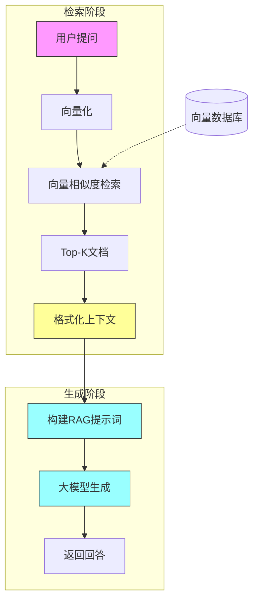

#### 9.1.2 完整代码实现

```python
from langchain_core.prompts import ChatPromptTemplate
from langchain_community.chat_models.tongyi import ChatTongyi
from langchain_core.output_parsers import StrOutputParser
from langchain_core.runnables import RunnablePassthrough
from langchain_chroma import Chroma
from langchain_community.embeddings import DashScopeEmbeddings

# ==================== 步骤1：准备向量存储 ====================
# 假设已有向量存储（详见第8章）
embeddings = DashScopeEmbeddings()
vector_store = Chroma(
    collection_name="health_docs",
    embedding_function=embeddings,
    persist_directory="./chroma_db"
)

# 创建检索器（Retriever）
# 作用：将用户查询转换为向量，检索相似文档
retriever = vector_store.as_retriever(
    search_type="similarity",    # 检索类型：相似度检索
    search_kwargs={"k": 3}       # 返回Top-3个文档
)

# ==================== 步骤2：定义格式化函数 ====================
def format_docs(docs):
    """
    将检索到的文档格式化为字符串
    
    输入：List[Document]
    输出：str（拼接后的文本）
    """
    # 提取每个文档的内容，用双换行分隔
    return "\n\n".join(doc.page_content for doc in docs)

# ==================== 步骤3：构建RAG提示模板 ====================
# RAG提示词的核心：告诉模型基于提供的上下文回答
rag_prompt = ChatPromptTemplate.from_messages([
    ("system", """你是一个专业的健康顾问。请基于以下参考资料回答用户问题。
如果参考资料中没有相关信息，请明确告知用户。

参考资料：
{context}"""),
    ("human", "{input}")
])

# ==================== 步骤4：组装RAG Chain ====================
model = ChatTongyi(model="qwen-max")

# LCEL链式组装
rag_chain = (
    {
        # 分支1：原样传递用户输入
        "input": RunnablePassthrough(),
        # 分支2：检索并格式化上下文
        "context": retriever | format_docs
    }
    | rag_prompt    # 构建完整提示词
    | model         # 调用大模型
    | StrOutputParser()  # 解析为字符串
)

# ==================== 步骤5：使用 ====================
query = "怎么科学减肥？"
response = rag_chain.invoke(query)
print(response)
```

#### 9.1.3 代码逐行解析

```python
# 数据流详解：

# 1. 用户输入："怎么科学减肥？"
#    ↓
# 2. RunnablePassthrough() 原样传递
#    输出：{"input": "怎么科学减肥？"}
#    ↓
# 3. retriever | format_docs 并行执行检索
#    - retriever：将"怎么科学减肥？"向量化，检索相似文档
#    - format_docs：将Document列表格式化为字符串
#    输出：{"context": "文档1内容\n\n文档2内容...", "input": "怎么科学减肥？"}
#    ↓
# 4. rag_prompt 构建完整提示词
#    将template中的{context}和{input}替换为实际值
#    输出：PromptValue对象
#    ↓
# 5. model 调用大模型
#    输出：AIMessage对象
#    ↓
# 6. StrOutputParser() 提取文本内容
#    输出：字符串形式的最终回答
```

### 9.2 复杂Chain数据流

实际生产环境的RAG系统通常包含更复杂的数据流，如多路检索、结果重排序、调试输出等。

#### 9.2.1 多分支数据流架构

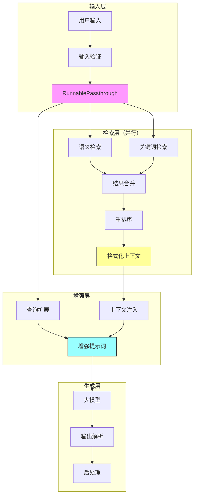

#### 9.2.2 带调试的RAG Chain

```python
from langchain_core.runnables import RunnableLambda

# 调试辅助函数
def print_context(data):
    """打印检索到的上下文（用于调试）"""
    print("=" * 50)
    print("检索到的上下文：")
    print(data["context"][:500] + "..." if len(data["context"]) > 500 else data["context"])
    print("=" * 50)
    return data  # 必须返回数据，继续传递

def print_prompt(data):
    """打印最终提示词（用于调试）"""
    print("=" * 50)
    print("最终提示词：")
    # PromptValue转换为字符串
    prompt_str = data.to_string() if hasattr(data, 'to_string') else str(data)
    print(prompt_str[:800] + "..." if len(prompt_str) > 800 else prompt_str)
    print("=" * 50)
    return data

# 增强版RAG Chain
enhanced_rag_chain = (
    {
        "input": RunnablePassthrough(),
        "context": retriever | format_docs
    }
    | RunnableLambda(print_context)  # 调试：查看检索结果
    | rag_prompt
    | RunnableLambda(print_prompt)   # 调试：查看最终提示词
    | model
    | StrOutputParser()
)

# 使用
response = enhanced_rag_chain.invoke("如何保持健康？")
```

#### 9.2.3 多路检索融合

```python
from langchain_core.runnables import RunnableParallel

# 场景：同时从多个数据源检索
vector_retriever = vector_store.as_retriever(search_kwargs={"k": 3})
# keyword_retriever = ...  # 关键词检索器

def merge_results(results):
    """合并多路检索结果并去重"""
    vector_docs = results["vector_results"]
    # keyword_docs = results["keyword_results"]
    
    # 去重逻辑（基于文档ID或内容哈希）
    seen = set()
    merged = []
    for doc in vector_docs:  # + keyword_docs
        doc_id = doc.metadata.get("id", hash(doc.page_content))
        if doc_id not in seen:
            seen.add(doc_id)
            merged.append(doc)
    
    return format_docs(merged)

# 并行检索Chain
multi_retrieval_chain = (
    RunnableParallel({
        "input": RunnablePassthrough(),
        "vector_results": vector_retriever,
        # "keyword_results": keyword_retriever,
    })
    | RunnableLambda(lambda x: {
        "input": x["input"],
        "context": merge_results(x)
    })
    | rag_prompt
    | model
    | StrOutputParser()
)
```

### 9.3 多模型串联Chain

复杂任务可分解为多个子任务，每个子任务由专门的模型处理，形成Pipeline。

#### 9.3.1 多模型串联架构

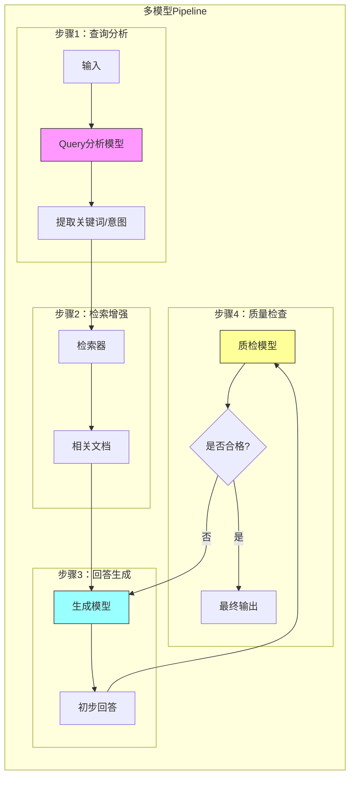

#### 9.3.2 查询改写 + RAG 示例

```python
from langchain_core.prompts import ChatPromptTemplate

# 模型1：查询改写（优化检索效果）
rewrite_prompt = ChatPromptTemplate.from_messages([
    ("system", "你是一个查询优化专家。将用户的问题改写为更适合向量检索的形式，提取关键概念。"),
    ("human", "原始问题：{query}\n请改写为检索友好的形式，直接输出改写后的问题。")
])

# 模型2：RAG回答
answer_prompt = ChatPromptTemplate.from_messages([
    ("system", "基于以下参考资料回答问题。\n\n参考资料：{context}"),
    ("human", "{query}")
])

# 组装多模型Chain
query_rewrite_chain = (
    {"query": RunnablePassthrough()}
    | rewrite_prompt
    | ChatTongyi(model="qwen-turbo")  # 轻量级模型处理改写
    | StrOutputParser()
)

# 完整流程：改写查询 -> 检索 -> 生成回答
full_chain = (
    {
        # 步骤1：改写查询
        "original_query": RunnablePassthrough(),
        "rewritten_query": query_rewrite_chain,
    }
    | RunnableLambda(lambda x: {
        # 步骤2：使用改写后的查询进行检索
        "query": x["original_query"],
        "context": retriever.invoke(x["rewritten_query"]) | format_docs
    })
    | answer_prompt
    | ChatTongyi(model="qwen-max")  # 强模型生成答案
    | StrOutputParser()
)

# 使用
response = full_chain.invoke("我想减肥，有什么好方法？")
```

#### 9.3.3 数据类型流转说明

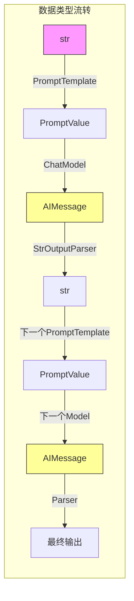

**关键理解**：
- LCEL自动处理组件间的数据类型转换
- 每个组件的输出类型与下一个组件的输入类型匹配
- 使用`StrOutputParser`可在任意位置将AIMessage转为字符串

---

## 第十部分：组件继承体系

### 章节摘要
本章节介绍了LangChain的组件继承体系，帮助读者理解不同组件之间的关系和层次结构，为更深入的LangChain开发打下基础。

### 10.1 核心继承链

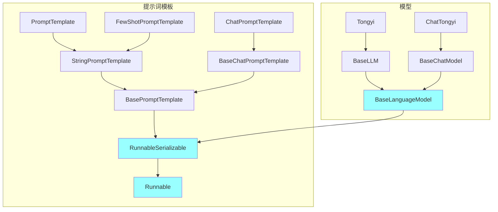

**核心要点**：所有LangChain组件都继承自`Runnable`，支持统一的接口方法。

---

## 附录：关键技术要点总结

### 知识点关联图

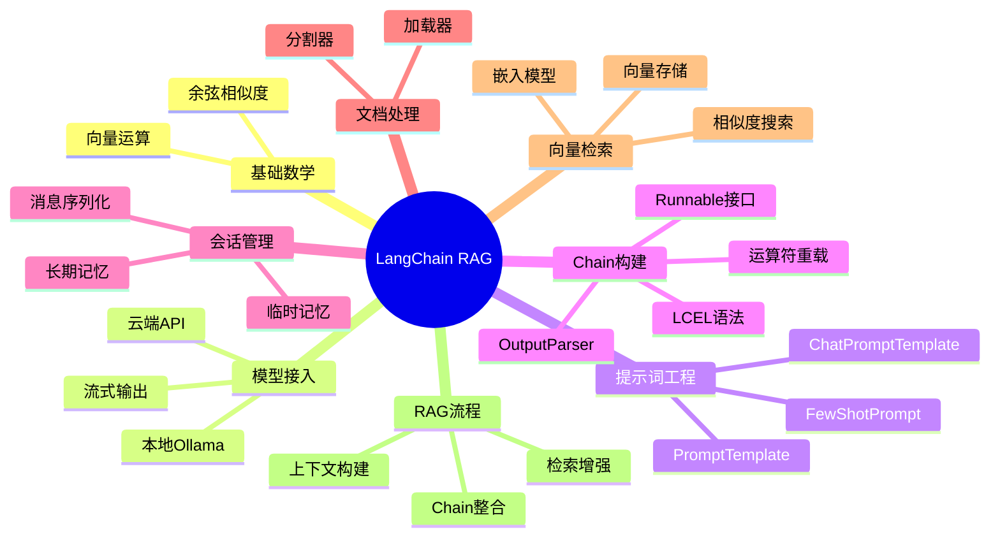

### 常见问题排查

| 问题 | 原因 | 解决方案 |
|------|------|---------|
| 模型不返回响应 | API Key未配置 | 设置环境变量 |
| 向量检索无结果 | 嵌入模型不匹配 | 确保检索与存储使用相同模型 |
| 会话历史丢失 | 使用内存存储 | 改用文件/数据库持久化 |
| Chain执行失败 | 组件类型不匹配 | 确保所有组件实现Runnable接口 |

---

## 参考资料

- LangChain官方文档：https://python.langchain.com/
- 阿里云DashScope：https://dashscope.aliyuncs.com/
- Ollama：https://github.com/ollama/ollama
