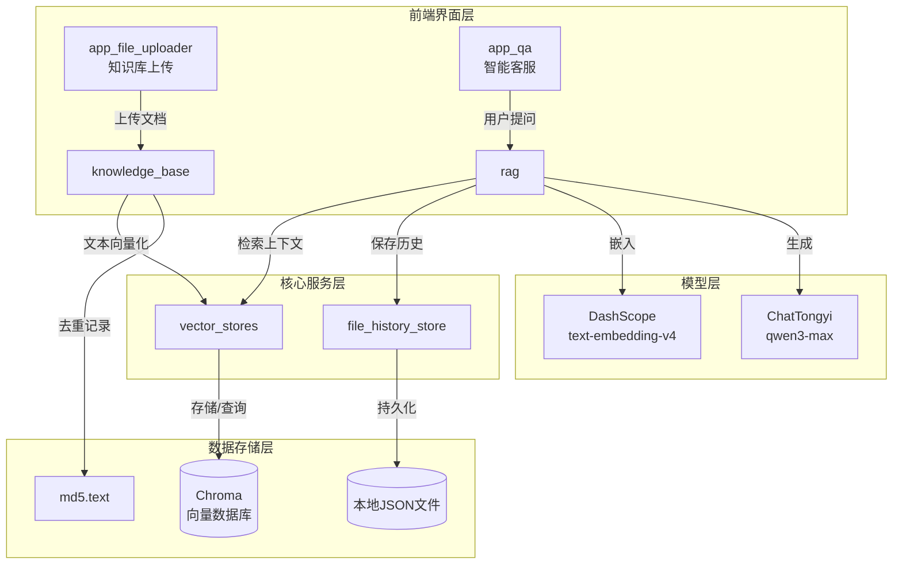
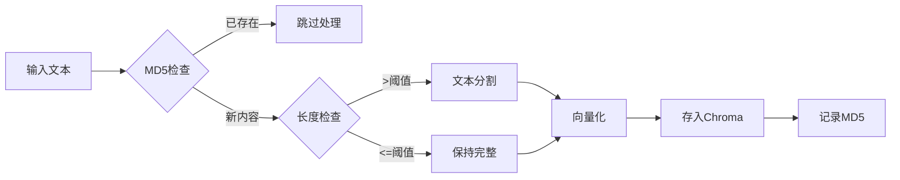
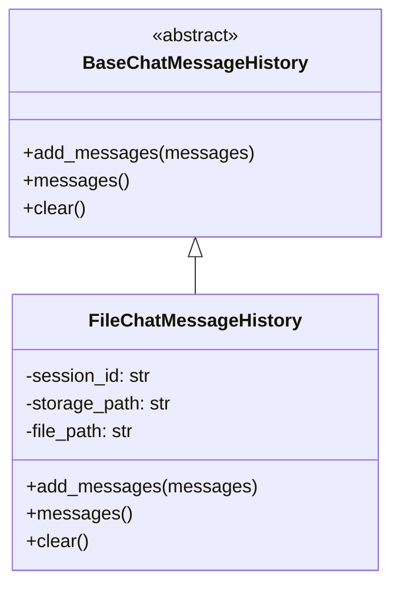
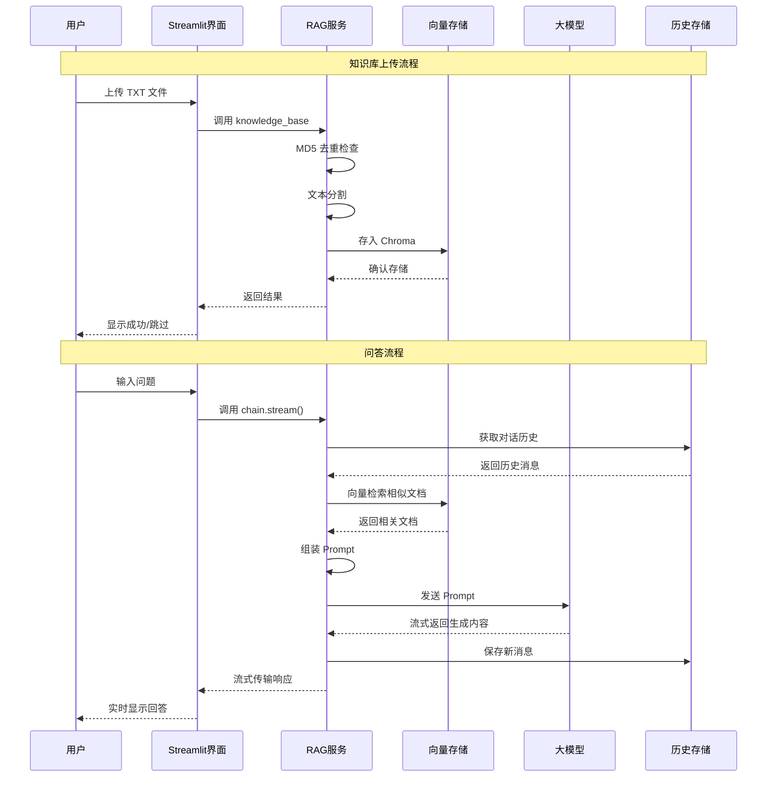

# 04 RAG 智能客服系统完整实战

## 核心定义

**RAG (Retrieval-Augmented Generation)**：检索增强生成，是一种结合信息检索与文本生成的 AI 架构。其核心思想是：在让大模型回答问题之前，先从知识库中检索相关信息，将检索结果作为上下文提供给模型，从而生成更准确、更可靠的回答。

**解决的问题**：
- 大模型幻觉（Hallucination）：模型编造不存在的信息
- 知识时效性：模型训练数据有截止日期，无法获取最新信息
- 领域专业性：通用模型缺乏特定领域的深度知识

---

## 项目架构概览

```
04RAG项目/
├── app_file_uploader.py      # 知识库上传界面 (Streamlit)
├── app_qa.py                 # 智能客服对话界面 (Streamlit)
├── config_data.py            # 全局配置参数
├── knowledge_base.py         # 知识库服务 (向量化 + 去重)
├── vector_stores.py          # 向量数据库封装
├── file_history_store.py     # 对话历史持久化
├── rag.py                    # RAG 核心链路组装
└── data/                     # 示例知识文档
    ├── 尺码推荐.txt
    ├── 洗涤养护.txt
    └── 颜色选择.txt
```

### 系统交互流程



---

## 模块详解

### 1. 配置模块 (config_data.py)

**核心定义**：集中管理项目所有配置参数，实现配置与代码分离。

**最小代码示例**：

```python
from pathlib import Path

# 跨平台路径处理：Windows 用 \，Linux/Mac 用 /
_BASE_DIR = Path(__file__).parent

# Chroma 向量数据库配置
collection_name = "rag"
persist_directory = str(_BASE_DIR / "chroma_db")

# 文本分割参数
chunk_size = 1000        # 每块最大字符数
chunk_overlap = 100      # 重叠字符数（保证语义连贯）

# 模型配置
embedding_model_name = "text-embedding-v4"
chat_model_name = "qwen3-max-2026-01-23"
```

**关键设计决策**：

| 参数 | 取值 | 设计理由 |
|------|------|----------|
| chunk_size | 1000 | 平衡检索精度与上下文长度限制 |
| chunk_overlap | 100 | 10% 重叠保证分割处语义不丢失 |
| similarity_threshold | 1 | 返回最相关的一条文档，避免信息干扰 |

---

### 2. 知识库服务 (knowledge_base.py)

**核心定义**：实现文档的向量化存储，包含 MD5 去重机制防止重复入库。

**处理流程图**：



**MD5 去重原理**：

MD5 是一种单向哈希算法，相同内容始终产生相同的 32 位十六进制哈希值。

$$
\text{MD5}(	ext{content}) \rightarrow \text{32位哈希值}
$$

**代码实现**：

```python
def get_string_md5(input_str: str, encoding='utf-8') -> str:
    """计算字符串的 MD5 哈希值"""
    str_bytes = input_str.encode(encoding=encoding)
    md5_obj = hashlib.md5()
    md5_obj.update(str_bytes)
    return md5_obj.hexdigest()  # 返回 32 位十六进制字符串
```

**文本分割策略**：

```python
self.spliter = RecursiveCharacterTextSplitter(
    chunk_size=1000,       # 每块最大字符数
    chunk_overlap=100,     # 相邻块重叠 100 字符
    separators=["\n\n", "\n", ".", "!", "?", "。", "！", "？", " ", ""],
    length_function=len,
)
```

**Why**：使用多级分隔符，优先按段落分割（`\n\n`），其次按句子（标点），最后按单词，确保分割后的文本块语义完整。

---

### 3. 向量存储服务 (vector_stores.py)

**核心定义**：封装 Chroma 向量数据库，提供统一的检索接口。

**架构设计**：

```python
class VectorStoreService(object):
    def __init__(self, embedding):
        # 依赖注入：外部传入 embedding 模型，提高灵活性
        self.embedding = embedding
        self.vector_store = Chroma(
            collection_name=config.collection_name,
            embedding_function=self.embedding,
            persist_directory=config.persist_directory,
        )

    def get_retriever(self):
        # 返回 LangChain 标准 Retriever 接口
        return self.vector_store.as_retriever(
            search_kwargs={"k": config.similarity_threshold}
        )
```

**关联知识**：

- **Embedding（嵌入）**：将文本映射到高维向量空间，语义相似的文本在向量空间中距离相近
- **余弦相似度**：计算两个向量的夹角余弦值，衡量语义相似程度

$$
\text{similarity}(A, B) = \frac{A \cdot B}{\|A\| \|B\|} = \frac{\sum_{i=1}^{n} A_i B_i}{\sqrt{\sum_{i=1}^{n} A_i^2} \sqrt{\sum_{i=1}^{n} B_i^2}}
$$

---

### 4. RAG 核心链路 (rag.py)

**核心定义**：使用 LCEL (LangChain Expression Language) 组装检索-生成链路。

**Chain 结构详解**：

```mermaid
flowchart TB
    subgraph 输入层
        A[用户输入<br/>{input}]
    end

    subgraph 并行处理层
        A --> B[RunnablePassthrough<br/>直通分支]
        A --> C[format_for_retriever<br/>提取查询]
        C --> D[Retriever<br/>向量检索]
        D --> E[format_document<br/>格式化文档]
    end

    subgraph 合并层
        B --> F{合并结果}
        E --> F
        F --> G[format_for_prompt_template<br/>格式转换]
    end

    subgraph 生成层
        G --> H[ChatPromptTemplate<br/>组装Prompt]
        H --> I[ChatTongyi<br/>大模型生成]
        I --> J[StrOutputParser<br/>解析输出]
    end

    subgraph 历史管理层
        K[RunnableWithMessageHistory<br/>对话历史包装]
    end
```

**LCEL 语法解析**：

```python
chain = (
    {
        "input": RunnablePassthrough(),  # 直通：原样传递用户输入
        "context": RunnableLambda(format_for_retriever) | retriever | format_document
        # 检索分支：提取查询 -> 向量检索 -> 格式化文档
    }
    | RunnableLambda(format_for_prompt_template)  # 合并数据格式转换
    | self.prompt_template   # 组装 Prompt
    | self.chat_model        # 调用大模型
    | StrOutputParser()      # 解析为字符串
)
```

**管道符 `|` 的工作原理**：

```
输入 -> [组件A] -> 输出A -> [组件B] -> 输出B -> [组件C] -> 最终结果
```

**Why 使用 LCEL**：

1. **声明式**：代码即流程图，直观表达数据流转
2. **可组合**：组件可自由组合、复用
3. **统一接口**：所有组件都实现 `Runnable` 接口，支持 stream、invoke、batch 等调用方式

---

### 数据流转结构详解

**Step 1: 用户调用 → 历史注入**
```python
# 输入
{"input": "针织毛衣如何保养？"}

# RunnableWithMessageHistory 自动注入 history
{
    "input": "针织毛衣如何保养？",
    "history": [HumanMessage(...), AIMessage(...)]  # 历史对话
}
```

**Step 2: 并行分支处理**
```python
# 分支1 (input): RunnablePassthrough 直通
{"input": "...", "history": [...]}  →  原样传递

# 分支2 (context): 检索流程
"针织毛衣如何保养？"                    # format_for_retriever 提取查询
    ↓
[Document(...), Document(...)]          # retriever 向量检索返回文档列表
    ↓
"文档片段：毛衣保养...\n文档元数据：..."  # format_document 格式化为字符串

# 合并结果（嵌套结构）
{
    "input": {"input": "...", "history": [...]},  # 嵌套
    "context": "文档片段：..."                      # 检索结果
}
```

**Step 3: 格式转换 → Prompt 组装**
```python
# format_for_prompt_template 解包为扁平结构
{"input": "...", "context": "...", "history": [...]}

# prompt_template 组装为 ChatPromptValue
ChatPromptValue(messages=[
    SystemMessage(content="参考资料:{context}"),
    SystemMessage(content="对话历史记录如下："),
    MessagesPlaceholder("history"),  # 历史消息展开
    HumanMessage(content="请回答用户提问：{input}")
])
```

**Step 4: 模型调用 → 输出解析**
```python
ChatPromptValue  →  chat_model  →  AIMessage(content="...")  →  StrOutputParser  →  "最终回答字符串"
```

**完整数据流转图**：

```
┌─────────────────────────────────────────────────────────────────┐
│ Step 1: 历史注入                                                 │
│  {"input": "问题"}  →  {"input": "问题", "history": [...]}         │
└────────────────────────────┬────────────────────────────────────┘
                             │
           ┌─────────────────┴─────────────────┐
           ▼                                   ▼
┌──────────────────────┐            ┌──────────────────────────────┐
│ Step 2a: 直通分支     │            │ Step 2b: 检索分支             │
│ RunnablePassthrough  │            │ format_for_retriever         │
│ (原样传递)            │            │ 提取: "问题"                  │
└──────────┬───────────┘            └──────────────┬───────────────┘
           │                                       │
           │                    ┌──────────────────┘
           │                    ▼
           │     ┌──────────────────────────────┐
           │     │ retriever 向量检索            │
           │     │ [Document, Document]         │
           │     └──────────────┬───────────────┘
           │                    │
           │                    ▼
           │     ┌──────────────────────────────┐
           │     │ format_document              │
           │     │ "文档片段：...\n元数据：..."   │
           │     └──────────────┬───────────────┘
           │                    │
           └──────────┬─────────┘
                      ▼
┌─────────────────────────────────────────────────────────────────┐
│ Step 3: 合并结果（嵌套结构）                                      │
│  {"input": {"input": "...", "history": [...]}, "context": "..."}  │
└────────────────────────────┬────────────────────────────────────┘
                             ▼
┌─────────────────────────────────────────────────────────────────┐
│ Step 4: 解包转换                                                 │
│  format_for_prompt_template                                      │
│  {"input": "...", "context": "...", "history": [...]}            │
└────────────────────────────┬────────────────────────────────────┘
                             ▼
┌─────────────────────────────────────────────────────────────────┐
│ Step 5: Prompt 组装                                              │
│  ChatPromptValue(messages=[System, System, History..., Human])  │
└────────────────────────────┬────────────────────────────────────┘
                             ▼
┌─────────────────────────────────────────────────────────────────┐
│ Step 6: 模型生成 + 解析                                          │
│  ChatPromptValue → AIMessage → "最终回答字符串"                  │
└─────────────────────────────────────────────────────────────────┘
```

**关键数据结构说明**：

| 阶段 | 数据类型 | 说明 |
|------|----------|------|
| 输入 | `dict` | 用户传入的字典，包含 `"input"` 键 |
| 历史注入后 | `dict` | 增加 `"history"` 键，值为 `list[BaseMessage]` |
| 并行合并后 | `dict` | 嵌套结构，`"input"` 键的值仍是字典 |
| 格式转换后 | `dict` | 扁平结构，三键平行：`input`, `context`, `history` |
| Prompt 组装后 | `ChatPromptValue` | LangChain 的 Prompt 对象，包含消息列表 |
| 模型输出 | `AIMessage` | 大模型返回的消息对象 |
| 最终输出 | `str` | 纯字符串，可直接展示给用户 |

---

### 5. 对话历史持久化 (file_history_store.py)

**核心定义**：实现基于本地文件的对话历史存储，继承 LangChain 的 `BaseChatMessageHistory`。

**类继承关系**：



**序列化与反序列化**：

```python
# 保存：BaseMessage -> dict -> JSON
new_messages = [message_to_dict(message) for message in all_messages]
json.dump(new_messages, f)

# 读取：JSON -> dict -> BaseMessage
messages_data = json.load(f)
return messages_from_dict(messages_data)
```

**Why 使用文件存储**：

- 简单可靠：无需额外数据库服务
- 持久化：应用重启后对话历史不丢失
- 可审计：可直接查看 JSON 文件内容

---

### 6. Streamlit 前端界面

#### 6.1 文件上传界面 (app_file_uploader.py)

**核心概念**：

- **Session State**：Streamlit 每次交互都会重新执行脚本，使用 `st.session_state` 持久化存储服务对象
- **Spinner**：加载动画，提升用户体验

```python
# Session State 初始化（仅首次执行）
if "service" not in st.session_state:
    st.session_state["service"] = KnowledgeBaseService()

# 文件处理
with st.spinner("载入知识库中。。。"):
    result = st.session_state["service"].upload_by_str(text, file_name)
```

#### 6.2 对话界面 (app_qa.py)

**流式输出实现**：

```python
def capture(generator, cache_list):
    """捕获生成器输出，同时用于流式展示和保存"""
    for chunk in generator:
        cache_list.append(chunk)
        yield chunk  # 流式输出给前端

# write_stream：实时显示打字效果
st.chat_message("assistant").write_stream(capture(res_stream, ai_res_list))
```

**Why 流式输出**：

- 提升用户体验：用户无需等待完整响应
- 感知性能：即使总时间相同，用户感觉更快

---

## 数据流向完整图解



---

## 两种实现方案对比

### 方案 A：本项目采用的 LCEL 链式方案

**优点**：
- 声明式代码，流程清晰
- 组件可复用、可替换
- 内置支持流式、批处理、异步

**缺点**：
- 学习曲线较陡
- 调试相对复杂

**适用场景**：生产环境、复杂流程、需要高度可维护性

### 方案 B：传统函数调用方案

```python
def simple_rag(query, history):
    # 1. 检索
    docs = retriever.invoke(query)
    context = format_docs(docs)

    # 2. 组装 Prompt
    prompt = f"参考资料：{context}\n历史：{history}\n问题：{query}"

    # 3. 调用模型
    response = llm.invoke(prompt)

    return response
```

**优点**：
- 简单直观，易于理解
- 调试方便，可逐行断点

**缺点**：
- 代码重复度高
- 难以复用组件
- 不支持流式输出（需额外实现）

**适用场景**：原型开发、学习阶段、简单需求

---

## 性能优化建议

### 1. 向量检索优化

```python
# 当前：返回 top-1
search_kwargs={"k": 1}

# 优化：增加多样性，使用 MMR (Maximal Marginal Relevance)
search_kwargs={"k": 3, "fetch_k": 10}
retriever = vector_store.as_retriever(
    search_type="mmr",  # 兼顾相关性和多样性
    search_kwargs=search_kwargs
)
```

### 2. 历史消息优化

```python
# 当前：保留全部历史
# 优化：只保留最近 N 轮，避免 Token 超限
def trim_history(messages, keep_last=5):
    return messages[-keep_last:]
```

### 3. 并发处理

```python
# 使用异步接口提升吞吐量
async def async_invoke(chain, input_data):
    return await chain.ainvoke(input_data)
```

---

## 安全注意事项

### 1. API Key 管理

```python
# 错误：硬编码密钥
api_key = "sk-xxxxxxxx"

# 正确：使用环境变量
import os
api_key = os.getenv("DASHSCOPE_API_KEY")
```

### 2. 输入校验

```python
def sanitize_input(user_input: str) -> str:
    """清理用户输入，防止 Prompt 注入"""
    # 限制长度
    if len(user_input) > 1000:
        raise ValueError("输入过长")
    # 过滤危险字符
    dangerous = ["<script>", "{{", "{%"]
    for d in dangerous:
        if d in user_input:
            raise ValueError("包含非法字符")
    return user_input
```

---

## 学习路径引导

### 前置知识依赖

1. **Python 基础**：类、装饰器、生成器
2. **LangChain 核心概念**：Chain、Prompt、Model、OutputParser
3. **向量数据库基础**：Embedding、相似度计算

### 进阶学习方向

1. **多路召回**：结合向量检索 + 关键词检索
2. **重排序 (Rerank)**：使用更精确的模型对检索结果排序
3. **Agent 模式**：让模型自主决定何时检索、检索什么

---

## 总结

本项目完整演示了一个 RAG 智能客服系统的工程实现，涵盖：

1. **知识库管理**：文本分割、向量化、MD5 去重
2. **向量检索**：Chroma 数据库、语义相似度搜索
3. **RAG 链路**：LCEL 链式组装、Prompt 工程
4. **对话历史**：文件持久化、多会话管理
5. **前端界面**：Streamlit 快速搭建交互界面

**核心收获**：

- 理解 RAG 如何解决大模型幻觉问题
- 掌握 LangChain LCEL 的链式编程范式
- 学会设计可扩展的模块化架构
