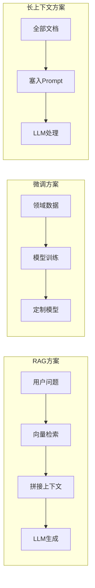
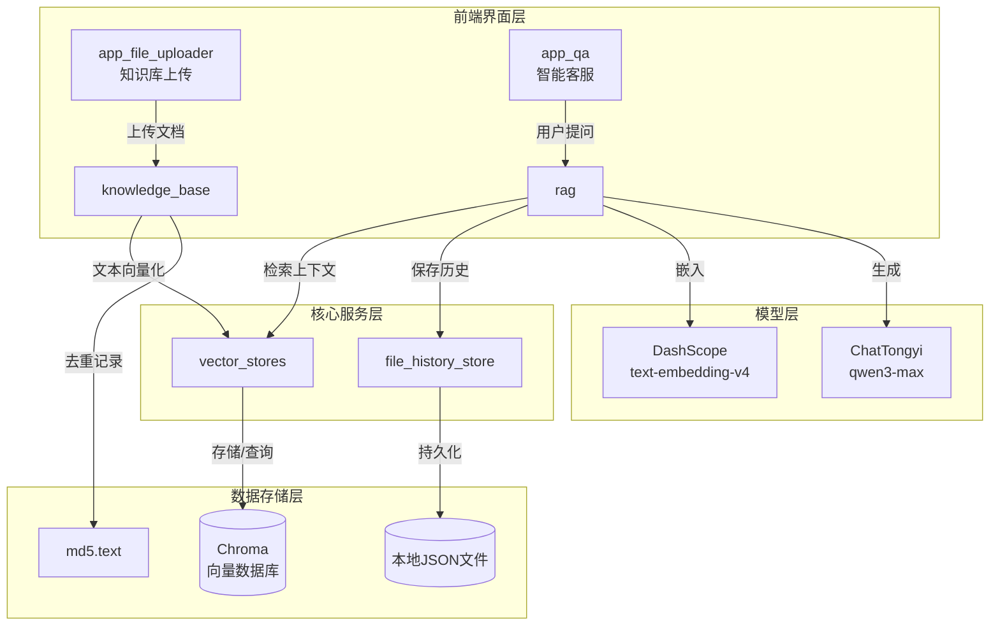
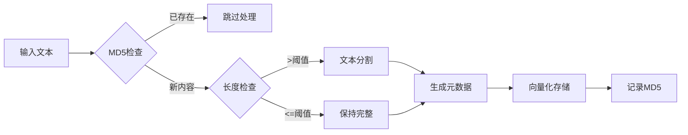
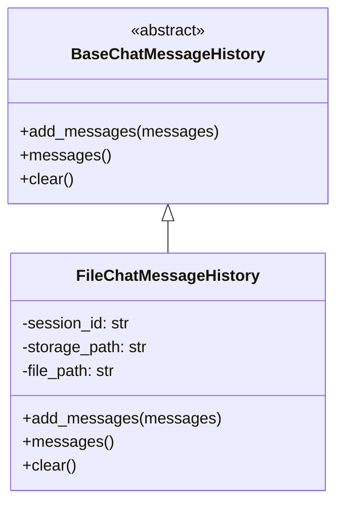
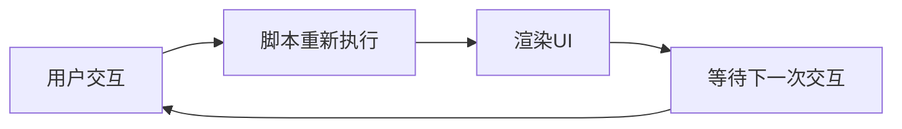
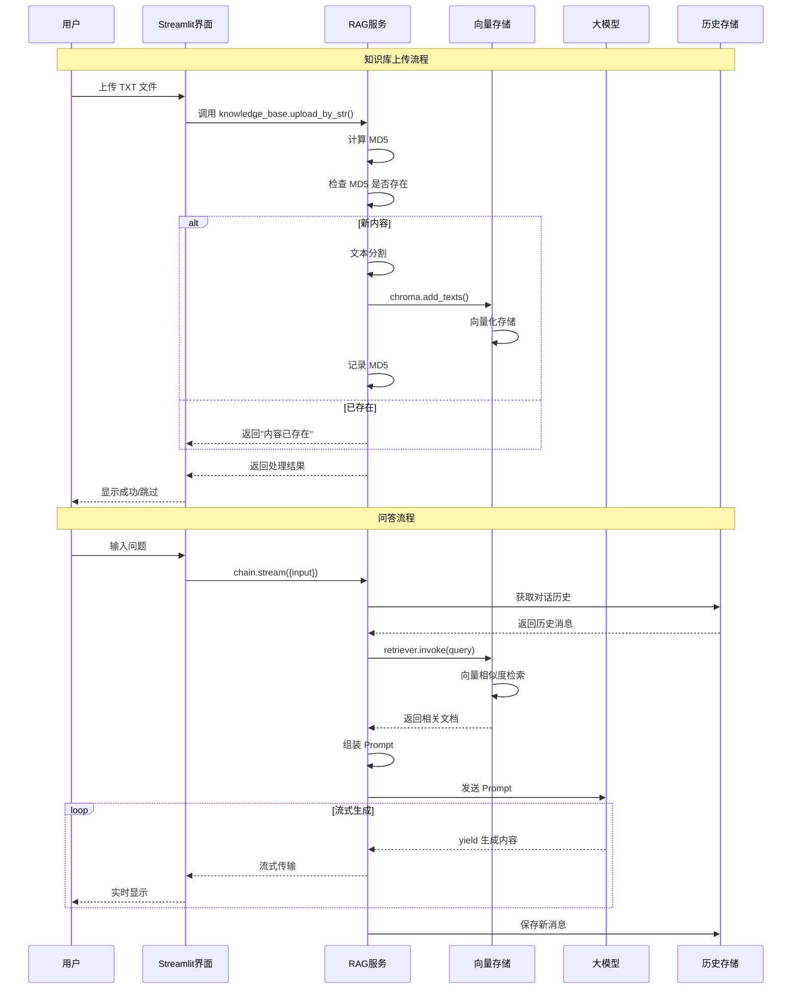
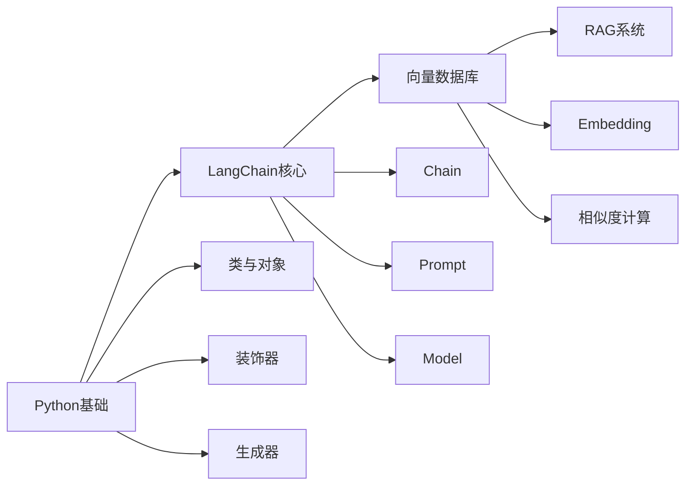

# 04 RAG 智能客服系统完整实战

**作者：Red_Moon**
**开发时间：2026年2月**

---

## 核心定义

**RAG (Retrieval-Augmented Generation)**：检索增强生成，是一种结合信息检索与文本生成的 AI 架构。其核心思想是：在让大模型回答问题之前，先从知识库中检索相关信息，将检索结果作为上下文提供给模型，从而生成更准确、更可靠的回答。

### RAG解决的问题

| 问题 | 描述 | RAG解决方案 |
|-----|------|------------|
| **大模型幻觉** | 模型编造不存在的信息 | 基于检索到的真实文档生成回答 |
| **知识时效性** | 模型训练数据有截止日期 | 知识库可随时更新，无需重新训练 |
| **领域专业性** | 通用模型缺乏特定领域知识 | 注入领域知识文档，实现专业问答 |

### RAG vs 微调 vs 长上下文



| 方案 | 优点 | 缺点 | 适用场景 |
|-----|-----|-----|---------|
| **RAG** | 知识可更新、成本较低、可解释性强 | 检索质量依赖向量模型 | 知识频繁更新、需要引用来源 |
| **微调** | 模型深度学习领域知识 | 成本高、知识固化、需重新训练 | 特定任务、风格迁移 |
| **长上下文** | 实现简单 | Token成本高、上下文窗口有限 | 文档量小、一次性处理 |

---

## 项目架构概览

### 项目结构

```
04RAG项目/
├── app_file_uploader.py      # 知识库上传界面 (Streamlit)
├── app_qa.py                 # 智能客服对话界面 (Streamlit)
├── config_data.py            # 全局配置参数
├── knowledge_base.py         # 知识库服务 (向量化 + 去重)
├── vector_stores.py          # 向量数据库封装
├── file_history_store.py     # 对话历史持久化
├── rag.py                    # RAG 核心链路组装
├── md5.text                  # MD5去重记录文件
└── data/                     # 示例知识文档
    ├── 尺码推荐.txt
    ├── 洗涤养护.txt
    └── 颜色选择.txt
```

### 系统交互流程



### 核心组件职责

| 组件 | 文件 | 核心职责 | 关键技术 |
|-----|-----|---------|---------|
| 配置中心 | config_data.py | 集中管理参数 | Path跨平台路径 |
| 知识库服务 | knowledge_base.py | 文档向量化存储 | MD5去重、文本分割 |
| 向量存储 | vector_stores.py | 向量检索接口 | Chroma、Retriever |
| RAG链路 | rag.py | 检索-生成流程 | LCEL、Runnable |
| 历史存储 | file_history_store.py | 对话持久化 | JSON序列化 |
| Web界面 | app_*.py | 用户交互 | Streamlit |

---

## 模块详解

### 1. 配置模块 (config_data.py)

**核心定义**：集中管理项目所有配置参数，实现配置与代码分离。

**设计原则**：
- 路径使用 `Path` 对象确保跨平台兼容性（Windows/Linux/Mac）
- 敏感信息（API Key）通过环境变量传入，本文件仅保留非敏感配置

```python
from pathlib import Path

# 获取当前文件所在目录，作为项目根路径
# Why: __file__ 是当前脚本的绝对路径，parent 获取其目录
_BASE_DIR = Path(__file__).parent

# MD5 记录文件路径：用于去重，记录已处理的文件指纹
md5_path = str(_BASE_DIR / "md5.text")

# Chroma 向量数据库配置
collection_name = "rag"  # 数据库集合（表）名称
persist_directory = str(_BASE_DIR / "chroma_db")  # 本地持久化存储路径

# 文本分割器配置
chunk_size = 1000        # 每个文本块的最大字符数
chunk_overlap = 100      # 相邻文本块的重叠字符数
separators = ["\n\n", "\n", ".", "!", "?", "。", "！", "？", " ", ""]

# 向量检索配置
similarity_threshold = 1  # 返回最相似的文档数量（top-k）

# 模型配置
embedding_model_name = "text-embedding-v4"      # 文本嵌入模型
chat_model_name = "qwen3-max-2026-01-23"        # 对话生成模型
```

**关键参数设计决策**：

| 参数 | 取值 | 设计理由 |
|------|------|----------|
| chunk_size | 1000 | 平衡检索精度与上下文长度限制，太小语义不完整，太大检索不精准 |
| chunk_overlap | 100 | 10% 重叠保证分割处语义不丢失，避免关键信息被截断 |
| similarity_threshold | 1 | 返回最相关的一条文档，避免信息干扰，可根据需求调整 |
| separators | 多级分隔符 | 优先按段落分割，其次按句子，确保语义完整 |

---

### 2. 知识库服务 (knowledge_base.py)

**核心定义**：实现文档的向量化存储，包含 MD5 去重机制防止重复入库。

#### 2.1 处理流程图



#### 2.2 MD5 去重原理

**MD5** 是一种单向哈希算法，相同内容始终产生相同的 32 位十六进制哈希值。

$$
\text{MD5}(\text{content}) \rightarrow \text{32位哈希值}
$$

**Why 使用MD5去重**：
- 快速比对：无需存储原始内容，只需比对固定长度的哈希值
- 空间效率：32字符 vs 原始文档可能数千字符
- 确定性：相同内容永远产生相同哈希

```python
def get_string_md5(input_str: str, encoding='utf-8') -> str:
    """
    计算字符串的 MD5 哈希值
    
    :param input_str: 输入字符串
    :param encoding: 字符编码，默认 utf-8
    :return: 32 位十六进制 MD5 字符串
    """
    # 字符串编码为字节数组
    str_bytes = input_str.encode(encoding=encoding)
    
    # 创建 MD5 哈希对象并更新内容
    md5_obj = hashlib.md5()
    md5_obj.update(str_bytes)
    
    # 获取十六进制表示的哈希值
    return md5_obj.hexdigest()
```

**Warning**：MD5存在碰撞风险（不同内容产生相同哈希），但在知识库去重场景中概率极低，可接受。

#### 2.3 文本分割策略

**Why 需要分割**：
- 大模型有上下文长度限制
- 检索精度：小片段更容易精准匹配
- 向量质量：短文本的向量表示更聚焦

```python
self.spliter = RecursiveCharacterTextSplitter(
    chunk_size=1000,       # 每块最大字符数
    chunk_overlap=100,     # 相邻块重叠 100 字符
    separators=["\n\n", "\n", ".", "!", "?", "。", "！", "？", " ", ""],
    length_function=len,   # 使用 Python 内置 len 计算长度
)
```

**分隔符优先级说明**：

| 优先级 | 分隔符 | 说明 |
|-------|-------|-----|
| 1 | `\n\n` | 段落分隔，保持段落完整性 |
| 2 | `\n` | 行分隔 |
| 3 | `. ! ? 。！？` | 句子分隔，保持句子完整性 |
| 4 | ` ` | 单词分隔 |
| 5 | `""` | 字符分隔（最后手段） |

#### 2.4 元数据设计

```python
metadata = {
    "source": filename,                                    # 来源文件
    "create_time": datetime.now().strftime("%Y-%m-%d %H:%M:%S"),  # 创建时间
    "operator": "Red_Moon",                                # 操作人
}
```

**元数据的作用**：
- 溯源：回答可追溯到具体文档
- 过滤：按时间、来源筛选检索范围
- 审计：记录知识库更新历史

---

### 3. 向量存储服务 (vector_stores.py)

**核心定义**：封装 Chroma 向量数据库，提供统一的检索接口。

#### 3.1 架构设计

```python
class VectorStoreService(object):
    def __init__(self, embedding):
        # 依赖注入：外部传入 embedding 模型，提高灵活性
        self.embedding = embedding
        self.vector_store = Chroma(
            collection_name=config.collection_name,
            embedding_function=self.embedding,
            persist_directory=config.persist_directory,
        )

    def get_retriever(self):
        # 返回 LangChain 标准 Retriever 接口
        return self.vector_store.as_retriever(
            search_kwargs={"k": config.similarity_threshold}
        )
```

**依赖注入的优势**：
- 灵活性：可随时切换不同的嵌入模型
- 可测试性：测试时可注入 Mock 对象
- 解耦：服务类不依赖具体的嵌入模型实现

#### 3.2 向量检索原理

**Embedding（嵌入）**：将文本映射到高维向量空间，语义相似的文本在向量空间中距离相近。

```
"扫地机器人如何保养" → [0.12, -0.34, 0.56, ...] (1536维向量)
"机器人清洁维护方法" → [0.11, -0.32, 0.58, ...] (语义相近，向量也相近)
"今天天气很好"       → [0.89, 0.12, -0.45, ...] (语义无关，向量差异大)
```

**余弦相似度**：计算两个向量的夹角余弦值，衡量语义相似程度。

$$
\text{similarity}(A, B) = \frac{A \cdot B}{\|A\| \|B\|} = \frac{\sum_{i=1}^{n} A_i B_i}{\sqrt{\sum_{i=1}^{n} A_i^2} \sqrt{\sum_{i=1}^{n} B_i^2}}
$$

**相似度范围**：

| 值 | 含义 | 示例 |
|---|------|-----|
| 1 | 完全相同 | 同一文本 |
| 0.8-0.99 | 高度相似 | 同义句 |
| 0.5-0.8 | 相关 | 同主题不同内容 |
| 0-0.5 | 弱相关 | 不同主题 |
| -1 | 完全相反 | 对立语义 |

#### 3.3 Chroma数据库特点

| 特性 | 说明 |
|-----|-----|
| **轻量级** | 无需额外数据库服务，本地文件存储 |
| **开源免费** | Apache 2.0 协议 |
| **持久化** | 数据保存到本地磁盘，重启不丢失 |
| **Python原生** | 纯Python实现，安装简单 |

---

### 4. RAG 核心链路 (rag.py)

**核心定义**：使用 LCEL (LangChain Expression Language) 组装检索-生成链路。

#### 4.1 Chain 结构详解

```mermaid
flowchart TB
    subgraph 输入层
        A[用户输入<br/>{input}]
    end

    subgraph 并行处理层
        A --> B[RunnablePassthrough<br/>直通分支]
        A --> C[format_for_retriever<br/>提取查询]
        C --> D[Retriever<br/>向量检索]
        D --> E[format_document<br/>格式化文档]
    end

    subgraph 合并层
        B --> F{合并结果}
        E --> F
        F --> G[format_for_prompt_template<br/>格式转换]
    end

    subgraph 生成层
        G --> H[ChatPromptTemplate<br/>组装Prompt]
        H --> I[ChatTongyi<br/>大模型生成]
        I --> J[StrOutputParser<br/>解析输出]
    end

    subgraph 历史管理层
        K[RunnableWithMessageHistory<br/>对话历史包装]
    end
```

#### 4.2 LCEL 语法解析

```python
chain = (
    {
        "input": RunnablePassthrough(),  # 直通：原样传递用户输入
        "context": RunnableLambda(format_for_retriever) | retriever | format_document
        # 检索分支：提取查询 -> 向量检索 -> 格式化文档
    }
    | RunnableLambda(format_for_prompt_template)  # 合并数据格式转换
    | self.prompt_template   # 组装 Prompt
    | self.chat_model        # 调用大模型
    | StrOutputParser()      # 解析为字符串
)
```

**管道符 `|` 的工作原理**：

```
输入 -> [组件A] -> 输出A -> [组件B] -> 输出B -> [组件C] -> 最终结果
```

**Why 使用 LCEL**：

| 优势 | 说明 |
|-----|-----|
| **声明式** | 代码即流程图，直观表达数据流转 |
| **可组合** | 组件可自由组合、复用 |
| **统一接口** | 所有组件都实现 `Runnable` 接口 |
| **内置能力** | 自动支持 stream、invoke、batch、async |

#### 4.3 数据流转详解

**Step 1: 用户调用 → 历史注入**

```python
# 用户输入
{"input": "针织毛衣如何保养？"}

# RunnableWithMessageHistory 自动注入 history
{
    "input": "针织毛衣如何保养？",
    "history": [HumanMessage(...), AIMessage(...)]  # 历史对话
}
```

**Step 2: 并行分支处理**

```python
# 分支1 (input): RunnablePassthrough 直通
{"input": "...", "history": [...]}  →  原样传递

# 分支2 (context): 检索流程
"针织毛衣如何保养？"                    # format_for_retriever 提取查询
    ↓
[Document(...), Document(...)]          # retriever 向量检索返回文档列表
    ↓
"文档片段：毛衣保养...\n文档元数据：..."  # format_document 格式化为字符串
```

**Step 3: 合并结果**

```python
# 合并结果（嵌套结构）
{
    "input": {"input": "...", "history": [...]},  # 嵌套
    "context": "文档片段：..."                      # 检索结果
}
```

**Step 4: 格式转换 → Prompt 组装**

```python
# format_for_prompt_template 解包为扁平结构
{"input": "...", "context": "...", "history": [...]}

# prompt_template 组装为 ChatPromptValue
ChatPromptValue(messages=[
    SystemMessage(content="以我提供的已知参考资料为主...参考资料:{context}"),
    SystemMessage(content="并且我提供用户的对话历史记录，如下："),
    MessagesPlaceholder("history"),  # 历史消息展开
    HumanMessage(content="请回答用户提问：{input}")
])
```

**Step 5: 模型调用 → 输出解析**

```python
ChatPromptValue  →  chat_model  →  AIMessage(content="...")  →  StrOutputParser  →  "最终回答字符串"
```

#### 4.4 完整数据流转图

```
┌─────────────────────────────────────────────────────────────────┐
│ Step 1: 历史注入                                                 │
│  {"input": "问题"}  →  {"input": "问题", "history": [...]}         │
└────────────────────────────┬────────────────────────────────────┘
                             │
           ┌─────────────────┴─────────────────┐
           ▼                                   ▼
┌──────────────────────┐            ┌──────────────────────────────┐
│ Step 2a: 直通分支     │            │ Step 2b: 检索分支             │
│ RunnablePassthrough  │            │ format_for_retriever         │
│ (原样传递)            │            │ 提取: "问题"                  │
└──────────┬───────────┘            └──────────────┬───────────────┘
           │                                       │
           │                    ┌──────────────────┘
           │                    ▼
           │     ┌──────────────────────────────┐
           │     │ retriever 向量检索            │
           │     │ [Document, Document]         │
           │     └──────────────┬───────────────┘
           │                    │
           │                    ▼
           │     ┌──────────────────────────────┐
           │     │ format_document              │
           │     │ "文档片段：...\n元数据：..."   │
           │     └──────────────┬───────────────┘
           │                    │
           └──────────┬─────────┘
                      ▼
┌─────────────────────────────────────────────────────────────────┐
│ Step 3: 合并结果（嵌套结构）                                      │
│  {"input": {"input": "...", "history": [...]}, "context": "..."}  │
└────────────────────────────┬────────────────────────────────────┘
                             ▼
┌─────────────────────────────────────────────────────────────────┐
│ Step 4: 解包转换                                                 │
│  format_for_prompt_template                                      │
│  {"input": "...", "context": "...", "history": [...]}            │
└────────────────────────────┬────────────────────────────────────┘
                             ▼
┌─────────────────────────────────────────────────────────────────┐
│ Step 5: Prompt 组装                                              │
│  ChatPromptValue(messages=[System, System, History..., Human])  │
└────────────────────────────┬────────────────────────────────────┘
                             ▼
┌─────────────────────────────────────────────────────────────────┐
│ Step 6: 模型生成 + 解析                                          │
│  ChatPromptValue → AIMessage → "最终回答字符串"                  │
└─────────────────────────────────────────────────────────────────┘
```

#### 4.5 Prompt模板设计

```python
self.prompt_template = ChatPromptTemplate.from_messages(
    [
        ("system", "以我提供的已知参考资料为主，"
         "简洁和专业的回答用户问题。参考资料:{context}。"),
        ("system", "并且我提供用户的对话历史记录，如下："),
        MessagesPlaceholder("history"),  # 历史消息占位符
        ("user", "请回答用户提问：{input}")
    ]
)
```

**模板设计要点**：

| 元素 | 作用 | 设计理由 |
|-----|-----|---------|
| System消息1 | 注入检索到的参考资料 | RAG核心：基于知识生成 |
| System消息2 | 说明历史记录的存在 | 引导模型关注上下文 |
| MessagesPlaceholder | 动态插入历史消息 | 支持多轮对话 |
| User消息 | 用户问题 | 明确回答目标 |

---

### 5. 对话历史持久化 (file_history_store.py)

**核心定义**：实现基于本地文件的对话历史存储，继承 LangChain 的 `BaseChatMessageHistory`。

#### 5.1 类继承关系



#### 5.2 序列化与反序列化

```python
# 保存：BaseMessage -> dict -> JSON
new_messages = [message_to_dict(message) for message in all_messages]
json.dump(new_messages, f, ensure_ascii=False, indent=2)

# 读取：JSON -> dict -> BaseMessage
messages_data = json.load(f)
return messages_from_dict(messages_data)
```

**Why 使用 LangChain 提供的序列化工具**：
- 兼容性：确保不同类型的消息（HumanMessage、AIMessage等）正确序列化
- 完整性：保留消息的所有属性（role、content、additional_kwargs等）

#### 5.3 存储文件格式示例

```json
[
  {
    "type": "human",
    "data": {
      "content": "针织毛衣如何保养？",
      "additional_kwargs": {},
      "type": "human"
    }
  },
  {
    "type": "ai",
    "data": {
      "content": "根据参考资料，针织毛衣保养建议如下...",
      "additional_kwargs": {},
      "type": "ai"
    }
  }
]
```

#### 5.4 多会话管理

```python
def get_history(session_id):
    """工厂函数：根据 session_id 创建对应的历史记录存储实例"""
    return FileChatMessageHistory(session_id, "./chat_history")

# 使用示例
session_config = {
    "configurable": {
        "session_id": "user_001",  # 不同用户使用不同session_id
    }
}
```

---

### 6. Streamlit 前端界面

#### 6.1 Streamlit 核心概念

**执行模型**：Streamlit 采用"即时执行"模式，每次用户交互（点击按钮、输入文本等）都会从头重新执行整个脚本。



**Session State**：跨脚本执行的状态存储机制。

```python
# 首次执行时初始化
if "service" not in st.session_state:
    st.session_state["service"] = KnowledgeBaseService()

# 后续执行时复用
service = st.session_state["service"]
```

#### 6.2 文件上传界面 (app_file_uploader.py)

```python
# 文件上传组件
uploader_file = st.file_uploader(
    "请上传TXT文件",
    type=['txt'],                    # 限制文件类型
    accept_multiple_files=False,     # 仅接受单个文件
)

if uploader_file is not None:
    # 提取文件元信息
    file_name = uploader_file.name
    file_size = uploader_file.size / 1024  # 转换为 KB

    # 读取文件内容
    text = uploader_file.getvalue().decode("utf-8")

    # 处理并显示结果
    with st.spinner("载入知识库中。。。"):
        result = st.session_state["service"].upload_by_str(text, file_name)
        st.write(result)
```

#### 6.3 对话界面 (app_qa.py)

**流式输出实现**：

```python
if prompt:
    # 流式响应处理
    ai_res_list = []
    with st.spinner("AI思考中..."):
        # stream(): 启用流式输出
        res_stream = st.session_state["rag"].chain.stream(
            {"input": prompt}, 
            config.session_config
        )

        # 捕获生成器输出：既用于流式展示，又用于保存完整响应
        def capture(generator, cache_list):
            for chunk in generator:
                cache_list.append(chunk)
                yield chunk

        # write_stream(): 流式渲染
        st.chat_message("assistant").write_stream(capture(res_stream, ai_res_list))
        
        # 保存完整响应
        st.session_state["message"].append({
            "role": "assistant", 
            "content": "".join(ai_res_list)
        })
```

**Why 流式输出**：

| 优势 | 说明 |
|-----|-----|
| **用户体验** | 用户无需等待完整响应，实时看到内容生成 |
| **感知性能** | 即使总时间相同，用户感觉更快 |
| **错误处理** | 可在生成过程中检测问题并中断 |

---

## 完整数据流向时序图



---

## 两种实现方案对比

### 方案 A：本项目采用的 LCEL 链式方案

**优点**：
- 声明式代码，流程清晰
- 组件可复用、可替换
- 内置支持流式、批处理、异步
- 与LangChain生态无缝集成

**缺点**：
- 学习曲线较陡
- 调试相对复杂（需理解数据流转）
- 嵌套结构可能令人困惑

**适用场景**：生产环境、复杂流程、需要高度可维护性

### 方案 B：传统函数调用方案

```python
def simple_rag(query, history):
    # 1. 检索
    docs = retriever.invoke(query)
    context = format_docs(docs)

    # 2. 组装 Prompt
    prompt = f"参考资料：{context}\n历史：{history}\n问题：{query}"

    # 3. 调用模型
    response = llm.invoke(prompt)

    return response
```

**优点**：
- 简单直观，易于理解
- 调试方便，可逐行断点
- 无需学习LCEL语法

**缺点**：
- 代码重复度高
- 难以复用组件
- 不支持流式输出（需额外实现）
- 历史管理需手动处理

**适用场景**：原型开发、学习阶段、简单需求

---

## 性能优化建议

### 1. 向量检索优化

```python
# 当前：返回 top-1
search_kwargs={"k": 1}

# 优化：增加多样性，使用 MMR (Maximal Marginal Relevance)
retriever = vector_store.as_retriever(
    search_type="mmr",  # 兼顾相关性和多样性
    search_kwargs={"k": 3, "fetch_k": 10}
)
```

**MMR原理**：在保证相关性的同时，避免返回内容过于相似的文档。

### 2. 历史消息优化

```python
# 当前：保留全部历史
# 优化：只保留最近 N 轮，避免 Token 超限
def trim_history(messages, keep_last=5):
    """只保留最近N轮对话"""
    return messages[-keep_last:]
```

### 3. 并发处理

```python
# 使用异步接口提升吞吐量
async def async_invoke(chain, input_data):
    return await chain.ainvoke(input_data)

# 批量处理
results = chain.batch([query1, query2, query3])
```

### 4. 缓存策略

```python
from langchain.cache import InMemoryCache
from langchain.globals import set_llm_cache

# 启用LLM缓存，相同问题不重复调用
set_llm_cache(InMemoryCache())
```

---

## 安全注意事项

### 1. API Key 管理

```python
# 错误：硬编码密钥
api_key = "sk-xxxxxxxx"

# 正确：使用环境变量
import os
api_key = os.getenv("DASHSCOPE_API_KEY")
```

### 2. 输入校验

```python
def sanitize_input(user_input: str) -> str:
    """清理用户输入，防止 Prompt 注入"""
    # 限制长度
    if len(user_input) > 1000:
        raise ValueError("输入过长")
    # 过滤危险字符
    dangerous = ["<script>", "{{", "{%", "```"]
    for d in dangerous:
        if d in user_input:
            raise ValueError("包含非法字符")
    return user_input.strip()
```

### 3. 敏感信息过滤

```python
def mask_sensitive(text: str) -> str:
    """脱敏敏感信息"""
    import re
    # 脱敏手机号
    text = re.sub(r"1[3-9]\d{9}", "1**********", text)
    # 脱敏邮箱
    text = re.sub(r"(\w+)@(\w+)\.(\w+)", r"\1***@\2.\3", text)
    return text
```

---

## 学习路径引导

### 前置知识依赖



### 进阶学习方向

| 方向 | 描述 | 推荐资源 |
|-----|-----|---------|
| **多路召回** | 结合向量检索 + 关键词检索 | LangChain EnsembleRetriever |
| **重排序** | 使用更精确的模型对检索结果排序 | Cohere Rerank |
| **Agent模式** | 让模型自主决定何时检索 | LangChain Agent |
| **多模态RAG** | 支持图片、表格等非文本内容 | LlamaIndex MultiModal |

---

## 总结

本项目完整演示了一个 RAG 智能客服系统的工程实现，涵盖：

1. **知识库管理**：文本分割、向量化、MD5 去重
2. **向量检索**：Chroma 数据库、语义相似度搜索
3. **RAG 链路**：LCEL 链式组装、Prompt 工程
4. **对话历史**：文件持久化、多会话管理
5. **前端界面**：Streamlit 快速搭建交互界面

**核心收获**：

- 理解 RAG 如何解决大模型幻觉问题
- 掌握 LangChain LCEL 的链式编程范式
- 学会设计可扩展的模块化架构
- 理解向量检索的原理和应用场景

**项目扩展方向**：

- 接入更多文档格式（PDF、Word、Excel）
- 实现知识库版本管理
- 添加用户反馈机制优化检索质量
- 部署为生产级服务（FastAPI + Docker）
