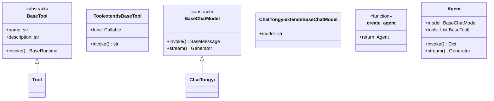

# LangChain Agent开发技术指南

**作者：Red_Moon**
**开发时间：2026年2月**

---

## 前置知识

在开始学习本指南之前，你需要具备以下基础知识：

1. **Python基础** → 装饰器、类型注解、生成器
2. **LangChain基础** → Chain、LLM调用、提示词模板
3. **工具概念** → Function Calling、API调用

---

## 学习目标

通过本指南的学习，你将能够：

- 理解Agent（智能体）与传统RAG的区别和联系
- 掌握LangChain Agent的创建和配置方法
- 理解ReAct思维框架的原理和应用
- 学会使用中间件实现Agent的监控和扩展
- 构建能够自主决策和调用工具的AI Agent

---

## 目录

1. [Agent核心概念](#第一部分agent核心概念)
2. [基础Agent创建](#第二部分基础agent创建)
3. [流式输出与调试](#第三部分流式输出与调试)
4. [ReAct思维框架](#第四部分react思维框架)
5. [中间件机制](#第五部分中间件机制)
6. [组件继承体系](#第六部分组件继承体系)

---

## 第一部分：Agent核心概念

### 章节摘要

本章节介绍Agent（智能体）的基本概念，对比其与传统RAG、Chain的区别，帮助建立对Agent的初步认知。

### 1.1 什么是Agent

**Agent（智能体）** 是LLM（大语言模型）的进化形态。传统LLM只能被动响应用户输入，而Agent具备**自主规划、工具调用、动态决策**的能力。

| 特性 | 传统LLM | Agent |
|-----|--------|-------|
| 交互方式 | 被动响应 | 主动规划 |
| 工具使用 | 不可用 | 可调用外部工具 |
| 执行模式 | 单次调用 | 多轮推理循环 |
| 状态管理 | 无状态 | 有内部状态 |

### 1.2 Agent vs Chain vs RAG


**核心区别**：

- **Chain**：固定流程，预定义好每一步做什么
- **RAG**：在Chain基础上增加了检索步骤，但仍是一次性执行
- **Agent**：具备**自主决策能力**，LLM自己决定何时调用工具、调用什么工具

### 1.3 Agent的工作原理

Agent的内部循环基于**Reasoning（推理）+ Acting（行动）**的迭代：


**关键点**：Agent不是一次性生成答案，而是在推理过程中**动态决定**是否需要调用外部工具。

---

## 第二部分：基础Agent创建

### 章节摘要

本章节详细讲解如何使用LangChain创建第一个Agent，包括工具定义、Agent配置和调用方式。

### 2.1 核心组件

LangChain Agent由三个核心组件构成：

| 组件 | 作用 | 代码要素 |
|-----|-----|---------|
| **Model** | 推理大脑，负责决策 | `model`参数 |
| **Tools** | 外部能力扩展 | `tools`参数 |
| **Prompt** | 行为规范 | `system_prompt`参数 |

### 2.2 工具定义

LangChain使用`@tool`装饰器将Python函数转换为Agent可用的工具：

```python
from langchain_core.tools import tool

@tool(description="查询天气")
def get_weather() -> str:
    """无参数工具：直接返回天气信息"""
    return "晴天"

@tool(description="获取股价，传入股票名称，返回字符串信息")
def get_price(name: str) -> str:
    """单参数工具：根据股票名称查询价格"""
    return f"股票{name}的价格是20元"
```

**关键点**：
- `description`参数至关重要，Agent通过描述决定何时调用该工具
- 函数名即为工具名，会暴露给Agent
- 返回类型应为字符串，Agent会将结果作为观察输入

### 2.3 create_agent函数

LangChain提供了`create_agent`工厂函数创建Agent：

```python
from langchain.agents import create_agent

agent = create_agent(
    model=ChatTongyi(model="qwen3-max"),
    tools=[get_weather, get_price],
    system_prompt="你是一个聊天助手，可以回答用户问题。"
)
```

**参数详解**：

| 参数 | 类型 | 说明 |
|-----|-----|-----|
| `model` | BaseChatModel | LLM实例，作为Agent的推理引擎 |
| `tools` | List[BaseTool] | 可用工具列表，Agent可自主选择调用 |
| `system_prompt` | str | 系统提示，定义Agent角色和行为规则 |

### 2.4 Agent调用方式

Agent支持两种调用方式：

#### 2.4.1 invoke（同步调用）

```python
res = agent.invoke({
    "messages": [
        {"role": "user", "content": "明天深圳的天气如何？"}
    ]
})
```

**特点**：等待完整结果返回，类似同步函数调用。

#### 2.4.2 stream（流式调用）

```python
for chunk in agent.stream(
    {"messages": [{"role": "user", "content": "传智教育股价多少"}]},
    stream_mode="values"
):
    latest_message = chunk['messages'][-1]
    # 实时处理中间状态
```

**特点**：实时yield中间状态，便于观察Agent推理过程和工具调用。

---

## 第三部分：流式输出与调试

### 章节摘要

本章节深入讲解Agent的流式输出机制，以及如何调试和观察Agent的推理过程。

### 3.1 stream_mode参数

`stream`方法的核心参数是`stream_mode`，控制返回内容的格式：

| 模式 | 说明 |
|-----|-----|
| `"values"` | 返回每一步的完整状态快照 |
| `"messages"` | 返回消息对象列表 |

### 3.2 消息结构解析

Agent返回的消息包含多个字段，理解这些字段对于调试至关重要：

```python
for chunk in agent.stream({"messages": [...]}, stream_mode="values"):
    latest_message = chunk['messages'][-1]

    # content: 消息文本内容（可能是思考、工具结果或最终回复）
    if latest_message.content:
        print(latest_message.content)

    # tool_calls: Agent决定调用工具时记录在此字段
    # 格式: [{"name": "工具名", "args": {"参数": "值"}, "id": "调用ID"}]
    if latest_message.tool_calls:
        print(f"工具调用：{latest_message.tool_calls}")
```

**消息类型**：

| 类型 | 角色(role) | 说明 |
|-----|-----------|-----|
| 用户消息 | user | 用户输入 |
| AI消息 | assistant | Agent的回复（含思考过程） |
| 工具消息 | tool | 工具执行结果 |

### 3.3 调试技巧

通过system_prompt要求Agent输出思考过程：

```python
agent = create_agent(
    model=ChatTongyi(model="qwen3-max"),
    tools=[get_price, get_info],
    system_prompt="请告知我思考过程，让我知道你为什么调用某个工具"
)
```

这样可以在流式输出中观察Agent的推理轨迹，便于理解其决策逻辑。

---

## 第四部分：ReAct思维框架

### 章节摘要

本章节详细介绍ReAct（Reasoning + Acting）框架的原理，以及如何在Agent中实现结构化的推理流程。

### 4.1 ReAct核心概念

**ReAct**是一种让LLM进行显式推理的框架，核心思想：

```
思考(Reason) → 行动(Act) → 观察(Observe) → 再思考 → ... → 回答
```

**与传统Prompt的区别**：

| 方式 | 行为 | 透明度 |
|-----|-----|-------|
| 普通Prompt | 直接生成答案 | 不可见 |
| ReAct Prompt | 先思考、再行动、观察结果、再思考 | 完全透明 |

### 4.2 ReAct实现方式

在LangChain中，通过system_prompt约束Agent行为：

```python
agent = create_agent(
    model=ChatTongyi(model="qwen3-max"),
    tools=[get_weight, get_height],
    system_prompt="""你是严格遵循ReAct框架的智能体，必须按「思考→行动→观察→再思考」的流程解决问题，
    且**每轮仅能思考并调用1个工具**，禁止单次调用多个工具。
    并告知我你的思考过程，工具的调用原因，按思考、行动、观察三个结构告知我""",
)
```

### 4.3 ReAct的执行流程示例

以"计算我的BMI"为例，ReAct的执行过程：


### 4.4 ReAct的关键约束

ReAct框架中一个重要约束是**每轮仅调用一个工具**：

**Why**：如果并行调用多个工具，将无法追踪"观察"结果归因于哪个工具，破坏了ReAct的因果链。

**Warning**：某些复杂任务可能需要更深的推理链，注意设置合理的迭代次数上限防止无限循环。

---

## 第五部分：中间件机制

### 章节摘要

本章节讲解LangChain Agent的中间件系统，学习如何拦截Agent执行过程中的各个阶段，实现监控、日志、行为修改等高级功能。

### 5.1 中间件概述

中间件（Middleware）是一种横切关注点（Cross-Cutting Concern）的实现方式，允许在Agent执行过程中插入自定义逻辑：


### 5.2 中间件类型

LangChain提供六种中间件类型：

| 中间件 | 触发时机 | 典型用途 |
|-------|---------|---------|
| `before_agent` | Agent执行前 | 日志记录、状态初始化 |
| `after_agent` | Agent执行后 | 结果处理、资源清理 |
| `before_model` | 模型调用前 | 修改prompt、注入上下文 |
| `after_model` | 模型调用后 | 检查/修改输出、日志 |
| `wrap_model_call` | 模型调用时 | 重试逻辑、计时、缓存 |
| `wrap_tool_call` | 工具调用时 | 参数校验、执行监控 |

### 5.3 声明式中间件

使用装饰器语法声明中间件函数：

```python
from langchain.agents.middleware import before_agent, after_agent
from langchain.agents import AgentState
from langgraph.runtime import Runtime

@before_agent
def log_before_agent(state: AgentState, runtime: Runtime) -> None:
    """Agent执行前记录消息数量"""
    print(f"[before agent]agent启动，并附带{len(state['messages'])}消息")

@after_agent
def log_after_agent(state: AgentState, runtime: Runtime) -> None:
    """Agent执行后记录消息数量"""
    print(f"[after agent]agent结束，并附带{len(state['messages'])}消息")
```

**参数说明**：
- `state`: 包含`messages`等状态数据的字典
- `runtime`: 执行时上下文，可用于控制流程、获取配置

### 5.4 包装式中间件

`wrap_`开头的中间件使用函数包装模式：

```python
from langchain.agents.middleware import wrap_tool_call

@wrap_tool_call
def monitor_tool(request, handler):
    """监控工具执行：打印工具名和参数，然后执行"""
    print(f"工具执行：{request.tool_call['name']}")
    print(f"工具参数：{request.tool_call['args']}")
    return handler(request)
```

**参数说明**：
- `request`: 包含`tool_call`字段（工具名、参数等）
- `handler`: 实际执行逻辑的回调函数

### 5.5 中间件注册

创建Agent时通过`middleware`参数注册中间件：

```python
agent = create_agent(
    model=ChatTongyi(model="qwen3-max"),
    tools=[get_weather],
    middleware=[
        log_before_agent,
        log_after_agent,
        log_before_model,
        log_after_model,
        model_call_hook,
        monitor_tool
    ]
)
```

**执行顺序**：按列表顺序依次执行，类似于责任链模式。

### 5.6 实际应用场景

| 场景 | 中间件选择 | 实现目标 |
|-----|----------|---------|
| 请求日志 | before_agent + after_agent | 记录请求耗时、统计调用量 |
| Prompt注入 | before_model | 在prompt中注入动态上下文 |
| 输出过滤 | after_model | 审核/修改LLM输出 |
| 工具缓存 | wrap_tool_call | 相同参数的工具结果缓存 |
| 重试机制 | wrap_model_call | 模型调用失败自动重试 |

---

## 第六部分：组件继承体系

### 章节摘要

本章节梳理LangChain Agent相关组件的类继承关系，帮助理解框架设计。

### 6.1 核心类图



### 6.2 执行流程中的对象流转


---

## 总结

本指南系统讲解了LangChain Agent的开发技术，从基础概念到高级中间件机制。通过本指南的学习，你应该能够：

1. **理解Agent核心概念**：Agent是具备自主决策能力的LLM进化形态
2. **创建基础Agent**：掌握create_agent、@tool、invoke/stream的用法
3. **调试Agent**：通过流式输出观察推理过程
4. **应用ReAct框架**：实现结构化的思考-行动-观察循环
5. **扩展Agent能力**：使用中间件实现监控、日志、修改行为

**延伸学习建议**：

- Agent与多模态工具的结合
- Agent的自我反思（Self-Reflection）机制
- 多Agent协作系统的设计
