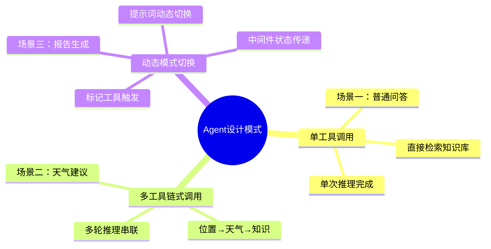

# LangChain Agent项目实战指南

**作者：Red_Moon**
**开发时间：2026年2月**

---

## 前置知识

在开始学习本指南之前，你需要具备以下基础知识：

1. **LangChain基础** → Agent创建、工具定义、中间件机制
2. **RAG开发** → 向量检索、文档加载、Prompt模板
3. **Web开发** → Streamlit基础
4. **Python进阶** → 工厂模式、装饰器、单例模式

---

## 学习目标

通过本指南的学习，你将能够：

- 理解完整Agent项目的架构设计
- 掌握工具函数的设计原则和实现方式
- 学会使用中间件实现动态提示词切换
- 实现基于Streamlit的Web聊天界面
- 理解RAG与Agent的整合方案

---

## 目录

1. [项目架构概览](#第一部分项目架构概览)
2. [应用场景与数据流转](#第二部分应用场景与数据流转)
3. [Agent核心模块](#第三部分agent核心模块)
4. [工具系统设计](#第四部分工具系统设计)
5. [中间件与动态提示词](#第五部分中间件与动态提示词)
6. [RAG服务整合](#第六部分rag服务整合)
7. [Web界面开发](#第七部分web界面开发)
8. [工程化实践](#第八部分工程化实践)

---

## 第一部分：项目架构概览

### 章节摘要

本章节介绍"智扫通"智能客服系统的整体架构，帮助建立对完整Agent项目的认知。

### 1.1 项目背景与目标

**项目名称**：智扫通机器人智能客服系统

**核心目标**：
- 解答用户关于扫地机器人的使用问题
- 结合用户位置、天气等信息提供个性化建议
- 支持生成用户使用报告

**技术选型**：

| 技术 | 选型 | 理由 |
|-----|-----|-----|
| LLM | 通义千问 qwen3-max | 中文能力强、性价比高 |
| 向量数据库 | Chroma | 轻量级、本地持久化 |
| Web框架 | Streamlit | 快速原型开发、Python原生 |
| 配置管理 | YAML | 人类可读、支持复杂数据结构 |

### 1.2 项目结构

```
06Agent项目/
├── agent/                    # Agent核心模块
│   ├── react_agent.py       # Agent入口类
│   └── tools/
│       ├── agent_tools.py   # 工具函数定义
│       └── middleware.py    # 中间件实现
├── rag/                     # RAG服务模块
│   ├── rag_service.py       # RAG检索增强服务
│   └── vector_store.py     # 向量存储服务
├── model/                   # 模型工厂
│   └── factory.py          # ChatModel/Embeddings工厂
├── utils/                   # 工具模块
│   ├── config_handler.py   # 配置加载
│   ├── logger_handler.py   # 日志处理
│   ├── path_tools.py       # 路径工具
│   ├── file_handler.py     # 文件处理
│   ├── prompt_loader.py    # 提示词加载
│   └── chain_debug.py      # 调试工具
├── config/                  # 配置文件
│   ├── agent.yml           # Agent配置
│   ├── chroma.yml          # 向量库配置
│   ├── prompts.yml         # 提示词路径配置
│   └── rag.yml             # RAG模型配置
├── data/                    # 知识库数据
│   ├── external/           # 外部数据（用户记录CSV）
│   └── *.txt/*.pdf         # 产品知识文档
├── prompts/                 # 提示词模板
│   ├── main_prompt.txt     # 主提示词（客服模式）
│   └── report_prompt.txt   # 报告提示词（报告模式）
├── app.py                  # Streamlit Web入口
└── logs/                   # 日志目录
```

### 1.3 核心流程


### 1.4 模块职责

| 模块 | 职责 | 关键技术 |
|-----|-----|---------|
| agent/react_agent.py | Agent入口、流式输出 | create_agent, stream |
| agent/tools | 工具函数定义 | @tool装饰器 |
| agent/middleware | 请求拦截、动态切换 | wrap_tool_call, dynamic_prompt |
| rag/rag_service.py | 检索增强生成 | LCEL Chain |
| rag/vector_store.py | 向量存储、文档加载 | Chroma, MD5去重 |
| model/factory.py | 模型统一创建 | 工厂模式 |
| utils/* | 配置/日志/路径等 | YAML, logging |

### 1.5 Agent vs RAG 对比


| 特性 | RAG | Agent |
|-----|-----|-------|
| **决策能力** | 无，固定流程 | 有，自主决定调用工具 |
| **工具调用** | 不支持 | 支持多种工具 |
| **多轮推理** | 单次检索 | 可多轮推理 |
| **适用场景** | 知识问答 | 复杂任务、需要外部数据 |

### 1.6 项目架构总览

```
┌─────────────────────────────────────────────────────────────────────────────┐
│                              Streamlit Web 界面 (app.py)                     │
│                           用户输入 → 流式输出显示                             │
└─────────────────────────────────────┬───────────────────────────────────────┘
                                      │ prompt (用户问题字符串)
                                      ▼
┌─────────────────────────────────────────────────────────────────────────────┐
│                          ReactAgent (react_agent.py)                         │
│                  封装Agent实例，提供execute_stream()方法                      │
└──────────────┬──────────────────────────────────────┬───────────────────────┘
               │                                      │
               ▼                                      ▼
┌──────────────────────────────┐       ┌──────────────────────────────────────┐
│     7个Agent工具              │       │        3个中间件                      │
│     (agent_tools.py)         │       │        (middleware.py)                │
│  ├─ rag_summarize           │       │  ├─ monitor_tool (工具监控)           │
│  ├─ get_weather             │       │  ├─ log_before_model (日志)           │
│  ├─ get_user_location       │       │  └─ report_prompt_switch (动态提示词) │
│  ├─ get_user_id             │       └──────────────────────────────────────┘
│  ├─ get_current_month       │
│  ├─ fetch_external_data     │
│  └─ fill_context_for_report │
└──────────────┬───────────────┘
               │
               ▼
┌──────────────────────────────────────────────────────────────────────────────┐
│                            RAG 检索增强层                                     │
│  ┌────────────────────────┐     ┌─────────────────────────────────────────┐ │
│  │ VectorStoreService     │────▶│ RagSummarizeService                     │ │
│  │ (vector_store.py)      │     │ (rag_service.py)                        │ │
│  │ Chroma向量数据库        │     │ 检索 + LLM摘要生成                       │ │
│  └────────────────────────┘     └─────────────────────────────────────────┘ │
└──────────────────────────────────────────────────────────────────────────────┘
               │
               ▼
┌──────────────────────────────────────────────────────────────────────────────┐
│                           模型工厂层 (factory.py)                             │
│         ChatTongyi (通义千问)        DashScopeEmbeddings (向量嵌入)           │
└──────────────────────────────────────────────────────────────────────────────┘
```

**架构层次说明**：

| 层次 | 组件 | 职责 | 数据流向 |
|-----|-----|-----|---------|
| **表现层** | Streamlit Web | 用户交互、消息渲染 | 接收prompt，返回响应 |
| **Agent层** | ReactAgent | 任务编排、流式输出 | 调用工具、整合结果 |
| **工具层** | 7个工具函数 | 外部能力扩展 | 执行具体任务 |
| **中间件层** | 3个中间件 | 横切关注点 | 日志、监控、动态切换 |
| **RAG层** | VectorStore + RagService | 知识检索增强 | 向量检索、摘要生成 |
| **模型层** | ChatModel + Embeddings | AI能力支撑 | 文本生成、向量化 |

---

## 第二部分：应用场景与数据流转

### 章节摘要

本章节通过三个典型应用场景，详细展示Agent内部的数据流转过程，帮助理解各组件如何协同工作。

### 2.1 场景一：普通知识问答

**用户问题**："小户型适合哪种扫地机器人？"

**场景特点**：仅需调用RAG检索工具，单次工具调用即可完成。

#### 数据流转步骤

**Step 1: 用户输入 → Streamlit 前端**

```python
# app.py 接收用户输入
prompt = st.chat_input()  # 用户输入: "小户型适合哪种扫地机器人？"
# 数据结构: str
```

**入参/出参说明**：

| 方向 | 数据 | 类型 | 说明 |
|-----|-----|-----|-----|
| 入参 | 用户键盘输入 | str | "小户型适合哪种扫地机器人？" |
| 出参 | prompt变量 | str | 传递给Agent的原始问题 |

**Step 2: 前端 → ReactAgent.execute_stream()**

```python
# app.py
res_stream = st.session_state["agent"].execute_stream(prompt)

# react_agent.py 构建消息字典
input_dict = {
    "messages": [
        {"role": "user", "content": "小户型适合哪种扫地机器人？"}  # 字段: role(str), content(str)
    ]
}
# 数据结构: Dict[str, List[Dict[str, str]]]
```

**入参/出参说明**：

| 方向  | 数据         | 类型   | 说明              |
| --- | ---------- | ---- | --------------- |
| 入参  | prompt     | str  | 用户原始问题          |
| 出参  | input_dict | Dict | LangChain标准消息格式 |

**Step 3: Agent调用 → 中间件链处理**

```python
# 调用agent.stream()，携带context参数
for chunk in self.agent.stream(input_dict, stream_mode="values", context={"report": False}):
    # context数据结构: Dict[str, bool]
    # 用途: 在中间件链间传递状态，report=False表示普通对话模式
```

**入参/出参说明**：

| 参数          | 类型              | 说明                        |
| ----------- | --------------- | ------------------------- |
| input_dict  | Dict            | 消息字典                      |
| stream_mode | str             | "values"返回完整状态快照          |
| context     | Dict[str, bool] | {"report": False}表示普通客服模式 |

**Step 4: 动态提示词中间件 → 返回main_prompt**

```python
# middleware.py - report_prompt_switch
is_report = request.runtime.context.get("report", False)  # False
return load_system_prompt()  # 返回main_prompt.txt内容
# 数据结构: str (提示词文本)
```

**main_prompt.txt 提示词结构**（完整内容）：

```
你是扫地机器人和扫拖一体机器人的专业智能客服，具备自主的ReAct思考与工具调用能力，
严格遵循「思考→行动→观察→再思考」的流程回答用户问题...

### 核心思考准则
1. 先判断用户的核心需求，分析「当前已有的信息是否足够直接回答」
2. 调用工具获取结果后，再次判断信息是否完整
3. 工具调用的入参必须与工具定义完全一致
...

### 可使用工具及能力边界
1. rag_summarize：入参query，从向量库检索专业资料
2. get_weather：入参city，获取城市天气
3. get_user_location：无入参，获取用户位置
...

### 输出规则
1. 每次调用工具前，必须输出真实的自然语言思考过程
2. 思考过程完成后，直接触发工具调用
3. 仅当获取的所有工具信息足够专业、完整时，才生成最终回答
```

**提示词Template参数**：此提示词为Agent系统提示词，无需动态参数填充。

**Step 5: Agent决策调用rag_summarize工具**

```python
# Agent基于LLM思考后，决定调用rag_summarize工具
# 工具调用请求数据结构 (ToolCallRequest):
request = {
    "tool_call": {
        "name": "rag_summarize",           # 工具名: str
        "args": {"query": "小户型扫地机器人推荐"}  # 参数: Dict[str, str]
    },
    "runtime": Runtime对象  # 包含context等运行时状态
}
```

**入参/出参说明**：

| 方向 | 数据 | 类型 | 说明 |
|-----|-----|-----|-----|
| 入参 | query | str | "小户型扫地机器人推荐"（Agent优化后的检索词） |
| 出参 | ToolCallRequest | Object | 包含工具名、参数、运行时状态 |

**Step 6: 工具监控中间件 → 记录日志**

```python
# middleware.py - monitor_tool
logger.info(f"[tool monitor]执行工具: rag_summarize")
logger.info(f"[tool monitor]参数: {'query': '小户型扫地机器人推荐'}")
result = handler(request)  # 调用实际工具函数
logger.info(f"[tool monitor]工具rag_summarize调用成功")
# 数据结构: ToolMessage | Command (工具返回结果)
```

**Step 7: rag_summarize → VectorStoreService检索**

```python
# agent_tools.py
def rag_summarize(query: str) -> str:
    return rag.rag_summarize(query)

# rag_service.py - 向量检索
def retrieve_docs(self, query: str) -> list[Document]:
    return self.retriever.invoke(query)
    # 返回数据结构: List[Document]
    # Document结构: {page_content: str, metadata: Dict}
```

**入参/出参说明**：

| 方向 | 数据 | 类型 | 说明 |
|-----|-----|-----|-----|
| 入参 | query | str | "小户型扫地机器人推荐" |
| 出参 | List[Document] | List | 检索到的文档列表，每个Document包含page_content和metadata |

**Step 8: VectorStoreService内部 → Chroma向量检索**

```python
# vector_store.py
def get_retriever(self):
    return self.vector_store.as_retriever(search_kwargs={"k": 3})
    # k=3: 返回最相似的3个文档
    # retriever.invoke(query)内部流程:
    #   1. query → embed_model.embed_query(query) → 向量 [float, float, ...]
    #   2. 向量 → Chroma相似度搜索 → 返回Top-K文档
```

**向量检索过程**：

```
输入: "小户型扫地机器人推荐"
    ↓ embed_model.embed_query()
向量: [0.0234, -0.1567, 0.0891, ..., 0.0456]  (1536维)
    ↓ Chroma.similarity_search()
输出: [
    Document(page_content="小户型建议选择...", metadata={"source": "选购指南.txt"}),
    Document(page_content="扫地机器人尺寸...", metadata={"source": "尺码推荐.txt"}),
    Document(page_content="紧凑型机器人...", metadata={"source": "产品介绍.txt"})
]
```

**Step 9: 检索结果 → 构建上下文**

```python
# rag_service.py
context_docs = self.retrieve_docs(query)  # List[Document]

# 构建上下文字符串
context = ""
for i, doc in enumerate(context_docs, 1):
    context += f"【参考资料{i}】：参考资料：{doc.page_content} | 参考元数据：{doc.metadata}\n"

# 构建输入字典
input_dict = {
    "input": "小户型扫地机器人推荐",     # 用户query: str
    "context": "【参考资料1】：...【参考资料2】：..."  # 检索上下文: str
}
# 数据结构: Dict[str, str]
```

**入参/出参说明**：

| 方向 | 数据 | 类型 | 说明 |
|-----|-----|-----|-----|
| 入参 | context_docs | List[Document] | 检索到的文档列表 |
| 出参 | input_dict | Dict[str, str] | {"input": query, "context": 上下文字符串} |

**Step 10: LCEL Chain处理 → LLM生成摘要**

```python
# rag_service.py
chain = self.prompt_template | self.model | StrOutputParser()
# 数据流:
#   input_dict → PromptTemplate填充 → 完整prompt字符串
#   完整prompt → ChatTongyi → AIMessage对象
#   AIMessage → StrOutputParser → str (最终摘要文本)

return self.chain.invoke(input_dict)  # 返回: str
```

**rag_summarize.txt 提示词Template**：

```
你是专注于"基于参考资料总结"的AI助手，需结合用户提问和向量检索到的参考资料，
生成简洁准确的概括回答。

### 输入信息
1. 用户提问：{input}
2. 参考资料(在下一个###之前内容均为参考资料)：{context}

### 严格遵守以下约束（违反将导致回答无效）
1. 内容合规：禁止包含违法、侵权、攻击性信息；
2. 事实准确：回答必须完全基于参考资料中的信息，不编造、不添加未提及的内容；
3. 语言要求：仅用中文回答，语气客观、简洁，不冗余；
4. 聚焦提问：严格围绕用户原始提问总结，不扩充问题范围；
5. 格式要求：仅输出概括内容本身，以纯文本字符串形式呈现。
```

**Template参数填充示例**：

| 占位符 | 填充值 | 来源 |
|-------|-------|-----|
| {input} | "小户型扫地机器人推荐" | 用户原始问题 |
| {context} | "【参考资料1】：小户型建议选择...【参考资料2】：..." | 向量检索结果拼接 |

**填充后的完整Prompt示例**：

```
你是专注于"基于参考资料总结"的AI助手...

### 输入信息
1. 用户提问：小户型扫地机器人推荐
2. 参考资料：
【参考资料1】：参考资料：小户型建议选择机身高度低于9cm的扫地机器人，
这样可以轻松进入沙发底、床底等低矮空间清洁...
【参考资料2】：参考资料：扫地机器人尺寸选择要点：1.测量家具底部高度；
2.选择比家具底部高度低2-3cm的机型...
【参考资料3】：参考资料：紧凑型机器人推荐：科沃斯N8、石头T7S等...

### 严格遵守以下约束...
```

**入参/出参说明**：

| 方向 | 数据 | 类型 | 说明 |
|-----|-----|-----|-----|
| 入参 | input_dict | Dict | {"input": str, "context": str} |
| 出参 | str | str | LLM生成的摘要文本 |

**Step 11: 工具返回 → Agent整合输出**

```python
# react_agent.py
for chunk in self.agent.stream(input_dict, stream_mode="values", context={"report": False}):
    latest_message = chunk["messages"][-1]
    if latest_message.content:
        yield latest_message.content.strip() + "\n"
```

**入参/出参说明**：

| 方向 | 数据 | 类型 | 说明 |
|-----|-----|-----|-----|
| 入参 | chunk | Dict | Agent流式返回的状态快照 |
| 出参 | Generator[str] | Generator | 流式输出的文本块 |

**Step 12: 流式输出 → 前端渲染**

```python
# app.py
def capture(generator, cache_list):
    for chunk in generator:
        cache_list.append(chunk)
        for char in chunk:
            time.sleep(0.01)  # 打字机效果
            yield char

st.chat_message("assistant").write_stream(capture(res_stream, response_messages))
```

**最终输出示例**：

```
根据您的需求，为小户型推荐以下扫地机器人选择建议：

1. **尺寸选择**：建议选择机身高度低于9cm的机型，这样可以轻松进入
   沙发底、床底等低矮空间进行清洁。

2. **推荐机型**：科沃斯N8、石头T7S等紧凑型机器人，体积小巧，
   适合小户型使用。

3. **注意事项**：购买前请先测量家具底部高度，选择比家具底部
   高度低2-3cm的机型，确保机器人能够顺利通过。
```

#### 场景一数据流转图


---

### 2.2 场景二：天气相关个性化建议

**用户问题**："扫地机器人在我所在地区的气温下如何保养？"

**场景特点**：需要调用多个工具（位置→天气→知识检索），体现Agent的多轮推理能力。

#### 数据流转步骤

**Step 1-4**: 与场景一相同，用户输入经过前端→Agent→中间件链。

**Step 5: Agent第一轮推理 → 调用get_user_location**

```python
# Agent思考：需要先获取用户位置
request = {
    "tool_call": {
        "name": "get_user_location",
        "args": {}  # 无参数
    }
}
# 返回: "深圳" (模拟数据)
```

**get_user_location工具详情**：

| 项目 | 内容 |
|-----|-----|
| **工具定义** | `@tool(description="获取用户所在城市名称，以纯字符形式返回")` |
| **入参** | 无 |
| **出参** | str，如"深圳"、"合肥"、"杭州" |
| **内部实现** | `return random.choice(["深圳", "合肥", "杭州"])` |

**Step 6: Agent第二轮推理 → 调用get_weather**

```python
# Agent思考：已获取位置"深圳"，现在查询天气
request = {
    "tool_call": {
        "name": "get_weather",
        "args": {"city": "深圳"}
    }
}
# 返回: "城市深圳天气为晴天，气温26摄氏度，空气湿度50%..."
```

**get_weather工具详情**：

| 项目 | 内容 |
|-----|-----|
| **工具定义** | `@tool(description="获取指定城市的天气，以消息字符形式返回")` |
| **入参** | city: str，城市名称 |
| **出参** | str，天气信息字符串 |
| **返回示例** | "城市深圳天气为晴天，气温26摄氏度，空气湿度50%，南风1级，AQI21，最近6小时内降雨概率极低" |

**Step 7: Agent第三轮推理 → 调用rag_summarize**

```python
# Agent思考：结合天气信息，查询保养知识
request = {
    "tool_call": {
        "name": "rag_summarize",
        "args": {"query": "扫地机器人高温天气保养维护"}
    }
}
# 返回: 基于知识库的保养建议
```

**rag_summarize工具详情**（与场景一相同，此处展示不同参数）：

| 项目 | 内容 |
|-----|-----|
| **入参** | query: str = "扫地机器人高温天气保养维护" |
| **出参** | str，基于向量检索的专业保养建议 |

**Step 8: Agent整合所有信息 → 生成最终回答**

```python
# Agent综合以下信息生成回答：
# 1. 用户位置：深圳
# 2. 天气情况：26摄氏度，晴天
# 3. 知识库建议：高温保养要点
# 输出: "根据您所在深圳的天气情况（26摄氏度，晴天），建议您..."
```

**Agent推理过程中的消息历史**：

```python
messages = [
    HumanMessage(content="扫地机器人在我所在地区的气温下如何保养？"),
    AIMessage(content="思考：用户询问保养建议，但未提供位置信息。需要先获取用户位置...", 
              tool_calls=[{"name": "get_user_location", "args": {}}]),
    ToolMessage(content="深圳", tool_call_id="call_001"),
    AIMessage(content="思考：已获取位置深圳，现在查询当地天气...",
              tool_calls=[{"name": "get_weather", "args": {"city": "深圳"}}]),
    ToolMessage(content="城市深圳天气为晴天，气温26摄氏度...", tool_call_id="call_002"),
    AIMessage(content="思考：已获取天气信息，现在查询高温保养知识...",
              tool_calls=[{"name": "rag_summarize", "args": {"query": "扫地机器人高温天气保养"}}]),
    ToolMessage(content="高温天气保养要点：1.避免阳光直射...", tool_call_id="call_003"),
    AIMessage(content="根据您所在深圳的天气情况（26摄氏度，晴天），建议您...")
]
```

**最终输出示例**：

```
根据您所在深圳的天气情况（26摄氏度，晴天，空气湿度50%），为您提供以下保养建议：

1. **温度适应**：当前气温26摄氏度属于适宜范围，扫地机器人可正常工作。
   但建议避免在阳光直射区域长时间停放。

2. **湿度注意**：空气湿度50%适中，无需特别担心电子元件受潮。
   但清洁后建议将机器人放置在通风处晾干。

3. **清洁频率**：晴天条件下，建议每周清洁2-3次，
   重点清理尘盒和滤网，防止灰尘堆积影响吸力。

4. **耗材检查**：高温天气下边刷和滚刷磨损可能加快，
   建议每月检查一次，及时更换老化部件。
```

#### 场景二数据流转图


**关键设计点**：
- Agent自主决定调用顺序，无需人工编排
- 每轮工具调用的结果自动注入下一轮推理的上下文
- 体现了ReAct框架的"思考→行动→观察→再思考"循环

---

### 2.3 场景三：用户使用报告生成

**用户问题**："帮我生成上个月的使用报告"

**场景特点**：触发动态提示词切换，从"客服模式"切换到"报告模式"。

#### 数据流转步骤

**Step 1-4**: 与场景一相同，用户输入经过前端→Agent→中间件链。

**Step 5: Agent推理 → 决定调用fill_context_for_report**

```python
# Agent思考：用户需要生成报告，先切换到报告模式
request = {
    "tool_call": {
        "name": "fill_context_for_report",
        "args": {}  # 无参数
    }
}
# 返回: "fill_context_for_report已调用"
```

**fill_context_for_report工具详情**：

| 项目 | 内容 |
|-----|-----|
| **工具定义** | `@tool(description="无入参，调用后触发中间件自动为报告生成场景动态注入上下文")` |
| **入参** | 无 |
| **出参** | str = "fill_context_for_report已调用" |
| **特殊作用** | 不返回实际数据，仅触发中间件状态变更 |

**Step 6: monitor_tool中间件 → 设置report标志**

```python
# middleware.py - monitor_tool
if request.tool_call['name'] == 'fill_context_for_report':
    logger.info(f"[tool monitor]fill_context_for_report工具被调用，注入上下文 report=True")
    request.runtime.context["report"] = True  # 关键：修改context状态
```

**中间件状态变更说明**：

| 变更前 | 变更后 | 说明 |
|-------|-------|-----|
| context = {"report": False} | context = {"report": True} | 标记进入报告生成模式 |

**Step 7: Agent继续推理 → 调用用户信息工具**

```python
# Agent依次调用获取报告所需数据
request = {
    "tool_call": {"name": "get_user_id", "args": {}}
}
# 返回: "1001"

request = {
    "tool_call": {"name": "get_current_month", "args": {}}
}
# 返回: "2025-01"

request = {
    "tool_call": {
        "name": "fetch_external_data",
        "args": {"user_id": "1001", "month": "2025-01"}
    }
}
# 返回: {"特征": "...", "效率": "...", "耗材": "...", "对比": "..."}
```

**用户信息工具详情**：

| 工具名 | 入参 | 出参 | 说明 |
|-------|-----|-----|-----|
| get_user_id | 无 | str = "1001" | 获取用户唯一标识 |
| get_current_month | 无 | str = "2025-01" | 获取当前月份（YYYY-MM格式） |

**fetch_external_data工具详情**：

| 项目 | 内容 |
|-----|-----|
| **工具定义** | `@tool(description="检索指定用户在指定月份的使用记录")` |
| **入参** | user_id: str, month: str |
| **出参** | str，结构化使用记录 |
| **数据来源** | CSV文件懒加载到内存字典 |

**fetch_external_data返回数据结构**：

```python
# 返回示例（字符串形式）
{
    "特征": "高效清洁模式",
    "效率": "92%",
    "耗材": "边刷需更换",
    "对比": "较上月提升5%"
}
```

**外部数据存储结构**（内存中）：

```python
external_data = {
    "1001": {
        "2025-01": {"特征": "高效清洁模式", "效率": "92%", "耗材": "边刷需更换", "对比": "较上月提升5%"},
        "2025-02": {"特征": "标准清洁模式", "效率": "88%", "耗材": "正常", "对比": "较上月下降3%"}
    },
    "1002": {
        "2025-01": {"特征": "静音清洁模式", "效率": "85%", "耗材": "滤网需清洗", "对比": "较上月持平"}
    }
}
```

**Step 8: dynamic_prompt中间件 → 切换提示词**

```python
# middleware.py - report_prompt_switch
is_report = request.runtime.context.get("report", False)  # True！
if is_report:
    return load_report_prompt()  # 返回报告提示词
```

**report_prompt.txt 提示词Template**：

```
你是专业的扫地/扫拖机器人方面的报告写手。根据查询回来的信息，
写一份机器使用情况报告并给出建议。

查询信息可以使用如下工具：
1. get_user_id：
   - 核心能力：无入参，精准获取当前发起请求的用户唯一标识（ID字符串）；
   - 出参：字符串类型的用户ID（如"1002"）；
   ...

输出要求:
1. 根据查询回来的信息，使用中文生成一份报告，遵循MarkDown语法，
   并根据使用情况给出具体建议，不要将查询回来的内容直接输出。
2. 标题为黑马程序员扫地机器人使用情况报告与保养建议。
```

**提示词对比**：

| 模式   | 提示词文件             | 核心角色 | 工具范围                   | 输出格式       |
| ---- | ----------------- | ---- | ---------------------- | ---------- |
| 客服模式 | main_prompt.txt   | 智能客服 | 7个工具全部可用               | 自然语言回答     |
| 报告模式 | report_prompt.txt | 报告写手 | 4个工具（用户ID、月份、外部数据、RAG） | Markdown报告 |

**Step 9: LLM使用报告提示词 → 生成结构化报告**

**Agent推理过程中的消息历史**：

```python
messages = [
    HumanMessage(content="帮我生成上个月的使用报告"),
    AIMessage(content="思考：用户需要生成报告，先切换到报告模式...",
              tool_calls=[{"name": "fill_context_for_report", "args": {}}]),
    ToolMessage(content="fill_context_for_report已调用", tool_call_id="call_001"),
    AIMessage(content="思考：已切换报告模式，现在获取用户ID和月份...",
              tool_calls=[{"name": "get_user_id", "args": {}}, {"name": "get_current_month", "args": {}}]),
    ToolMessage(content="1001", tool_call_id="call_002"),
    ToolMessage(content="2025-01", tool_call_id="call_003"),
    AIMessage(content="思考：已获取用户ID和月份，查询使用记录...",
              tool_calls=[{"name": "fetch_external_data", "args": {"user_id": "1001", "month": "2025-01"}}]),
    ToolMessage(content="{'特征': '高效清洁模式', '效率': '92%', ...}", tool_call_id="call_004"),
    AIMessage(content="## 黑马程序员扫地机器人使用情况报告...")
]
```

**最终输出示例**：

```markdown
## 黑马程序员扫地机器人使用情况报告与保养建议

### 一、基本信息
- 用户ID：1001
- 统计周期：2025年1月
- 报告生成时间：2025年1月22日

### 二、使用情况分析

#### 2.1 清洁效率
本月清洁效率达到92%，表现优秀。相比上月提升5%，
说明您的使用习惯和机器状态都处于良好水平。

#### 2.2 清洁模式特征
本月主要使用高效清洁模式，该模式适合日常深度清洁，
能够有效清理地面灰尘和毛发。

#### 2.3 耗材状态
当前耗材状态：边刷需更换。建议尽快更换边刷，
以保证清洁效果和机器寿命。

### 三、对比分析
与上月相比，清洁效率提升5%，说明：
1. 机器运行状态良好
2. 清洁频率适中
3. 维护保养到位

### 四、保养建议

1. **立即处理**：更换边刷，建议选择原厂配件
2. **每周维护**：清理尘盒、清洗滤网
3. **每月检查**：检查滚刷、边刷磨损情况
4. **季度保养**：清理传感器、检查电池状态

### 五、下月使用建议
继续保持高效清洁模式的使用频率，注意及时更换耗材，
预计下月清洁效率可保持在90%以上。
```

#### 场景三数据流转图


**关键设计点**：
- `fill_context_for_report`是一个"标记工具"，不返回实际数据，仅触发状态变更
- `runtime.context`在中间件链中共享，实现跨组件通信
- 动态提示词切换实现了Agent行为的模式转换

---

### 2.4 三种场景对比总结

#### 场景特点对比

| 场景 | 工具调用链 | 中间件作用 | 输出特点 |
|-----|----------|-----------|---------|
| **普通问答** | rag_summarize | 日志记录 | 基于知识库的直接回答 |
| **天气建议** | get_user_location → get_weather → rag_summarize | 日志记录 | 多轮推理，个性化建议 |
| **报告生成** | fill_context_for_report → get_user_id → get_current_month → fetch_external_data | 日志记录 + 动态提示词切换 | 结构化报告格式 |

#### 数据结构对比

| 数据项 | 场景一（普通问答） | 场景二（天气建议） | 场景三（报告生成） |
|-------|------------------|------------------|------------------|
| **用户输入** | str: "小户型适合哪种扫地机器人？" | str: "扫地机器人在我所在地区的气温下如何保养？" | str: "帮我生成上个月的使用报告" |
| **context状态** | {"report": False} | {"report": False} | {"report": False} → {"report": True} |
| **工具调用次数** | 1次 | 3次 | 4次 |
| **提示词模式** | main_prompt | main_prompt | report_prompt |
| **输出格式** | 自然语言回答 | 自然语言建议 | Markdown报告 |

#### 工具调用详情对比

| 工具 | 场景一 | 场景二 | 场景三 |
|-----|-------|-------|-------|
| rag_summarize | ✓ query="小户型扫地机器人推荐" | ✓ query="扫地机器人高温天气保养维护" | 可选（补充专业知识） |
| get_user_location | - | ✓ 无入参 → "深圳" | - |
| get_weather | - | ✓ city="深圳" → 天气信息 | - |
| get_user_id | - | - | ✓ 无入参 → "1001" |
| get_current_month | - | - | ✓ 无入参 → "2025-01" |
| fetch_external_data | - | - | ✓ user_id="1001", month="2025-01" → 使用记录 |
| fill_context_for_report | - | - | ✓ 无入参 → 触发模式切换 |

#### 消息历史长度对比

| 场景 | 消息数量 | 消息类型分布 |
|-----|---------|------------|
| 场景一 | 4条 | HumanMessage(1) + AIMessage(2) + ToolMessage(1) |
| 场景二 | 8条 | HumanMessage(1) + AIMessage(4) + ToolMessage(3) |
| 场景三 | 10条 | HumanMessage(1) + AIMessage(5) + ToolMessage(4) |

#### 提示词Template参数对比

| 提示词文件 | Template参数 | 填充来源 | 使用场景 |
|----------|------------|---------|---------|
| main_prompt.txt | 无动态参数 | - | Agent系统提示词，定义角色和工具能力 |
| report_prompt.txt | 无动态参数 | - | Agent系统提示词，定义报告写手角色 |
| rag_summarize.txt | {input}, {context} | 用户问题、向量检索结果 | RAG摘要生成 |

#### 关键设计模式总结



**核心设计思想**：

1. **工具自治**：Agent自主决定调用哪些工具、调用顺序，无需人工编排
2. **状态传递**：通过`runtime.context`在中间件链间共享状态
3. **动态提示词**：根据业务场景动态切换系统提示词，实现Agent行为模式转换
4. **流式输出**：所有场景都支持流式返回，提升用户体验

---

## 第三部分：Agent核心模块

### 章节摘要

本章节详解ReactAgent类的设计，探讨如何封装Agent以提供流式输出能力。

### 2.1 ReactAgent类设计

```python
class ReactAgent(object):
    """
    智能客服Agent封装类
    整合LLM、工具列表、中间件，提供流式输出能力
    """

    def __init__(self):
        """
        初始化Agent实例
        - model: 阿里云通义千问作为推理引擎
        - system_prompt: 从外部文件加载，定义Agent角色
        - tools: 7个工具（检索、天气、用户信息、外部数据、报告生成）
        - middleware: 3个中间件（工具监控、模型调用日志、动态提示词）
        """
        self.agent = create_agent(
            model=chat_model,                    # 推理引擎
            system_prompt=load_system_prompt(),  # 系统提示词
            tools=[rag_summarize, get_weather, get_user_location, 
                   get_user_id, get_current_month, fetch_external_data, 
                   fill_context_for_report],     # 工具列表
            middleware=[monitor_tool, log_before_model, report_prompt_switch],  # 中间件列表
        )

    def execute_stream(self, query):
        """
        流式执行用户查询
        :param query: 用户问题字符串
        :return: Generator[str]，逐块返回Agent响应
        """
        # 构建输入字典，兼容LangChain的消息格式
        input_dict = {
            "messages": [
                {"role": "user", "content": query},
            ]
        }

        # context参数：通过runtime.context在中间件间传递状态
        # report=False 表示普通对话模式，True表示报告生成模式
        for chunk in self.agent.stream(input_dict, stream_mode="values", context={"report": False}):
            latest_message = chunk["messages"][-1]  # 有历史记录所以取最后一条
            if latest_message.content:
                yield latest_message.content.strip() + "\n"
```

### 2.2 设计要点详解

#### 2.2.1 单例模式应用

```python
# 在Streamlit中使用session_state缓存Agent实例
if "agent" not in st.session_state:
    st.session_state["agent"] = ReactAgent()

# 后续调用复用同一实例
agent = st.session_state["agent"]
```

**Why 单例模式**：
- 避免重复初始化：Agent创建涉及模型加载、工具注册，开销较大
- 状态一致性：同一会话内Agent状态应保持一致

#### 2.2.2 context参数机制

```python
# 初始化时设置默认context
agent.stream(input_dict, context={"report": False})

# 中间件中修改context
request.runtime.context["report"] = True

# 另一个中间件读取context
is_report = request.runtime.context.get("report", False)
```

**context的作用**：
- 在中间件链中共享状态
- 实现跨中间件的通信
- 支持动态行为切换

#### 2.2.3 stream_mode参数

| 模式 | 返回内容 | 适用场景 |
|-----|---------|---------|
| `"values"` | 每一步的完整状态快照 | 调试、观察中间状态 |
| `"messages"` | 消息对象列表 | 仅关注最终输出 |
| `"updates"` | 状态增量更新 | 实时UI更新 |

### 2.3 流式输出实现

```python
for chunk in self.agent.stream(input_dict, stream_mode="values", context={"report": False}):
    latest_message = chunk["messages"][-1]
    if latest_message.content:
        yield latest_message.content.strip() + "\n"
```

**关键点**：
- `stream`方法返回Generator，逐块yield中间状态
- `chunk["messages"]`包含完整消息历史
- `latest_message`可能是思考、工具调用或最终回复

**消息类型判断**：

```python
# 判断消息类型
from langchain_core.messages import HumanMessage, AIMessage, ToolMessage

if isinstance(latest_message, HumanMessage):
    print("用户消息")
elif isinstance(latest_message, AIMessage):
    if latest_message.tool_calls:
        print("Agent决定调用工具")
    else:
        print("Agent回复")
elif isinstance(latest_message, ToolMessage):
    print("工具执行结果")
```

---

## 第四部分：工具系统设计

### 章节摘要

本章节讲解Agent工具的设计原则，包括工具定义、工具类型和外部数据整合。

### 3.1 工具定义规范

LangChain使用`@tool`装饰器将Python函数转换为Agent可用的工具：

```python
from langchain_core.tools import tool

@tool(description="从向量存储中检索参考资料")
def rag_summarize(query: str) -> str:
    """RAG检索工具：将用户问题转换为向量，从知识库检索相关文档并生成摘要"""
    return rag.rag_summarize(query)

@tool(description="获取指定城市的天气，以消息字符形式返回")
def get_weather(city: str) -> str:
    """天气查询工具：返回城市的天气信息（模拟数据）"""
    return f"城市{city}天气为晴天，气温26摄氏度，空气湿度50%，南风1级，AQI21"
```

**规范要点**：

| 要素 | 要求 | 示例 |
|-----|-----|-----|
| **description** | 清晰描述功能，Agent据此决定何时调用 | "获取指定城市的天气" |
| **函数名** | 语义清晰，作为工具名展示 | `get_weather` |
| **参数注解** | 必须标注类型，Agent据此构造调用 | `city: str` |
| **返回类型** | 统一为字符串，便于Agent理解 | `-> str` |
| **docstring** | 补充说明，不暴露给Agent | """天气查询工具""" |

### 3.2 工具类型分类

本项目中的7个工具可分为4类：


| 类别 | 工具 | 作用 | 参数 |
|-----|-----|-----|-----|
| **知识检索** | rag_summarize | 从向量库检索产品知识 | query: str |
| **环境信息** | get_weather | 获取城市天气 | city: str |
| | get_user_location | 获取用户位置 | 无 |
| **用户信息** | get_user_id | 获取用户ID | 无 |
| | get_current_month | 获取当前月份 | 无 |
| **外部数据** | fetch_external_data | 查询用户使用记录 | user_id, month |
| | fill_context_for_report | 切换报告模式 | 无 |

### 3.3 外部数据加载

#### 3.3.1 懒加载模式

```python
# 外部数据缓存（懒加载，只在首次调用时加载）
external_data = {}

def generate_external_data():
    """从CSV文件懒加载外部数据"""
    # 避免重复加载
    if not external_data:
        if "external_data_path" not in agent_conf:
            raise KeyError("配置中缺少 external_data_path 字段")

        external_data_path = get_abs_path(agent_conf["external_data_path"])

        # CSV格式：user_id,feature,efficiency,consumables,comparison,time
        with open(external_data_path, "r", encoding="utf-8") as f:
            for line in f.readlines()[1:]:  # 跳过表头
                arr = line.strip().split(",")
                user_id = arr[0].replace('"', "")
                time = arr[5].replace('"', "")
                
                if user_id not in external_data:
                    external_data[user_id] = {}
                
                # 按用户ID和时间构建嵌套字典
                external_data[user_id][time] = {
                    "特征": arr[1],
                    "效率": arr[2],
                    "耗材": arr[3],
                    "对比": arr[4],
                }
```

**懒加载的优势**：
- 启动快：无需预加载所有数据
- 按需加载：只在首次使用时加载
- 内存友好：如果工具从未被调用，数据不会加载

**Warning**：大文件需考虑内存占用，可采用数据库替代内存缓存。

#### 3.3.2 数据结构设计

```
external_data = {
    "1001": {
        "2025-01": {"特征": "...", "效率": "...", "耗材": "...", "对比": "..."},
        "2025-02": {...}
    },
    "1002": {
        "2025-01": {...}
    }
}
```

**设计理由**：
- 两级索引：先按用户ID查找，再按月份查找
- O(1)查询：字典查找时间复杂度为常数
- 易扩展：可方便添加更多维度

### 3.4 工具返回值设计

```python
@tool(description="检索指定用户在指定月份的使用记录")
def fetch_external_data(user_id: str, month: str) -> str:
    generate_external_data()
    try:
        return external_data[user_id][month]
    except KeyError:
        logger.warn(f"未检索到用户:{user_id}在{month}的数据。")
        return ""  # 返回空字符串而非报错
```

**返回值设计原则**：
- 统一字符串类型：便于Agent理解和处理
- 空值处理：返回空字符串而非抛异常，让Agent自行判断
- 日志记录：便于调试和审计

---

## 第五部分：中间件与动态提示词

### 章节摘要

本章节深入讲解中间件的高级用法，特别是如何实现动态提示词切换。

### 4.1 中间件类型回顾


| 中间件             | 触发时机     | 本项目应用   | 参数               |
| --------------- | -------- | ------- | ---------------- |
| before_agent    | Agent执行前 | -       | state, runtime   |
| after_agent     | Agent执行后 | -       | state, runtime   |
| before_model    | 模型调用前    | 打印日志    | state, runtime   |
| after_model     | 模型调用后    | -       | state, runtime   |
| wrap_model_call | 模型调用时    | -       | request, handler |
| wrap_tool_call  | 工具调用时    | 监控、设置标志 | request, handler |
| dynamic_prompt  | 模型调用前    | 动态切换提示词 | request          |

### 4.2 工具监控中间件

```python
@wrap_tool_call
def monitor_tool(request, handler):
    """
    工具执行监控中间件
    功能：
    1. 记录工具调用日志（工具名、参数、结果）
    2. 特殊处理fill_context_for_report工具，动态修改runtime.context
    """
    logger.info(f"[tool monitor]执行工具: {request.tool_call['name']}")
    logger.info(f"[tool monitor]参数: {request.tool_call['args']}")

    try:
        result = handler(request)  # 执行实际工具
        logger.info(f"[tool monitor]工具{request.tool_call['name']}调用成功")

        # 特殊逻辑：检测fill_context_for_report工具
        if request.tool_call['name'] == 'fill_context_for_report':
            logger.info(f"[tool monitor]fill_context_for_report工具被调用，注入上下文 report=True")
            # 通过runtime.context在中间件链中传递状态
            request.runtime.context["report"] = True

        return result
    except Exception as e:
        logger.info(f"工具{request.tool_call['name']}调用失败: {e}")
        raise
```

**request对象结构**：

```python
request = ToolCallRequest(
    tool_call={
        "name": "get_weather",      # 工具名
        "args": {"city": "深圳"},   # 参数字典
        "id": "call_123",           # 调用ID
    },
    runtime=Runtime(
        context={"report": False},  # 上下文状态
        ...
    )
)
```

### 4.3 动态提示词切换

#### 4.3.1 实现原理

```python
@dynamic_prompt
def report_prompt_switch(request: ModelRequest) -> str:
    """
    动态提示词切换中间件
    功能：根据runtime.context["report"]标志位，动态切换系统提示词
    - report=False: 使用main_prompt（普通客服模式）
    - report=True: 使用report_prompt（报告生成模式）
    """
    is_report = request.runtime.context.get("report", False)
    if is_report:
        return load_report_prompt()   # 报告生成模式
    return load_system_prompt()       # 普通客服模式
```

#### 4.3.2 工作流程


#### 4.3.3 提示词文件示例

**main_prompt.txt（客服模式）**：
```
你是智扫通扫地机器人的智能客服，你的职责是：
1. 解答用户关于扫地机器人的使用问题
2. 根据用户所在地区的天气给出保养建议
3. 推荐适合用户的产品功能

请用简洁专业的语言回答用户问题。
```

**report_prompt.txt（报告模式）**：
```
你是一个数据分析助手，需要根据用户的使用记录生成分析报告。

报告格式要求：
## 用户使用报告

### 基本信息
- 用户ID：{user_id}
- 统计周期：{month}

### 使用分析
（根据工具返回的数据进行分析）

### 建议
（给出改进建议）
```

### 4.4 上下文标记工具

```python
@tool(description="无入参，调用后触发中间件自动为报告生成场景动态注入上下文")
def fill_context_for_report():
    """
    上下文填充工具：标记当前会话进入报告生成模式
    触发机制：Agent调用此工具后，中间件检测到工具名，动态修改runtime.context["report"]=True
    应用场景：当用户请求生成报告时调用，触发提示词切换
    """
    return "fill_context_for_report已调用"
```

**设计思想**：
- 通过Agent自主调用工具来触发状态变更
- 而非从外部强制修改
- 体现了Agent的自主决策能力

---

## 第六部分：RAG服务整合

### 章节摘要

本章节讲解如何将RAG服务整合到Agent工具系统中，实现知识增强。

### 5.1 RAG服务架构

```python
class RagSummarizeService:
    """
    RAG检索增强服务
    工作流程：接收用户问题 → 向量检索 → 构建上下文 → 调用LLM生成摘要
    """

    # 类变量缓存：避免多个实例重复读取提示词文件
    _PROMPT_TEXT: str = None

    def __init__(self, vector_store: VectorStoreService):
        self.vector_store = vector_store
        self.retriever = self.vector_store.get_retriever()
        self.prompt_text = self._load_prompt_text()
        self.prompt_template = PromptTemplate.from_template(self.prompt_text)
        self.model = chat_model
        self.chain = self._init_chain()

    def _init_chain(self):
        """初始化LCEL Chain：PromptTemplate → ChatModel → StrOutputParser"""
        chain = self.prompt_template | self.model | StrOutputParser()
        return chain

    def rag_summarize(self, query: str) -> str:
        """RAG核心方法：检索+生成"""
        # 1. 向量检索：从知识库获取相关文档
        context_docs = self.retrieve_docs(query)

        # 2. 构建上下文：将检索到的文档拼接为字符串
        context = ""
        counter = 0
        for doc in context_docs:
            counter += 1
            context += f"【参考资料{counter}】：{doc.page_content}\n"

        # 3. 构建输入：用户问题 + 检索到的上下文
        input_dict = {"input": query, "context": context}

        # 4. 调用Chain生成回答
        return self.chain.invoke(input_dict)
```

### 5.2 向量存储服务

```python
class VectorStoreService:
    """
    向量存储服务
    功能：
    1. 初始化Chroma向量数据库
    2. 加载文档（PDF/TXT/CSV）并向量化存储
    3. 提供检索接口（Retriever）
    """

    def __init__(self):
        # 初始化Chroma向量数据库
        self.vector_store = Chroma(
            collection_name=chroma_conf["collection_name"],
            embedding_function=embed_model,  # 嵌入模型（通义千问）
            persist_directory=chroma_conf["persist_directory"],
        )

        # 文档分片器配置
        self.spliter = RecursiveCharacterTextSplitter(
            chunk_size=chroma_conf["chunk_size"],       # 每个片段的最大字符数
            chunk_overlap=chroma_conf["chunk_overlap"],  # 相邻片段的重叠字符数
            separators=chroma_conf["separators"],        # 分隔符列表
        )

    def load_document(self):
        """加载知识库文档到向量存储（增量加载）"""
        for path in allowed_files:
            md5_hex = get_file_md5_hex(path)

            if check_md5_hex(md5_hex):  # 已加载过
                logger.info(f"[加载知识库] {path} 内容已存在，跳过")
                continue

            documents = get_file_documents(path)
            split_document = self.spliter.split_documents(documents)
            self.vector_store.add_documents(split_document)
            save_md5_hex(md5_hex)
```

**增量加载机制**：
- 使用MD5哈希检测文件变更
- 只加载新增/修改的文件
- 避免重复向量化，提升效率

### 5.3 工具封装

```python
# 初始化RAG服务（全项目共用单例，避免重复初始化）
vector_store = VectorStoreService()
rag = RagSummarizeService(vector_store)

@tool(description="从向量存储中检索参考资料")
def rag_summarize(query: str) -> str:
    """RAG检索工具：将用户问题转换为向量，从知识库检索相关文档并生成摘要"""
    return rag.rag_summarize(query)
```

**整合方式**：
- 将RAG服务封装为Agent工具
- Agent可自主决定何时调用知识检索
- 实现了RAG与Agent的无缝结合

---

## 第七部分：Web界面开发

### 章节摘要

本章节讲解如何使用Streamlit快速构建Agent的Web聊天界面。

### 6.1 Streamlit基础

```python
import streamlit as st

# 页面标题
st.title("智扫通机器人智能客服")
st.divider()

# 会话状态：消息历史
# Warning: Streamlit重载页面时session_state会重置，需持久化存储请使用外部数据库
if "message" not in st.session_state:
    st.session_state["message"] = [
        {"role": "assistant", "content": "你好，我是智扫通机器人智能客服，请问有什么可以帮助你？"}
    ]

# 初始化会话状态：Agent实例（避免每次重载重复创建）
if "agent" not in st.session_state:
    st.session_state["agent"] = ReactAgent()

# 渲染消息历史
for message in st.session_state["message"]:
    st.chat_message(message["role"]).write(message["content"])

# 在页面最下方提供用户输入栏
prompt = st.chat_input()
```

### 6.2 流式输出渲染

```python
if prompt:
    # 在页面输出用户的提问
    st.chat_message("user").write(prompt)
    st.session_state["message"].append({"role": "user", "content": prompt})

    # 存储完整响应（用于保存到历史）
    response_messages = []

    # 显示加载动画
    with st.spinner("智能客服思考中..."):
        # 调用Agent流式输出
        res_stream = st.session_state["agent"].execute_stream(prompt)

        # 流式字符渲染器：控制输出速度，模拟打字机效果
        def capture(generator, cache_list):
            for chunk in generator:
                cache_list.append(chunk)  # 缓存完整响应

                for char in chunk:
                    time.sleep(0.01)  # 控制每个字符的显示间隔
                    yield char

        # 实时显示AI回复
        st.chat_message("assistant").write_stream(capture(res_stream, response_messages))

        # 保存AI回复到会话历史
        st.session_state["message"].append({"role": "assistant", "content": response_messages[-1]})

        # 刷新页面（重新渲染消息历史）
        st.rerun()
```

**关键点**：
- `write_stream`：流式渲染文本
- `time.sleep`：控制输出速度，增强用户体验
- `cache_list`：缓存完整响应用于保存历史

### 6.3 打字机效果实现

```python
def capture(generator, cache_list):
    """
    捕获生成器输出，同时用于流式展示和保存
    
    :param generator: Agent返回的生成器
    :param cache_list: 用于缓存完整响应的列表
    :yield: 单个字符
    """
    for chunk in generator:
        cache_list.append(chunk)
        for char in chunk:
            time.sleep(0.01)  # 10ms延迟，模拟打字效果
            yield char
```

**Why 打字机效果**：
- 提升用户体验：让用户感知到AI正在"思考"
- 降低等待焦虑：即使总时间相同，用户感觉更快
- 视觉吸引力：动态效果比静态等待更有趣

---

## 第八部分：工程化实践

### 章节摘要

本章节总结项目中的工程化实践，包括配置管理、日志系统、路径处理等。

### 7.1 配置管理

#### 7.1.1 YAML配置文件

```yaml
# config/rag.yml
chat_model_name: qwen3-max-2026-01-23
embedding_model_name: text-embedding-v3

# config/chroma.yml
collection_name: 扫地机器人知识库
persist_directory: chroma_db
chunk_size: 500
chunk_overlap: 50
separators:
  - "\n\n"
  - "\n"
  - "。"
  - " "
k: 3

# config/agent.yml
external_data_path: data/external/records.csv

# config/prompts.yml
rag_summarize_prompt_path: prompts/rag_summarize.txt
main_prompt_path: prompts/main_prompt.txt
report_prompt_path: prompts/report_prompt.txt
```

#### 7.1.2 配置加载器

```python
class ConfigHandler(object):
    """配置处理器：静态方法类，提供各类配置文件的加载方法"""

    @staticmethod
    def load_rag_config(config_path: str=get_abs_path("config/rag.yml")):
        with open(config_path, "r", encoding="utf-8") as f:
            return yaml.load(f.read(), Loader=yaml.FullLoader)

# 模块级加载：项目启动时自动加载所有配置
rag_conf = ConfigHandler.load_rag_config()
chroma_conf = ConfigHandler.load_chroma_config()
prompts_conf = ConfigHandler.load_prompts_config()
agent_conf = ConfigHandler.load_agent_config()
```

**配置管理的优势**：
- 集中管理：所有配置在一处维护
- 环境隔离：不同环境使用不同配置文件
- 安全性：敏感信息可通过环境变量注入

### 7.2 日志系统

#### 7.2.1 日志配置

```python
def get_logger(name="agent", console_level=logging.INFO, file_level=logging.DEBUG):
    """
    获取配置好的日志器（开箱即用）
    :param name: 日志器名称
    :param console_level: 控制台日志级别
    :param file_level: 文件日志级别
    """
    logger = logging.getLogger(name)
    logger.setLevel(logging.DEBUG)
    logger.addFilter(SensitiveDataFilter())  # 添加脱敏过滤器

    # 避免重复添加Handler
    if logger.handlers:
        return logger

    # 控制台Handler
    console_handler = logging.StreamHandler()
    console_handler.setLevel(console_level)
    logger.addHandler(console_handler)

    # 文件Handler（按日期生成）
    log_file = os.path.join(LOG_ROOT, f"{name}_{datetime.now().strftime('%Y%m%d')}.log")
    file_handler = logging.FileHandler(log_file, encoding="utf-8")
    file_handler.setLevel(file_level)
    logger.addHandler(file_handler)

    return logger
```

#### 7.2.2 敏感信息脱敏

```python
def mask_sensitive_data(text: str) -> str:
    """
    日志脱敏函数：隐藏API Key、手机号、邮箱等敏感信息
    Warning: 正则表达式可能存在绕过风险，敏感数据不建议记录日志
    """
    if not isinstance(text, str):
        return text

    # 脱敏API Key（sk-开头）
    text = re.sub(r"sk-\w+", "sk-******", text)
    # 脱敏手机号
    text = re.sub(r"1[3-9]\d{9}", "1**********", text)
    # 脱敏邮箱
    text = re.sub(r"(\w+)@(\w+)\.(\w+)", r"\1****@\2.\3", text)
    # 脱敏密码/密钥
    text = re.sub(r"(password|key|secret)=[^& ]+", r"\1=******", text)
    return text


class SensitiveDataFilter(logging.Filter):
    """日志过滤器：自动脱敏日志中的敏感信息"""

    def filter(self, record: logging.LogRecord) -> bool:
        if record.msg:
            record.msg = mask_sensitive_data(record.msg)
        if record.args:
            record.args = tuple(mask_sensitive_data(arg) for arg in record.args)
        return True
```

### 7.3 路径处理

```python
def get_project_root() -> str:
    """
    获取工程根目录
    原理：基于当前文件的绝对路径，向上推导到工程根目录
    """
    current_file = os.path.abspath(__file__)
    current_dir = os.path.dirname(current_file)
    project_root = os.path.dirname(current_dir)  # utils/ 的上一级
    return project_root

def get_abs_path(relative_path: str) -> str:
    """
    将工程内的相对路径转为绝对路径
    :param relative_path: 相对于工程根目录的路径
    :return: 绝对路径
    """
    return os.path.join(get_project_root(), relative_path)
```

**优势**：无论脚本在哪个目录运行，都能获得正确的绝对路径。

### 7.4 模型工厂

```python
class BaseModelFactory(ABC):
    """模型工厂抽象基类"""

    @abstractmethod
    def generator(self) -> Optional[Embeddings | BaseChatModel]:
        pass


class ChatModelFactory(BaseModelFactory):
    """聊天模型工厂：生成通义千问ChatModel"""

    def generator(self):
        return ChatTongyi(model=rag_conf["chat_model_name"])


class EmbeddingsFactory(BaseModelFactory):
    """嵌入模型工厂：生成通义千问Embeddings"""

    def generator(self):
        return DashScopeEmbeddings(model=rag_conf["embedding_model_name"])


# 模块级单例：项目启动时直接创建模型实例
chat_model = ChatModelFactory().generator()
embed_model = EmbeddingsFactory().generator()
```

**工厂模式的优点**：
- 统一模型创建入口
- 便于切换底层模型
- 符合依赖注入原则
- 支持单元测试Mock

---

## 总结

本指南详细讲解了"智扫通"智能客服系统的完整实现。通过本指南的学习，你应该能够：

1. **理解项目架构**：Agent + RAG + Web的完整技术栈
2. **掌握工具设计**：@tool装饰器、外部数据整合
3. **理解中间件机制**：动态提示词切换、状态传递
4. **实现Web界面**：Streamlit流式聊天
5. **工程化实践**：配置管理、日志系统、路径处理

### 核心知识点回顾


### 延伸学习建议

| 方向 | 描述 | 推荐资源 |
|-----|-----|---------|
| **多Agent协作** | 多个Agent协同完成复杂任务 | LangGraph, AutoGen |
| **Agent记忆** | 短期/长期记忆机制 | LangChain Memory |
| **生产部署** | Docker、Kubernetes部署 | FastAPI + Docker |
| **性能优化** | 缓存、异步处理 | Redis, asyncio |

### 项目扩展方向

- 接入更多数据源（数据库、API）
- 实现多轮对话状态管理
- 添加用户反馈机制
- 支持多语言
- 实现Agent自我反思（Self-Reflection）
