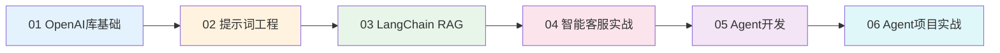
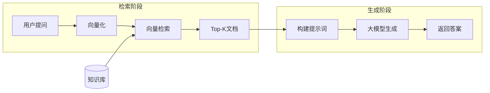
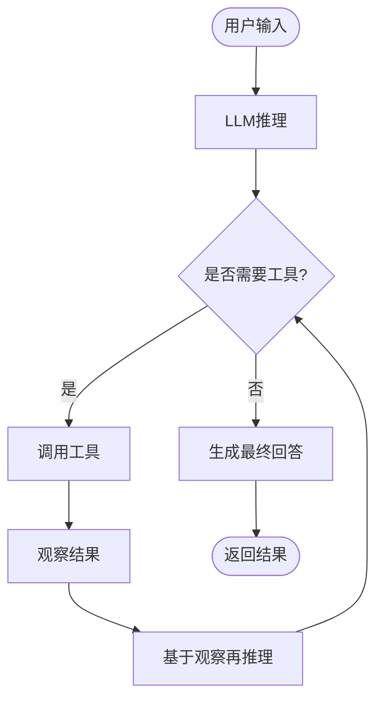
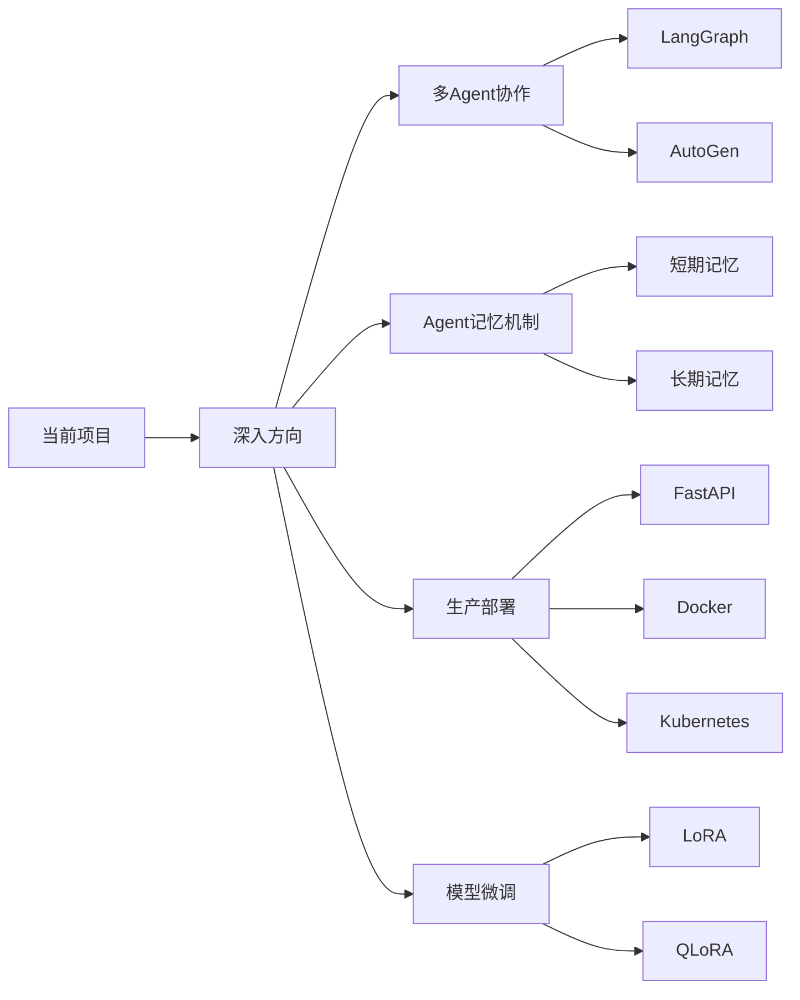

# LangChain 大模型应用开发学习项目

**作者**：Red_Moon  
**开发时间**：2026年2月

---

## 项目简介

本项目是一个系统化的大模型应用开发学习教程，从OpenAI库的基础使用出发，逐步深入到提示词工程、RAG（检索增强生成）技术、Agent智能体开发，最终完成两个完整的实战项目。项目采用**原理先行、实践驱动**的教学模式，每个知识点都配有详细的理论讲解和可运行的代码示例，帮助学习者从学院派理论向工程化实践转变。

---

## 学习路径



### 各章节内容概览

| 章节 | 核心内容 | 技能目标 |
|------|----------|----------|
| **01 OpenAI库基础** | OpenAI SDK使用、流式输出、多轮对话、Token管理 | 掌握大模型API调用基础 |
| **02 提示词工程** | System提示词、Few-Shot Learning、JSON结构化输出 | 学会编写高质量提示词 |
| **03 LangChain RAG** | 文档加载、向量存储、LCEL链式调用、会话记忆 | 掌握RAG核心技术栈 |
| **04 智能客服实战** | 完整RAG项目架构、Streamlit界面、知识库管理 | 具备独立开发RAG应用能力 |
| **05 Agent开发** | Agent核心概念、工具定义、ReAct框架、中间件机制 | 掌握Agent开发技术 |
| **06 Agent项目实战** | 完整Agent项目、动态提示词切换、RAG与Agent整合 | 具备独立开发Agent应用能力 |

---

## 项目结构

```
LangChain/
├── 01OpenAI库的基础使用/              # 第一章：OpenAI SDK基础
│   ├── 01_OpenAI库基础使用指南.md     # 完整教程文档
│   ├── 01测试APIEKEY.py               # API密钥验证
│   ├── 02OpenAI库的基础使用.py         # 基础对话调用
│   ├── 03OpenAI库的流式输出.py         # 流式输出实现
│   └── 04OpenAI附带历史消息调用模型.py  # 多轮对话上下文管理
│
├── 02提示词优化/                      # 第二章：提示词工程与JSON输出
│   ├── 02_提示词工程与JSON结构化输出指南.md
│   ├── 05提示词优化案例_金融文本分类.py   # Few-Shot分类任务
│   ├── 06Json的基础使用.py               # JSON格式构建
│   ├── 07提示词优化案例_金融信息抽取.py   # Schema定义+JSON输出
│   └── 08提示词优化案例_金融文本匹配判断.py # 正负例平衡设计
│
├── 03LangChainRAG开发/               # 第三章：LangChain与RAG技术
│   ├── 03_LangChainRAG开发技术指南.md  # 完整技术文档
│   ├── data/                          # 示例数据文件
│   ├── chat_history/                  # 会话历史存储
│   ├── chroma_db/                     # Chroma向量数据库
│   └── [28个Python示例文件]            # 从基础到高级的完整示例
│
├── 04RAG项目/                        # 第四章：RAG智能客服系统实战
│   ├── 04_RAG智能客服系统完整实战.md   # 项目实战文档
│   ├── app_file_uploader.py           # 知识库上传界面
│   ├── app_qa.py                      # 智能客服对话界面
│   ├── config_data.py                 # 全局配置
│   ├── knowledge_base.py              # 知识库服务（MD5去重）
│   ├── vector_stores.py               # 向量数据库封装
│   ├── file_history_store.py          # 对话历史持久化
│   ├── rag.py                         # RAG核心链路（LCEL）
│   └── data/                          # 示例知识文档
│
├── 05Agent/                          # 第五章：Agent开发技术
│   ├── 05_Agent开发技术指南.md         # Agent技术文档
│   └── [Agent示例文件]                # Agent创建与调试示例
│
├── 06Agent项目/                       # 第六章：Agent项目实战
│   ├── 06_Agent项目实战指南.md         # 项目实战文档
│   ├── agent/                         # Agent核心模块
│   │   ├── react_agent.py            # Agent入口类
│   │   └── tools/
│   │       ├── agent_tools.py        # 7个工具函数定义
│   │       └── middleware.py         # 3个中间件实现
│   ├── rag/                          # RAG服务模块
│   │   ├── rag_service.py            # RAG检索增强服务
│   │   └── vector_store.py           # 向量存储服务
│   ├── model/                        # 模型工厂
│   │   └── factory.py                # ChatModel/Embeddings工厂
│   ├── utils/                        # 工具模块
│   ├── config/                       # YAML配置文件
│   ├── data/                         # 知识库数据
│   ├── prompts/                      # 提示词模板
│   ├── app.py                        # Streamlit Web入口
│   └── logs/                         # 日志目录
│
└── README.md                         # 本文件
```

---

## 核心概念速览

### RAG (Retrieval-Augmented Generation)

检索增强生成，结合信息检索与文本生成的AI架构：



**解决的问题**：
- 大模型幻觉（Hallucination）
- 知识时效性
- 领域专业性

### Agent（智能体）

具备自主规划、工具调用、动态决策能力的LLM进化形态：



**Agent vs RAG vs Chain**：

| 特性 | Chain | RAG | Agent |
|-----|-------|-----|-------|
| **决策能力** | 无，固定流程 | 无，固定流程 | 有，自主决定 |
| **工具调用** | 不支持 | 不支持 | 支持多种工具 |
| **多轮推理** | 单次执行 | 单次检索 | 可多轮推理 |
| **适用场景** | 简单流程 | 知识问答 | 复杂任务、需要外部数据 |

### ReAct框架

Reasoning + Acting，让LLM进行显式推理的框架：

```
思考 → 行动 → 观察 → 再思考 → ... → 回答
```

---

## 技术栈

| 类别 | 技术选型 | 说明 |
|------|---------|------|
| **编程语言** | Python 3.10+ | 类型注解、装饰器、生成器 |
| **大模型服务** | 阿里云百炼 | 通义千问 qwen3-max |
| **核心框架** | LangChain | Chain、Agent、Tool |
| **向量数据库** | Chroma | 轻量级本地持久化 |
| **嵌入模型** | DashScope Embeddings | text-embedding-v4 |
| **前端界面** | Streamlit | 快速原型开发 |
| **本地模型** | Ollama（可选） | 离线场景支持 |

### 核心依赖

```
openai>=1.0.0
langchain>=0.3.0
langchain-community
langchain-chroma
chromadb
streamlit
dashscope
pyyaml
```

---

## 环境配置

### 1. 安装依赖

```bash
pip install openai langchain langchain-community langchain-chroma chromadb streamlit dashscope pyyaml
```

### 2. 配置API密钥

**方式一：环境变量（推荐）**

```powershell
# Windows PowerShell
$env:DASHSCOPE_API_KEY="你的API密钥"

# Linux/Mac
export DASHSCOPE_API_KEY="你的API密钥"
```

**方式二：.env文件**

在项目根目录创建 `.env` 文件：

```
DASHSCOPE_API_KEY=你的API密钥
```

### 3. 获取API密钥

1. 访问阿里云百炼控制台：https://bailian.console.aliyun.com/
2. 注册/登录账号
3. 创建API Key

---

## 快速开始

### 测试API连接

```bash
cd 01OpenAI库的基础使用
python 01测试APIEKEY.py
```

### 运行RAG智能客服系统

```bash
cd 04RAG项目

# 启动知识库上传界面
streamlit run app_file_uploader.py

# 启动智能客服对话界面
streamlit run app_qa.py
```

### 运行Agent智能客服系统

```bash
cd 06Agent项目

# 启动Agent智能客服界面
streamlit run app.py
```

---

## LangChain核心组件

| 组件 | 功能 | 典型用法 |
|------|------|----------|
| `ChatModel` | 对话模型封装 | `ChatTongyi`、`ChatOllama` |
| `PromptTemplate` | 提示词模板 | `ChatPromptTemplate` |
| `Document Loader` | 文档加载 | `TextLoader`、`PyPDFLoader` |
| `Text Splitter` | 文本分割 | `RecursiveCharacterTextSplitter` |
| `Vector Store` | 向量存储 | `Chroma` |
| `Retriever` | 检索器 | `VectorStoreRetriever` |
| `Chain` | 处理链路 | LCEL表达式 `|` |
| `Tool` | Agent工具 | `@tool` 装饰器 |
| `Middleware` | 中间件 | `wrap_tool_call`、`dynamic_prompt` |

---

## 项目特色

### 教学模式

- **原理先行**：每个技术点都配有原理讲解和公式推导（如余弦相似度数学原理）
- **知识关联**：主动关联已学知识，构建系统化知识网络
- **多方案对比**：提供至少两种实现思路，培养架构选型意识

### 代码规范

- **防御性编程**：参数校验、空值处理、异常捕获
- **意图注释**：解释Why而非翻译What，标注性能陷阱和并发风险
- **Mermaid图解**：架构、流程、状态流转可视化

### 学习增强

- **错误溯源**：不仅给出修复代码，更解释错误产生的底层机制
- **版本适配**：识别依赖版本，避免弃用API
- **工程化实践**：配置管理、日志脱敏、工厂模式

---

## 文档清单

| 文档 | 说明 |
|------|------|
| [01_OpenAI库基础使用指南.md](01OpenAI库的基础使用/01_OpenAI库基础使用指南.md) | OpenAI SDK完整教程：客户端初始化、流式输出、多轮对话、Token管理 |
| [02_提示词工程与JSON结构化输出指南.md](02提示词优化/02_提示词工程与JSON结构化输出指南.md) | 提示词优化技巧：System消息、Few-Shot Learning、JSON输出控制 |
| [03_LangChainRAG开发技术指南.md](03LangChainRAG开发/03_LangChainRAG开发技术指南.md) | LangChain与RAG技术详解：文档处理、向量存储、LCEL链式调用 |
| [04_RAG智能客服系统完整实战.md](04RAG项目/04_RAG智能客服系统完整实战.md) | RAG项目实战：完整架构设计、知识库管理、Streamlit界面 |
| [05_Agent开发技术指南.md](05Agent/05_Agent开发技术指南.md) | Agent开发技术：工具定义、ReAct框架、中间件机制 |
| [06_Agent项目实战指南.md](06Agent项目/06_Agent项目实战指南.md) | Agent项目实战：完整架构、动态提示词切换、RAG与Agent整合 |

---

## 核心知识点回顾

### 第一章：OpenAI库基础

| 知识点 | 核心概念 | 关键方法/参数 |
|--------|---------|--------------|
| 客户端初始化 | OpenAI客户端是与模型交互的入口 | `OpenAI(api_key=..., base_url=...)` |
| 消息结构 | system/user/assistant三种角色 | `{"role": "...", "content": "..."}` |
| 流式输出 | 逐token返回，降低TTFT | `stream=True` |
| 多轮对话 | 需要发送完整历史 | messages列表包含所有历史 |

### 第二章：提示词工程

| 知识点 | 核心概念 | 应用场景 |
|--------|---------|---------|
| System消息 | 定义模型角色和行为 | 所有提示词任务 |
| Few-Shot学习 | 通过示例引导模型 | 分类、抽取、匹配 |
| JSON输出 | 结构化数据格式 | 信息抽取、数据提取 |
| 思维链 | 展示推理过程 | 数学、逻辑推理 |

### 第三章：LangChain RAG

| 模块 | 核心概念 | 关键类/方法 |
|------|---------|------------|
| 数学基础 | 余弦相似度衡量向量方向相似性 | `cosine_similarity()` |
| 模型接入 | ChatModel支持消息角色管理 | `ChatTongyi`, `ChatOllama` |
| 提示词模板 | 模板化提示词管理 | `ChatPromptTemplate` |
| LCEL | 声明式链式调用 | `\|` 管道运算符 |
| 会话记忆 | 历史消息持久化 | `RunnableWithMessageHistory` |
| 向量存储 | 语义检索基础 | `Chroma`, `DashScopeEmbeddings` |

### 第四章：RAG项目实战

| 组件 | 职责 | 关键技术 |
|-----|-----|---------|
| 配置中心 | 集中管理参数 | Path跨平台路径 |
| 知识库服务 | 文档向量化存储 | MD5去重、文本分割 |
| 向量存储 | 向量检索接口 | Chroma、Retriever |
| RAG链路 | 检索-生成流程 | LCEL、Runnable |

### 第五章：Agent开发

| 知识点 | 核心概念 | 关键方法 |
|--------|---------|---------|
| Agent创建 | 具备自主决策能力的LLM | `create_agent()` |
| 工具定义 | 扩展Agent能力 | `@tool` 装饰器 |
| ReAct框架 | 思考-行动-观察循环 | system_prompt约束 |
| 中间件 | 横切关注点处理 | `wrap_tool_call`, `dynamic_prompt` |

### 第六章：Agent项目实战

| 模块 | 职责 | 关键技术 |
|-----|-----|---------|
| ReactAgent | Agent入口、流式输出 | create_agent, stream |
| 工具系统 | 7个工具函数 | @tool装饰器、懒加载 |
| 中间件 | 请求拦截、动态切换 | wrap_tool_call, dynamic_prompt |
| RAG整合 | 知识检索增强 | 向量检索、摘要生成 |

---

## 进阶学习建议



| 方向 | 描述 | 推荐资源 |
|-----|-----|---------|
| **多Agent协作** | 多个Agent协同完成复杂任务 | LangGraph, AutoGen |
| **Agent记忆** | 短期/长期记忆机制 | LangChain Memory |
| **生产部署** | Docker、Kubernetes部署 | FastAPI + Docker |
| **性能优化** | 缓存、异步处理 | Redis, asyncio |
| **模型微调** | 领域知识注入 | LoRA, QLoRA |

---

## 许可证

本项目仅供学习交流使用。

---

**最后更新**：2026年2月  
**文档版本**：v2.0
