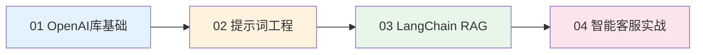
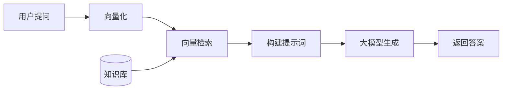

# LangChain 学习项目

**作者**：Red_Moon  
**开发时间**：2026年2月

---

## 项目简介

本项目是一个系统化的LangChain与大模型应用开发学习教程，从OpenAI库的基础使用出发，逐步深入到提示词工程、RAG（检索增强生成）技术，最终完成一个完整的智能客服系统实战项目。

项目采用**原理先行、实践驱动**的教学模式，每个知识点都配有详细的理论讲解和可运行的代码示例，帮助学习者从学院派理论向工程化实践转变。

---

## 项目结构

```
LangChain/
├── 01OpenAI库的基础使用/          # 第一章：OpenAI SDK基础
│   ├── 01_OpenAI库基础使用指南.md
│   ├── 01测试APIEKEY.py
│   ├── 02OpenAI库的基础使用.py
│   ├── 03OpenAI库的流式输出.py
│   └── 04OpenAI附带历史消息调用模型.py
│
├── 02提示词优化/                  # 第二章：提示词工程与JSON输出
│   ├── 02_提示词工程与JSON结构化输出指南.md
│   ├── 05提示词优化案例_金融文本分类.py
│   ├── 06Json的基础使用.py
│   ├── 07提示词优化案例_金融信息抽取.py
│   └── 08提示词优化案例_金融文本匹配判断.py
│
├── 03LangChainRAG开发/           # 第三章：LangChain与RAG技术
│   ├── 03_LangChainRAG开发技术指南.md
│   ├── data/                     # 示例数据文件
│   ├── chat_history/             # 会话历史存储
│   ├── chroma_db/                # Chroma向量数据库
│   └── [28个Python示例文件]       # 从基础到高级的完整示例
│
├── 04RAG项目/                    # 第四章：智能客服系统实战
│   ├── 04_RAG智能客服系统完整实战.md
│   ├── app_file_uploader.py      # 知识库上传界面
│   ├── app_qa.py                 # 智能客服对话界面
│   ├── config_data.py            # 全局配置
│   ├── knowledge_base.py         # 知识库服务
│   ├── vector_stores.py          # 向量数据库封装
│   ├── file_history_store.py     # 对话历史持久化
│   ├── rag.py                    # RAG核心链路
│   └── data/                     # 示例知识文档
│
└── README.md                     # 本文件
```

---

## 学习路径



### 各章节内容概览

| 章节 | 核心内容 | 技能目标 |
|------|----------|----------|
| **01 OpenAI库基础** | OpenAI SDK使用、流式输出、多轮对话 | 掌握大模型API调用基础 |
| **02 提示词工程** | System提示词、Few-Shot、JSON结构化输出 | 学会编写高质量提示词 |
| **03 LangChain RAG** | 文档加载、向量存储、检索增强生成 | 掌握RAG核心技术栈 |
| **04 智能客服实战** | 完整项目架构、Streamlit界面、知识库管理 | 具备独立开发AI应用能力 |

---

## 技术栈

- **编程语言**: Python 3.10+
- **大模型服务**: 阿里云百炼（DashScope）
- **主要框架**: LangChain、OpenAI SDK
- **向量数据库**: Chroma
- **前端界面**: Streamlit
- **本地模型**: Ollama（可选）

### 核心依赖

```
openai>=1.0.0
langchain>=0.3.0
langchain-community
langchain-chroma
chromadb
streamlit
dashscope
```

---

## 环境配置

### 1. 安装依赖

```bash
pip install openai langchain langchain-community langchain-chroma chromadb streamlit dashscope
```

### 2. 配置API密钥

**方式一：环境变量（推荐）**

```powershell
# Windows PowerShell
$env:DASHSCOPE_API_KEY="你的API密钥"

# Linux/Mac
export DASHSCOPE_API_KEY="你的API密钥"
```

**方式二：.env文件**

在项目根目录创建 `.env` 文件：

```
DASHSCOPE_API_KEY=你的API密钥
```

### 3. 获取API密钥

1. 访问阿里云百炼控制台：https://bailian.console.aliyun.com/
2. 注册/登录账号
3. 创建API Key

---

## 快速开始

### 测试API连接

```bash
cd 01OpenAI库的基础使用
python 01测试APIEKEY.py
```

### 运行智能客服系统

```bash
cd 04RAG项目

# 启动知识库上传界面
streamlit run app_file_uploader.py

# 启动智能客服对话界面
streamlit run app_qa.py
```

---

## 核心概念速览

### RAG (Retrieval-Augmented Generation)

检索增强生成，结合信息检索与文本生成的AI架构：



**解决的问题**：
- 大模型幻觉（Hallucination）
- 知识时效性
- 领域专业性

### LangChain核心组件

| 组件 | 功能 | 典型用法 |
|------|------|----------|
| `ChatModel` | 对话模型封装 | `ChatTongyi`、`ChatOllama` |
| `PromptTemplate` | 提示词模板 | `ChatPromptTemplate` |
| `Document Loader` | 文档加载 | `TextLoader`、`PDFLoader` |
| `Text Splitter` | 文本分割 | `RecursiveCharacterTextSplitter` |
| `Vector Store` | 向量存储 | `Chroma` |
| `Retriever` | 检索器 | `VectorStoreRetriever` |
| `Chain` | 处理链路 | `LCEL`表达式 |

---

## 项目特色

### 教学模式

- **原理先行**：每个技术点都配有原理讲解和公式推导
- **知识关联**：主动关联已学知识，构建系统化知识网络
- **多方案对比**：提供至少两种实现思路，培养架构选型意识

### 代码规范

- **防御性编程**：参数校验、空值处理、异常捕获
- **意图注释**：解释Why而非翻译What
- **Mermaid图解**：架构、流程、状态流转可视化

### 学习增强

- **错误溯源**：不仅给出修复代码，更解释错误产生的底层机制
- **性能分析**：标注性能陷阱、并发风险、易错边界
- **版本适配**：识别依赖版本，避免弃用API

---

## 文档清单

| 文档 | 说明 |
|------|------|
| [01_OpenAI库基础使用指南.md](01OpenAI库的基础使用/01_OpenAI库基础使用指南.md) | OpenAI SDK完整教程 |
| [02_提示词工程与JSON结构化输出指南.md](02提示词优化/02_提示词工程与JSON结构化输出指南.md) | 提示词优化技巧 |
| [03_LangChainRAG开发技术指南.md](03LangChainRAG开发/03_LangChainRAG开发技术指南.md) | LangChain与RAG技术详解 |
| [04_RAG智能客服系统完整实战.md](04RAG项目/04_RAG智能客服系统完整实战.md) | 完整项目实战文档 |

---

## 进阶学习建议

1. **深入理解Transformer架构**：了解注意力机制、位置编码等核心概念
2. **学习向量数据库原理**：理解HNSW、IVF等近似最近邻算法
3. **掌握Prompt Engineering高级技巧**：Chain-of-Thought、ReAct等
4. **探索Agent开发**：工具调用、多Agent协作
5. **关注模型微调**：LoRA、QLoRA等参数高效微调方法


---

## 许可证

本项目仅供学习交流使用。

---

**最后更新**：2026年2月  
**文档版本**：v1.0
